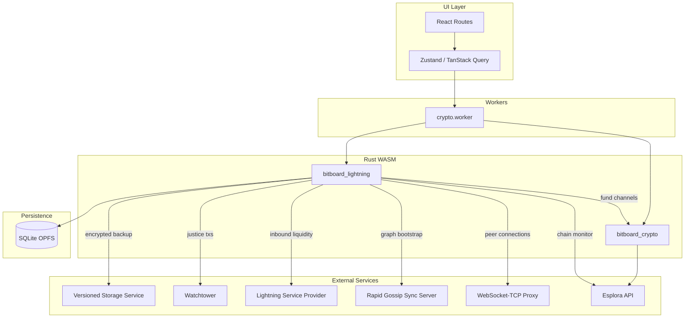

# In-Browser LDK Lightning Node Roadmap

## Architecture Overview

The `bitboard_lightning` crate is the core, compiled to WASM and loaded by the crypto worker (with the option to move it to a dedicated worker later). External services are introduced incrementally across phases.

---

## Phase 0 (Done): PoC -- LDK compiles to WASM

Validates that the `lightning` crate compiles and runs on `wasm32-unknown-unknown`. Implemented in the `bitboard-lightning` crate. `KeysManager` creates a node keypair from a seed and returns the node public key.

---

## Phase 1: Persistence and Seed Derivation

**Goal:** The node can be created, stored, and restored across sessions. Multiple nodes coexist (one per network).

**Key deliverables:**

- Deterministic LDK seed derivation from the existing BIP39 mnemonic via a dedicated BIP32 path (e.g. `m/535'/0'` for mainnet, `m/535'/1'` for testnet, etc.)
- SQLite schema for Lightning node state: `lightning_nodes` table (network, encrypted seed/keys, channel monitors, network graph snapshot, scorer data)
- Implement LDK's `Persist` trait backed by SQLite/OPFS -- channel monitor updates are written to the DB
- Implement LDK's `KVStore` trait for general key-value persistence (network graph, scorer, manager state)
- Node lifecycle in `bitboard-lightning`: `create_node(seed, network)`, `restore_node(persisted_state)`, `stop_node()` exposed via `wasm_bindgen`
- Encrypted storage for sensitive Lightning state (reuse the existing encryption worker pattern)
- Design (but do not yet implement) the cloud backup strategy (VSS or equivalent)

**Scope boundary:** No networking, no channels. The node exists only as a persistable identity.

---

## Phase 2: Networking, Chain Monitoring, and Network Graph

**Goal:** The node connects to Lightning peers, monitors the chain, and has a usable view of the network graph.

**Key deliverables:**

- **WebSocket-TCP proxy**: deploy or self-host a proxy that bridges browser WebSocket connections to Lightning peers' TCP sockets. Implement LDK's `SocketDescriptor` trait over WebSocket in Rust/WASM.
- **Chain monitoring**: implement LDK's `Filter` and `Confirm` traits using the existing Esplora proxy. Poll for relevant transactions on a timer (the node needs to detect funding confirmations, force closures, HTLC spends).
- **Fee estimation**: implement LDK's `FeeEstimator` trait sourcing data from the Esplora `fee-estimates` endpoint.
- **Rapid Gossip Sync**: integrate the `lightning-rapid-gossip-sync` crate to bootstrap the network graph from a public RGS server (e.g. rapidsync.lightningdevkit.org) instead of slow P2P gossip.
- **Event loop**: since `lightning-background-processor` requires `tokio`, build a WASM-compatible event loop using `setInterval` (or `setTimeout` chains) in the worker that periodically calls `process_pending_events`, `timer_tick_occurred`, and persists dirty state.
- **Peer connection management**: connect to peers by pubkey + address (via the WebSocket proxy), handle handshake, maintain connections.
- **Logger**: implement LDK's `Logger` trait routing to `console.log` / `console.warn` etc.
- **Network graph persistence**: serialize and persist the graph + scorer to SQLite via the `KVStore` from Phase 1.

**Scope boundary:** The node can connect to peers and has a network graph, but cannot open channels.

---

## Phase 3: Channel Creation

**Goal:** The node can open and close channels with peers.

**Key deliverables:**

- **On-chain wallet integration**: when LDK fires `FundingGenerationReady`, coordinate with the BDK on-chain wallet (in `bitboard_crypto`) to create and sign the funding transaction. This requires cross-WASM-module communication through the worker layer.
- **Channel open flow**: expose `open_channel(peer_pubkey, amount_sats, push_msat)` via wasm_bindgen. Handle the full negotiation: `OpenChannel` -> `AcceptChannel` -> `FundingGenerationReady` event -> fund -> `FundingSigned` -> wait for confirmations -> `ChannelReady`.
- **Channel close flows**: cooperative close (`close_channel`) and force close (`force_close_channel`). Handle `SpendableOutputs` events to sweep funds back to the on-chain wallet.
- **Channel state UI**: display open/pending/closed channels in the management page.
- **Channel monitor persistence**: ensure every `ChannelMonitorUpdate` is persisted before acknowledging (critical for safety -- data loss here means fund loss).

**Scope boundary:** Channels can be opened and closed. No payments yet.

---

## Phase 4: Sending Payments

**Goal:** The node can pay BOLT11 invoices.

**Key deliverables:**

- **Invoice parsing**: use `lightning-invoice` crate to decode BOLT11 invoices.
- **Pathfinding**: use LDK's `find_route` with the network graph and probabilistic scorer. The scorer improves over time as payment attempts succeed or fail.
- **Payment execution**: `ChannelManager::send_payment` with the computed route. Handle `PaymentSent` and `PaymentFailed` events.
- **Retry logic**: implement payment retries on transient failures (LDK provides `Retry` configuration).
- **Payment tracking**: persist payment attempts and outcomes. Expose payment history to the UI.
- **Send UI integration**: integrate with the existing send flow (currently on-chain + NWC) to support sending via the internal LDK node as a third option.

**Scope boundary:** The node can send payments. Cannot yet receive (no invoice creation).

---

## Phase 5: Receiving Payments

**Goal:** The node can create invoices and receive payments.

**Key deliverables:**

- **Invoice creation**: use `lightning-invoice`'s `InvoiceBuilder` (or LDK's utility functions) to create BOLT11 invoices with the node's pubkey, payment hash, amount, expiry, and route hints for private channels.
- **Payment claiming**: handle `PaymentClaimable` events, verify payment preimages, call `claim_funds`. Handle `PaymentClaimed` to confirm receipt.
- **Route hints**: include route hints in invoices so payers can find a path to the node through its channel peers.
- **Receive UI integration**: integrate with the existing receive flow to support receiving via the internal LDK node.
- **Keysend receiving**: support spontaneous payments without an invoice (keysend / BOLT12 offers as stretch).

**Scope boundary:** Full send + receive capability. Liquidity is manually managed.

---

## Phase 6: LSP Integration

**Goal:** The node can receive payments without manually pre-arranging inbound liquidity.

**Key deliverables:**

- **LSP client**: integrate with an LSP (e.g. Voltage Flow, Olympus, ACINQ) using the LSPS protocol (or the LSP's proprietary API). The `lightning-liquidity` crate provides LSPS client support.
- **JIT channels**: when a payment arrives but the node has no inbound capacity, the LSP opens a channel on-the-fly (Just-In-Time) and forwards the payment through it.
- **Channel management automation**: auto-request inbound liquidity when needed, rebalance channels.
- **Zero-conf channels**: support 0-conf channel opens from the LSP for instant receiving.
- **Cost transparency**: display LSP fees to the user so they understand the cost of JIT channel opens.

**Scope boundary:** Receiving payments works seamlessly for end users. Channel management is largely automated.

---

## Phase 7: Hardening

**Goal:** The node is safe to use with real funds on mainnet.

**Key deliverables:**

- **Cloud backup (VSS)**: implement encrypted, versioned channel state backups to a remote server. Every channel monitor update must be backed up before being acknowledged. Losing a channel update can mean losing funds.
- **Watchtower integration**: connect to a watchtower service that monitors the chain for revoked commitment transactions while the node is offline, and broadcasts justice transactions if needed.
- **Force-close handling**: robust handling of all force-close scenarios (local force close, remote force close, revoked state broadcast, HTLC timeout sweeps).
- **Stale state protection**: detect if the persisted state is older than what the counterparty has, and refuse to broadcast (to avoid punishment).
- **Security audit**: review key management, seed handling, persistence integrity, and attack surface.
- **Error recovery**: graceful degradation when the WebSocket proxy is unreachable, when Esplora is down, when the LSP is unavailable.

---

## Lab Integration (Cross-cutting, can begin after Phase 3)

The Lab can host multiple LDK node instances communicating in-memory (no real networking), using the simulated blockchain for chain monitoring. This mirrors how LDK's own integration tests work. The approach:

- Swap the `SocketDescriptor` implementation from WebSocket to an in-memory channel between node instances
- Swap the chain monitor from Esplora to the Lab's simulated blockchain
- Swap the fee estimator to return Lab-configured fee rates
- The core LDK logic (channels, payments, state machines) remains identical

This is best approached after Phase 3 (channels) is working, since that's the minimum needed for a meaningful Lab Lightning experience.