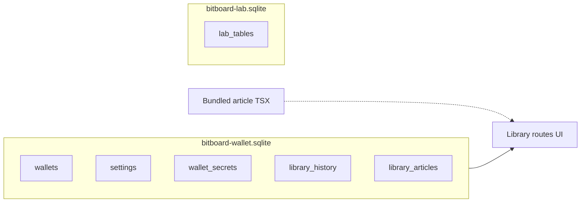
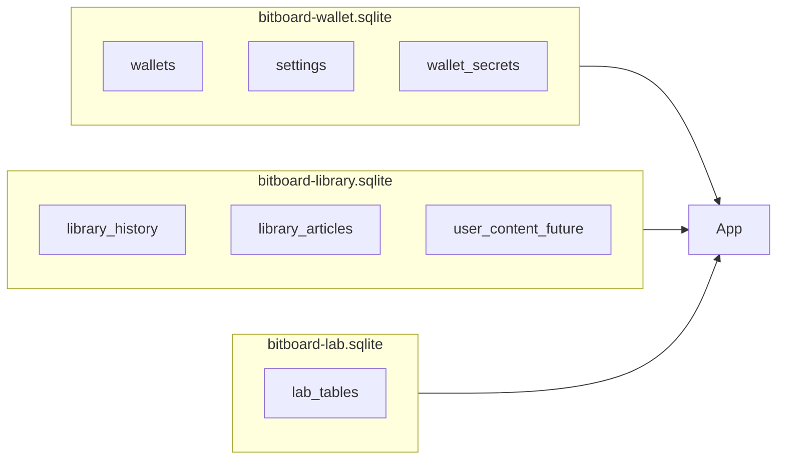

# Library domain evolution (reference draft)

## Current architecture (baseline)

- **Single wallet SQLite** ([`frontend/src/db/database.ts`](frontend/src/db/database.ts), OPFS basename [`bitboard-wallet`](frontend/src/db/opfs-sqlite-database-names.ts)) holds wallets, encrypted secrets, settings, **and** library state.
- **Library tables** (see [`frontend/src/db/schema.ts`](frontend/src/db/schema.ts)): `library_history` (recent reads) and `library_articles` (per-slug `is_favorite`). Created in [`frontend/src/db/migrations/wallet/20260417120000_initial_wallet_schema.ts`](frontend/src/db/migrations/wallet/20260417120000_initial_wallet_schema.ts).
- **Article catalog** is **not** in SQLite: bundled React modules discovered via `import.meta.glob` in [`frontend/src/lib/library/articles-registry.ts`](frontend/src/lib/library/articles-registry.ts).
- **Access layer**: [`frontend/src/db/library-articles.ts`](frontend/src/db/library-articles.ts), [`frontend/src/db/library-history.ts`](frontend/src/db/library-history.ts) use `getDatabase()`.
- **Lab precedent**: second file + Kysely singleton in [`frontend/src/db/lab-database.ts`](frontend/src/db/lab-database.ts) with [`bitboard-lab`](frontend/src/db/opfs-sqlite-database-names.ts).
- **Backups / wipe**: Wallet export/import flows in [`frontend/src/components/settings/use-data-backups-card.ts`](frontend/src/components/settings/use-data-backups-card.ts) operate on the **whole** wallet SQLite blob; library rows therefore travel with wallet backup today. Full app wipe calls [`destroyDatabase`](frontend/src/db/database.ts) (wallet only—lab is separate).

## Principle (your decision)

Stay on **one wallet DB** until Library grows **user-owned data** and **independent lifecycle** needs (export/share library without wallet, reset library without touching keys, different migration cadence). Settings remain coupled to wallet operation—**no** fourth DB for settings.

## Phase 1 — Features while still in wallet SQLite

Useful groundwork before any file split:

- **Distinguish “catalog vs overlay” in the data model**: keep built-in slugs from `ARTICLES`; add tables or columns only when you introduce **user drafts, notes, forks, or custom articles** (e.g. `source: 'bundled' | 'user'`, `base_slug`, revision timestamps).
- **Stable identifiers**: slugs work for bundled content; user content may need UUID primary keys while still linking to optional `base_slug`.
- **Query boundaries**: route all library persistence through a small module (already mostly true via `library-articles` / `library-history`) so a later `getLibraryDatabase()` swap is localized.

## Phase 2 — Dedicated `bitboard-library` SQLite (when justified)

**Trigger examples:** “export library only”, “import shared pack”, “wipe library but keep wallet”, or library migrations becoming frequent/risky relative to wallet schema.

**Mechanical pattern** (copy from lab):

- Add `LIBRARY_SQLITE_OPFS_BASENAME` next to existing constants in [`frontend/src/db/opfs-sqlite-database-names.ts`](frontend/src/db/opfs-sqlite-database-names.ts).
- New `library-database.ts` + `library-schema.ts` + `run-library-migrations` (folder under [`frontend/src/db/migrations/`](frontend/src/db/migrations/)).
- **Migration move**: wallet migration adds a step (or one-time app migration script) that copies `library_*` rows into the new file, then drops those tables from wallet DB—or ship a **lazy copy-on-first-open** if you need smoother upgrades.
- **Teardown**: extend [`frontend/src/lib/wipe-all-app-data-opfs-and-reload.ts`](frontend/src/lib/wipe-all-app-data-opfs-and-reload.ts) and any cross-tab sync naming (see [`frontend/src/lib/wallet-cross-tab-sync.ts`](frontend/src/lib/wallet-cross-tab-sync.ts)) if library gets its own change notifications.
- **Backups**: either add a **library ZIP** parallel to [`LAB_BACKUP_ZIP_FILENAME`](frontend/src/lib/lab-backup-constants.ts) / lab import paths, or **document** that wallet backup no longer includes library (breaking change—version the backup manifest if you split).

## Phase 3 — Sharing and collaboration (product-dependent)

Rough design space to pin down when you implement:

- **Interchange format**: signed JSON bundle (manifest + articles + media hashes) vs. SQLite file inside ZIP (closer to existing backup tooling).
- **Trust model**: optional signatures, content hashing, “imported from user X” metadata.
- **Conflicts**: last-write-wins vs. per-article versioning if users edit shared articles locally.

## Risks to track

- **Transactional coupling**: rare today; splitting removes single-transaction guarantees across wallet and library (usually acceptable for this domain).
- **Backup semantics**: users may assume “wallet backup = everything”; any split requires clear UI copy and possibly **dual export** during a transition period.
- **Test matrix**: today [`frontend/src/db/__tests__/library-*.test.ts`](frontend/src/db/__tests__/) use wallet DB helpers—duplicate or parameterize for a second dialect when the split lands.

## Suggested “go / no-go” for the split

| Go | No-go |
|----|--------|
| Library export/import is a first-class feature | Library remains favorites + history only |
| You want reset/wipe library without wallet teardown | You want zero extra OPFS files |
| Library schema churn could destabilize wallet migrations | You prefer minimal moving parts |

---

This document is intentionally a **reference draft**; implementation should start with Phase 1 data modeling only if/when you commit to user-editable or shareable content.
