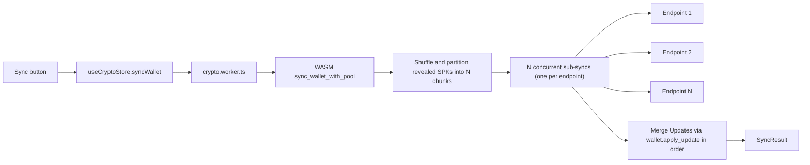

# Multi-provider Esplora sharding with per-sync randomization

## Goals and non-goals

- **Goal**: No single Esplora operator ever sees the full revealed-SPK set of a wallet during a sync; the subset a given operator sees is randomized anew every sync. Preserve today's UX: one button -> one sync.
- **Non-goal (for the core work)**: Truly per-HTTP-request routing inside `bdk_esplora`'s internal fan-out. We'll stay at sync-level partition granularity (reshuffled each sync).
- **Non-goal (for Phase A)**: Decoy traffic; that's Phase B, optional, behind a setting.

## Threat model delta vs. today

- Single honest-but-curious provider: today sees 100% of SPKs; after Phase A sees ~1/N with a different ~1/N each sync. Cannot reliably cluster an IP's queries into one wallet without colluding with the other pool members.
- Colluding pool: unaffected by sharding; the honest baseline (own node / Tor) remains the advanced user story.
- Passive network observer (ISP, state actor): unchanged; they see traffic to all pool members. Document this explicitly in the privacy policy follow-up.

## Data model

Replace the single-URL setting with a JSON-encoded ordered pool per network, keyed by `custom_esplora_pool_<networkMode>` in the `settings` table (see [frontend/src/db/schema.ts](frontend/src/db/schema.ts)).

- Value format: `JSON.stringify(["https://...", "https://..."])`.
- Absent key => use curated default pool for that network.
- On first read, migrate any legacy `custom_esplora_url_<network>` (see `CUSTOM_ESPLORA_URL_KEY_PREFIX` in [frontend/src/lib/wallet-utils.ts](frontend/src/lib/wallet-utils.ts)) into the new key as a single-element pool, then delete the legacy row. Migration is lazy on-read to avoid a DB migration step.

Curated default pools (proposal — subject to your review during implementation):

- `mainnet`: `https://mempool.space/api`, `https://blockstream.info/api`, `https://mempool.emzy.de/api`
- `testnet` (testnet4): `https://mempool.space/testnet4/api`, `https://blockstream.info/testnet/api` (confirm testnet4 coverage before shipping; drop or replace entries that don't support testnet4)
- `signet`: keep `https://mutinynet.com/api` as single entry for now — Bitboard's current default targets Mutinynet specifically, which is incompatible with plain-signet mempool.space endpoints. Revisit if/when plain-signet support is added.
- `regtest`: single entry (user's local node); no pool.
- `lab`: empty (in-app chain).

## Core mechanism (Phase A)

### Architecture



### Rust/WASM ([crypto/src/esplora.rs](crypto/src/esplora.rs), [crypto/src/lib.rs](crypto/src/lib.rs), [crypto/src/blockchain.rs](crypto/src/blockchain.rs), [crypto/src/sync.rs](crypto/src/sync.rs))

- Introduce `EsploraPoolClient` (new file `crypto/src/esplora_pool.rs`) that owns a `Vec<bdk_esplora::esplora_client::AsyncClient<WasmSleeper>>` built from an ordered URL list.
- Extend the WASM ABI with pool-aware entry points:
  - `sync_wallet_with_pool(urls_json: &str) -> JsValue` (new)
  - `full_scan_wallet_with_pool(urls_json: &str, stop_gap: usize) -> JsValue` (new)
  - `broadcast_transaction_with_pool(raw_tx_hex: &str, urls_json: &str) -> JsValue` (new)
  - Keep the current `sync_wallet(url)`, `full_scan_wallet(url)`, `broadcast_transaction(tx, url)` as thin wrappers that build a 1-entry pool, so WASM consumers can migrate incrementally. Nothing else calls them directly outside of [frontend/src/workers/crypto.worker.ts](frontend/src/workers/crypto.worker.ts).
- New `sync_wallet_with_pool` body (pseudocode):

```rust
let now = current_unix_time();
let revealed: Vec<ScriptBuf> = with_wallet(|w| {
    // collect external + internal revealed SPKs
    w.spk_index().revealed_spks(..).map(|(_, _, spk)| spk.to_owned()).collect()
})?;
let mut rng = bitcoin::secp256k1::rand::thread_rng(); // crypto-strong
revealed.shuffle(&mut rng);
let partitions = split_into_chunks(revealed, pool.len());

let sub_updates = futures::future::join_all(
    pool.clients().iter().zip(partitions).map(|(client, chunk)| async move {
        if chunk.is_empty() { return Ok(None); }
        let req = SyncRequest::builder_at(now).spks(chunk).build();
        let resp = client.sync(req, PER_CLIENT_PARALLEL_REQUESTS).await?;
        Ok::<_, CryptoError>(Some(Update::from(resp)))
    })
).await;

// Failure fallback: for any failed chunk, retry on a different (still-healthy) endpoint once.
// Surface an error only if all endpoints fail for at least one chunk.

with_wallet_mut(|w| {
    for update in successful_updates {
        sync::apply_update(w, update)?;
    }
    Ok(())
})?;
```

- Randomness source: use `bitcoin::secp256k1::rand::rngs::OsRng` (already available transitively) so the shuffle is cryptographically strong; document this in code comments.
- `PER_CLIENT_PARALLEL_REQUESTS`: set to `max(1, PARALLEL_REQUESTS / pool.len())` so total concurrency stays close to today's 5 and we don't DoS any single provider.
- Chain-tip merging: we apply sub-updates sequentially via `wallet.apply_update(update)` (see existing [crypto/src/sync.rs](crypto/src/sync.rs) `apply_update`). BDK 2.3 merges tx graph, last-active-indices, and chain views across calls. Verify this with a dedicated test (see Testing). If height skew between providers turns out to cause anchor races in practice, fall back to: pick the healthiest/highest-tip endpoint to fetch the tip/headers and only use the others for SPK fetches. Note this as a follow-up lever.

### Full scan strategy

`start_full_scan_at` walks each keychain sequentially using stop-gap, so we can't split one keychain across endpoints without losing the "consecutive unused" signal.

- External keychain -> one random endpoint from the pool.
- Internal keychain -> a different random endpoint (fall back to first endpoint if pool has only 1 member).
- Run both sub-scans concurrently, apply both updates. This splits the "where does my change go" info from the "what did I receive" info across operators — a meaningful privacy win for the only-ever-one-time full scan.

### Broadcast strategy

Broadcasting a signed tx is public by nature (the mempool will gossip it to everyone within seconds anyway), so privacy is not the point — **reliability** is. We fan out to all endpoints in parallel, take the first successful txid, log later failures as warnings without surfacing errors.

## Typescript plumbing

### Worker API ([frontend/src/workers/crypto-api.ts](frontend/src/workers/crypto-api.ts), [frontend/src/workers/crypto.worker.ts](frontend/src/workers/crypto.worker.ts))

- Add `syncWalletWithPool(urls: string[])`, `fullScanWalletWithPool(urls: string[], stopGap: number)`, `broadcastTransactionWithPool(rawTxHex: string, urls: string[])`.
- The worker serializes `urls` as `JSON.stringify(urls)` and forwards to the new WASM entrypoints. Old single-URL methods stay as trivial wrappers (`[url]` pool) for the deprecation window; delete once all call sites migrate.

### Crypto store ([frontend/src/stores/cryptoStore.ts](frontend/src/stores/cryptoStore.ts))

- Replace `syncWallet(esploraUrl)`, `fullScanWallet(esploraUrl, stopGap)`, `broadcastTransaction(rawTxHex, esploraUrl)` with pool-taking variants. Keep names; change signature `string -> string[]`. Update the `CryptoState` interface.

### Pool resolver ([frontend/src/lib/wallet-utils.ts](frontend/src/lib/wallet-utils.ts), [frontend/src/lib/bitcoin-utils.ts](frontend/src/lib/bitcoin-utils.ts))

- Replace `DEFAULT_ESPLORA_URLS: Record<NetworkMode, string>` with `DEFAULT_ESPLORA_POOLS: Record<NetworkMode, readonly string[]>`.
- Replace `getEsploraUrl(network, customUrl)` with `getEsploraPool(network, customPool)`; preserve the existing DEV proxy behavior by mapping each default entry through the DEV proxy when `import.meta.env.DEV`.
- Replace `saveCustomEsploraUrl / loadCustomEsploraUrl / deleteCustomEsploraUrl` with `saveCustomEsploraPool / loadCustomEsploraPool / deleteCustomEsploraPool` (JSON-encoded value). Keep signatures simple (`NetworkMode -> string[] | null`). Include the lazy legacy-key migration described above.
- Update every call site that currently does `const customUrl = await loadCustomEsploraUrl(...); const esploraUrl = getEsploraUrl(...)` to load the pool and pass it through. Call sites (see earlier grep):
  - `syncActiveWalletAndUpdateState` / `runIncrementalDashboardWalletSync` / `loadDescriptorWalletAndSync` in [frontend/src/lib/wallet-utils.ts](frontend/src/lib/wallet-utils.ts)
  - `useSendMutations` in [frontend/src/hooks/useSendMutations.ts](frontend/src/hooks/useSendMutations.ts)
  - `useLightningMutations` in [frontend/src/hooks/useLightningMutations.ts](frontend/src/hooks/useLightningMutations.ts)
  - `setup/import` in [frontend/src/routes/setup/import.tsx](frontend/src/routes/setup/import.tsx)
  - `FaucetLinker` in [frontend/src/components/receive/FaucetLinker.tsx](frontend/src/components/receive/FaucetLinker.tsx) (note: this uses the URL only to probe a faucet; it should pick one pool entry deterministically or keep using `fetchEsploraTipBlockHeight` against the first entry, whichever the implementer judges clearer).

### UI ([frontend/src/components/settings/EsploraUrlSettings.tsx](frontend/src/components/settings/EsploraUrlSettings.tsx))

Upgrade the single input to an ordered pool editor:

- Show the effective pool (curated default or user-customized) as a list.
- Per-entry: URL input + remove button + drag handle for reorder.
- "Add endpoint" button (validated via existing `validateEsploraUrl`).
- "Reset to default pool" button (clears custom pool).
- "Custom" badge visible whenever a user pool differs from the default.
- Preserve the informational text about what Esplora is.
- Do not expose sharding as a toggle — it is always on whenever the pool has >= 2 entries, with no UI surface for "privacy on/off". A user who sets a single custom URL effectively opts out and has the same behavior as today.

### Broadcast/faucet nuance

- `FaucetLinker` runs tip checks, not wallet-address queries. It's fine to pin it to the first pool entry; not worth sharding for one read.

## Phase B: Decoy / cover traffic (opt-in)

Gated by a new setting `esplora_decoys_enabled` in the `settings` table (default `0`).

- **UI**: add a toggle in Security or a new Privacy card in settings with clear wording ("Adds extra decoy requests to make your real queries harder to fingerprint. Uses more bandwidth.").
- **Decoy source**: lazily populate a rolling cache (keyed per network) of ~256 scripthashes drawn from recent block outputs via `GET /block/:hash/txs`, stored as a plain setting-row per network (short TTL, e.g. 24 h). Refresh opportunistically on idle.
- **Mechanism**: when enabled, for each sub-sync expand each chunk with `K` randomly-drawn decoys from the cache before the shuffle-partition step. `K` starts at `2 * chunk.len()` (3x total traffic) and is tunable by a hidden constant.
- **Rust entrypoint**: `sync_wallet_with_pool_and_decoys(urls_json, decoys_json)`; decoys collected in TS from the cache and forwarded. Keeps the WASM side pure (no HTTP fetches for decoy sourcing), so the decoy-cache refresh stays in TS and is testable without WASM.
- **Drop decoy results**: BDK will record them in the tx graph, which is undesirable. Alternatives:
  1. Build decoy `SyncRequest`s separately and **throw the returned `SyncResponse` away** instead of applying it — the provider still sees the HTTP traffic, but the wallet state is unaffected. This is the simplest safe path.
  2. Filter the response to drop tx data outside the wallet's SPK set before applying. More efficient but more code. Start with (1).
- **Decoy quality note**: decoy SPKs must be real recent-chain scripthashes. Random bytes would be trivially distinguishable. Hence the rolling-cache approach.
- Phase B is independent of Phase A; it should land in a separate PR once Phase A is stable.

## Testing strategy

- **Rust unit tests** ([crypto/tests/esplora_tests.rs](crypto/tests/esplora_tests.rs)): extend the existing mocks to:
  - Assert that N sub-syncs against N `wiremock` servers together see exactly the union of revealed SPKs, and that no single server sees more than `ceil(M/N)` SPKs.
  - Assert randomization: over 20 runs, the partition-to-endpoint assignment distribution is not constant.
  - Single-endpoint fallback: when one server returns 500s, the chunk is retried on a healthy server.
  - Chain-tip skew: two servers at different heights, assert `wallet.apply_update` of both succeeds and the resulting tip is the max.
- **Frontend unit tests**: adjust existing mocks (`frontend/src/routes/__tests__/settings.test.tsx`, `frontend/src/routes/setup/__tests__/import.test.tsx`, `frontend/src/routes/__tests__/send.test.tsx`, `frontend/src/routes/__tests__/receive.test.tsx`, `frontend/src/components/receive/FaucetLinker.test.tsx`) from `loadCustomEsploraUrl` -> `loadCustomEsploraPool`.
- **E2E ([frontend/tests/e2e/](frontend/tests/e2e/))**: the existing regtest E2E path stays on single-URL config, so no new E2E scaffolding is needed for Phase A. Add a dedicated E2E test that points at two regtest endpoints (both served by the same local node behind different `/api` paths) and asserts sync behavior is equivalent to single-endpoint sync.
- **Migration test**: seed the settings table with a legacy `custom_esplora_url_mainnet` row, call `loadCustomEsploraPool('mainnet')`, assert the returned pool is `['<legacy url>']` and the legacy row is gone.

## Privacy policy follow-up

Once Phase A lands, update §5 of [frontend/common/privacy/PrivacyPolicyDe.tsx](frontend/common/privacy/PrivacyPolicyDe.tsx) and [frontend/common/privacy/PrivacyPolicyEn.tsx](frontend/common/privacy/PrivacyPolicyEn.tsx) to:

- Replace the current "Bitboard does not currently layer any such mitigation on top" with a factual description of sharded per-sync routing, naming that each pool member sees only a randomized subset of addresses per sync, and that the network-level observer threat model is unchanged.
- Avoid over-claiming: no claim of anonymity, just that clustering-by-one-provider becomes materially harder.

## Rollout order (suggested PR breakdown)

1. **PR 1 (pure refactor, no behavior change)**: introduce the pool data model, default pools as 1-element lists, the `getEsploraPool` API, migrate call sites. After this PR nothing is sharded yet but the plumbing accepts a list.
2. **PR 2 (core sharding)**: Rust pool client + new WASM entrypoints; worker + store migration; switch defaults to real multi-entry pools for mainnet/testnet; new tests.
3. **PR 3 (UI)**: upgrade `EsploraUrlSettings` to pool editor; "Custom" badge reflects "pool != default pool"; infomode text revised.
4. **PR 4 (privacy policy update)**: §5 rewrite reflecting the new behavior.
5. **PR 5 (Phase B: decoys)**: optional feature, toggle, decoy cache, extended WASM entrypoint. Lands last, independent.

## Open TODOs to validate during implementation

- Verify `testnet4` coverage on `blockstream.info/testnet` (and whether a separate `/testnet4/api` path is needed) before adding the second default. If not, ship testnet as a single-entry pool and note it in the infomode text.
- Decide the exact pool values — see Curated default pools above — once you've vetted uptime and any ToS constraints on each provider.
- Consider whether `FaucetLinker`'s tip check should respect the pool (low priority; its privacy leak is negligible vs. the sync itself).
