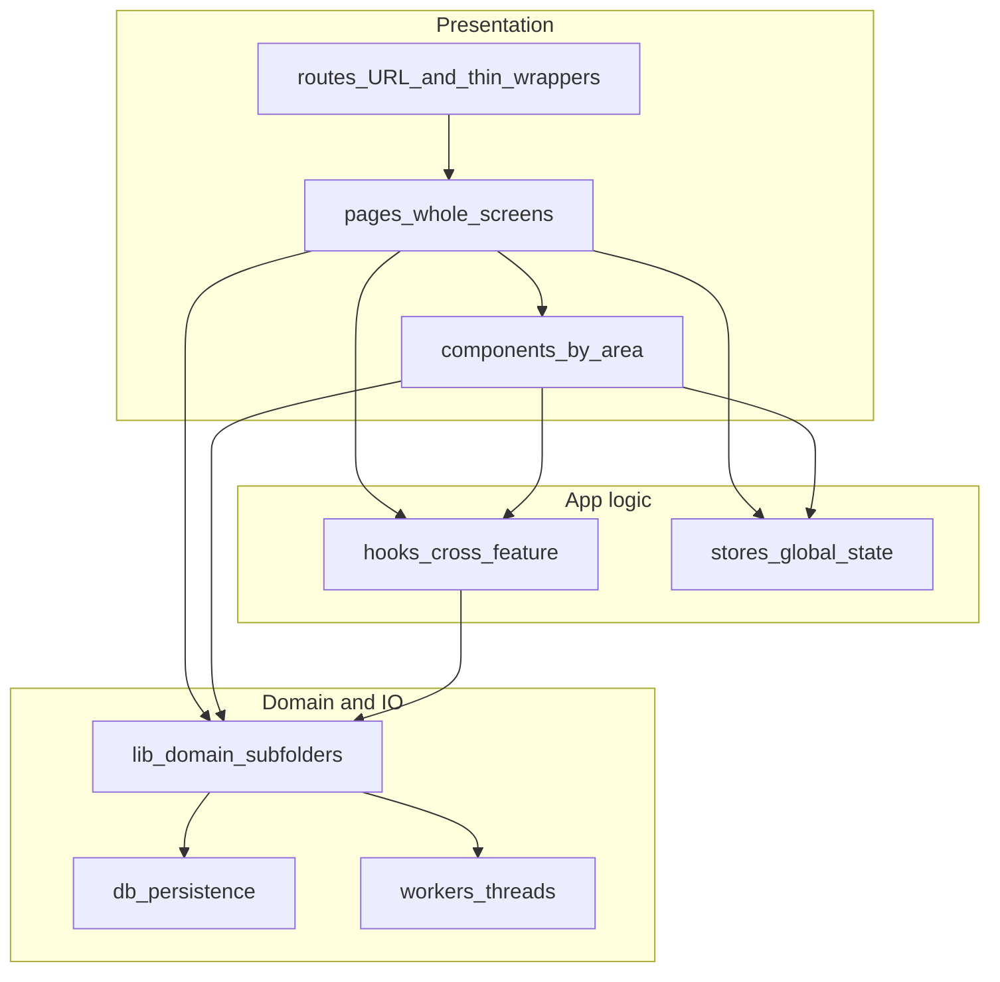

# Two-week remediation + hybrid frontend structure

## Goal (unchanged)

Reduce the highest maintainability and regression risks in ~10 working days using small, reviewable PRs. **Add:** a single, written **frontend structure contract** so new code (and agents) default to the hybrid model instead of flat [`frontend/src/lib/`](frontend/src/lib/).

## Hybrid model (authoritative summary)

**Rules**

| Layer | Role |
|--------|------|
| [`frontend/src/routes/`](frontend/src/routes/) | TanStack route modules only: URL, `createFileRoute`, lazy shells, redirects. **No whole-page UI**—import from `pages/`. |
| [`frontend/src/pages/<area>/`](frontend/src/pages/) | Whole page components (`*Page.tsx`). Large screens may use a subfolder (e.g. `pages/wallet/SendPage/`). |
| [`frontend/src/components/<area>/`](frontend/src/components/) | Reusable feature UI (`lab`, `wallet`, `settings`, …). Co-locate tiny private hooks next to a component when truly local. |
| [`frontend/src/lib/<domain>/`](frontend/src/lib/) | Portable domain logic shared across routes—not a flat dump. Use subfolders such as `lib/lab/`, `lib/wallet/`, `lib/lightning/` for new and moved code. |
| [`frontend/src/hooks/`](frontend/src/hooks/), [`frontend/src/stores/`](frontend/src/stores/) | Cross-feature hooks and global client state. |
| [`frontend/src/db/`](frontend/src/db/), [`frontend/src/workers/`](frontend/src/workers/) | Persistence and worker boundaries; keep separate from “feature UI” unless a deliberate vertical slice is adopted later. |

**`pages/` migration status:** Wallet, settings, setup, and privacy are migrated. **Lab and Library are pending**—page components still live inline in `routes/lab/` and `routes/library/`.

**Guardrails (reviews + agents)**

- **Do not add whole-page UI to `routes/`**; use `pages/<area>/` and thin route imports.
- Prefer **no new single-purpose files at `lib/` root**; add under `lib/<domain>/` (or an agreed cross-cutting name like `lib/shared/` for truly generic helpers).
- **Reusable UI in `components/`**, **screen composition in `pages/`**; `lib/` stays mostly non-UI pure logic, types, and formatters.
- Optional later strictness: `lib` must not import from `components`; `routes` should not accumulate business logic.

**Relationship to a full “features/” layout:** Not required. The hybrid above matches TanStack file-based routes, `pages/` for screens, and existing `components/<area>/` usage; avoid duplicating `routes/` + `pages/` + `features/` for the same screen without a migration project.

## Changes to the existing PR sequence

### New: doc PR (fold into Week 1, right after or with PR-1)

- **Scope:** Add a short markdown doc (e.g. [`frontend/docs/FRONTEND_STRUCTURE.md`](frontend/docs/FRONTEND_STRUCTURE.md) or a “Frontend layout” section in [`frontend/README.md`](frontend/README.md) if it exists) containing the table + guardrails above—**no mass file moves** in this PR.
- **Effort:** Small (&lt; 0.5 day).
- **Risk:** Low.
- **Validation:** Link from root [`README.md`](README.md) or [`CONTRIBUTING.md`](CONTRIBUTING.md) if the repo uses one; otherwise `frontend/README.md` is enough.

### Align existing PR bullets (wording only—no scope creep)

- **PR-3 / PR-5:** When extracting hooks or pure functions, **place them** under `components/settings/` or `pages/wallet/...` / `components/wallet/...` / `lib/wallet/` (or `lib/send/`) per the doc—not new loose `lib/foo.ts` at root unless justified as cross-domain. Send flow logic lives in `pages/wallet/SendPage/`; the route file is already a thin shell.
- **PR-4:** Invalidation helpers remain in wallet domain; path can evolve toward `lib/wallet/` in the same PR or a tiny follow-up—document the target in the structure doc.

### Backlog (explicitly out of the 2-week critical path)

- **`pages/` migration (Lab, Library):** Move inline page components from `routes/lab/` and `routes/library/` into `pages/lab/` and `pages/library/` in small PRs. Wallet, settings, setup, and privacy are already migrated.
- **Gradual `lib/` migration:** Move prefixed clusters (`lab-*.ts`, `lightning-*.ts`, …) from flat `lib/` into `lib/lab/`, `lib/lightning/`, etc., in small PRs after the conference or when touching those files.

## Updated sequence

- **Day 1:** PR-1 (CI gates) **+ structure doc** (same day or immediately after PR-1 merge).
- **Days 2–10:** Unchanged PR-2 through PR-8; reviewers use the structure doc as the default placement rule.

## Definition of Done (additions)

- A checked-in **frontend structure** doc exists and is referenced from the main developer entrypoint.
- Hotspot extractions in PR-3 and PR-5 **follow** the documented placement (called out in PR descriptions).
- Backlog ticket(s) for optional `lib/` subdirectory migration, if not started in the two weeks.

## File to update after plan approval

Apply the above sections into [`.cursor/plans/two_week_remediation_roadmap_4e11cfd8.plan.md`](.cursor/plans/two_week_remediation_roadmap_4e11cfd8.plan.md): insert **Frontend folder structure (hybrid)** and **Guardrails**, add the **doc PR** to Week 1, extend **Definition of Done**, add **Backlog** bullets, and adjust the **YAML `todos`** with a new item (e.g. `week1-frontend-structure-doc`) if you track todos from frontmatter.
