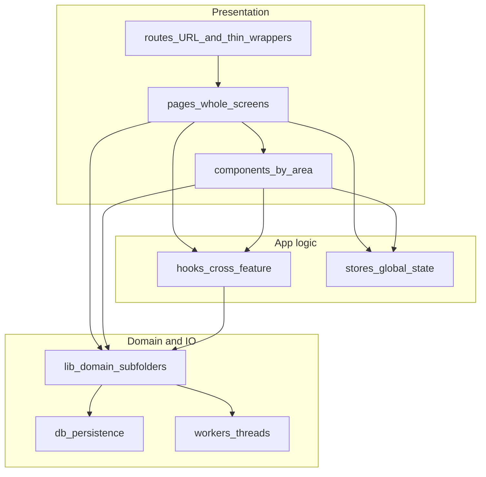
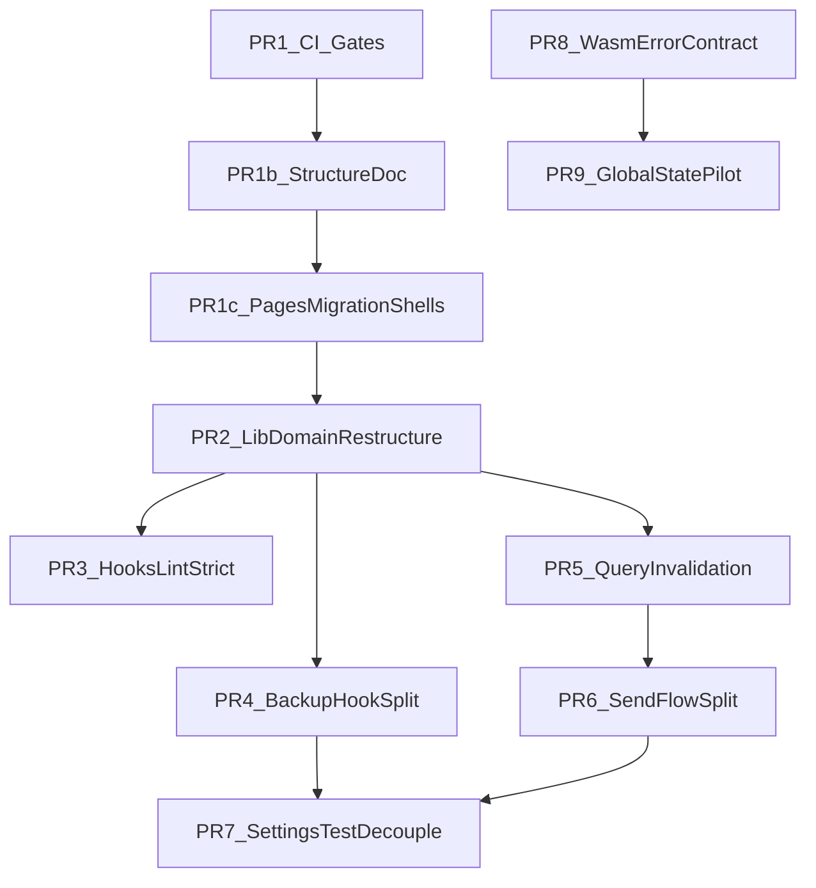

# Remediation Roadmap

## Goal

Reduce the highest maintainability and regression risks using small, reviewable PRs with clear sequencing and validation gates.

**Current priority:** hotspot refactors (PR-4, PR-5) and remaining deferred queue items per dependency order below.

## Prioritization Principles

- Fix guardrails first so later refactors are safer. **(Done — PR #32.)**
- **Next:** structural alignment (`lib/<domain>/`) before feature-level extractions—reduces noise in every subsequent PR.
- Prefer mechanical moves with unchanged behavior before logic changes.
- Keep each PR independently releasable and testable.
- Follow the [frontend structure doc](frontend/docs/FRONTEND_STRUCTURE.md) when placing code.

## Progress

| PR | Status | Notes |
|----|--------|-------|
| PR-1 | **Done** (Day 1, PR #32) | Frontend CI lint / unit / typecheck |
| PR-1b | **Done** (Day 1, PR #32) | [frontend/docs/FRONTEND_STRUCTURE.md](frontend/docs/FRONTEND_STRUCTURE.md) |
| PR-1c | **Done** (Day 1, PR #32) | Routes → pages shell migration (wallet, lab partial, library shells) |
| PR-2 | **Done** | `lib/` domain restructuring |
| PR-3 | **Done** | `react-hooks/exhaustive-deps` promoted to error |
| PR-4 – PR-9 | **Deferred** | See queue below |

## Frontend Folder Structure (Hybrid)

**Rules**

| Layer | Role |
|--------|------|
| [`frontend/src/routes/`](frontend/src/routes/) | TanStack route modules only: URL, `createFileRoute`, lazy shells, redirects. **No whole-page UI**—import from `pages/`. |
| [`frontend/src/pages/<area>/`](frontend/src/pages/) | Whole page components (`*Page.tsx`). Large screens may use a subfolder (e.g. `pages/wallet/SendPage/`). |
| [`frontend/src/components/<area>/`](frontend/src/components/) | Reusable feature UI (`lab`, `wallet`, `settings`, …). Co-locate tiny private hooks next to a component when truly local. |
| [`frontend/src/lib/<domain>/`](frontend/src/lib/) | Portable domain logic shared across routes—not a flat dump. Use subfolders such as `lib/lab/`, `lib/wallet/`, `lib/lightning/` for new and moved code. |
| [`frontend/src/hooks/`](frontend/src/hooks/), [`frontend/src/stores/`](frontend/src/stores/) | Cross-feature hooks and global client state. |
| [`frontend/src/db/`](frontend/src/db/), [`frontend/src/workers/`](frontend/src/workers/) | Persistence and worker boundaries; keep separate from “feature UI” unless a deliberate vertical slice is adopted later. |

**`pages/` migration status:** Wallet, settings, setup, privacy, library route shells, and part of lab live under `pages/`. **Lab is partially migrated**—four route files still hold inline page UI. Article **content** modules remain under `routes/library/articles/` (see backlog). Authoritative detail: [frontend/docs/FRONTEND_STRUCTURE.md](frontend/docs/FRONTEND_STRUCTURE.md).

| Area | Status |
|--------|--------|
| `wallet/` | **Migrated** — includes `WalletsPage`, `SendPage/`, etc. |
| `settings/`, `setup/`, `privacy/` | Migrated |
| `library/` | **Shells migrated** — index, history, favorites, article, tags in `pages/library/` |
| `lab/` | **Partial** — `BlocksPage`, `ControlPage`, `Layer2Page` done; transactions, block detail, tx detail still inline |

**Guardrails (reviews + agents)**

- **Do not add whole-page UI to `routes/`**; use `pages/<area>/` and thin route imports (see [frontend/docs/FRONTEND_STRUCTURE.md](frontend/docs/FRONTEND_STRUCTURE.md)).
- Prefer **no new single-purpose files at `lib/` root**; add under `lib/<domain>/` (or `lib/shared/` for truly generic helpers).
- **Reusable UI in `components/`**, **screen composition in `pages/`**; `lib/` stays mostly non-UI pure logic, types, and formatters.
- Optional later strictness: `lib` must not import from `components`; `routes` should not accumulate business logic.

**Relationship to a full “features/” layout:** Not required. The hybrid above matches TanStack file-based routes, `pages/` for screens, and existing `components/<area>/` usage; avoid duplicating `routes/` + `pages/` + `features/` for the same screen without a migration project.

---

## Phase 1 — Foundation (completed)

> Delivered in **PR #32 (“Remediation basics”)**, Day 1: PR-1, PR-1b, PR-1c + CI triggers for version branches.

### PR-1: Frontend CI quality gates ✓

- **Scope**
  - Add frontend lint, unit test, and typecheck jobs to CI workflow.
  - Ensure failures block merge.
- **Files**
  - [.github/workflows/general.yml](.github/workflows/general.yml)
  - [frontend/package.json](frontend/package.json)
- **Effort**: Small (0.5-1 day)
- **Risk**: Low
- **Expected impact**: Immediate prevention of frontend quality regressions.
- **Validation**
  - CI runs lint + unit + typecheck on PRs targeting `main` and version branches (`v{n}.{m}`, `v{n}.{m}.{k}`).
  - No flaky baseline failures after 2 consecutive runs.

### PR-1b: Frontend structure doc ✓

- **Scope**
  - Add [frontend/docs/FRONTEND_STRUCTURE.md](frontend/docs/FRONTEND_STRUCTURE.md) containing the hybrid model table and guardrails above.
  - Link from [frontend/README.md](frontend/README.md) (and root [README.md](README.md) if appropriate).
- **Effort**: Small (< 0.5 day)
- **Risk**: Low
- **Expected impact**: Single placement contract for reviewers, contributors, and agents.
- **Validation**
  - Doc is linked from the main developer entrypoint.
  - PR descriptions for later PRs reference it for file placement.

### PR-1c: Routes → pages migration (shell thinning) ✓

- **Scope**
  - Move whole-page UI out of `routes/` into `pages/` for areas not yet thinned, keeping route files as `createFileRoute` + import shells only.
  - **Delivered in PR #32:**
    - `pages/wallet/WalletsPage` ← `routes/wallet/wallets.tsx`
    - `pages/lab/BlocksPage`, `ControlPage`, `Layer2Page` ← `routes/lab/blocks.tsx`, `control.tsx`, `layer-2.tsx`
    - `pages/library/` — `LibraryIndexPage`, `HistoryPage`, `FavoritesPage`, `ArticlePage`, `TagsPage` ← corresponding `routes/library/*` shells
  - **Still backlog** (see below): remaining lab routes (`transactions`, block detail, tx detail); library article **content** modules under `routes/library/articles/` (registry glob change).
- **Effort**: Small-Medium (0.5–1 day, mechanical moves)
- **Risk**: Low-Medium (wide touch surface, behavior should be unchanged)
- **Expected impact**: Aligns codebase with hybrid structure; reduces route-file hotspot size.
- **Validation**
  - Route files contain no whole-page UI (for migrated routes).
  - Existing unit and E2E tests pass; migration status table in structure doc matches repo.

---

## Phase 2 — `lib/` domain restructuring (completed)

### PR-2: `lib/` domain restructuring ✓

**Why now:** ~106 modules still sit at `frontend/src/lib/` root. Only `library/`, partial `lightning/`, and a single `wallet/` file use subfolders. Every subsequent remediation PR touches `lib/` imports; fixing layout first removes the biggest navigation pain.

**Scope**

- Move all flat `lib/*.ts` / `lib/*.tsx` (and co-located `lib/__tests__/*` where domain-specific) into domain subfolders.
- Update all `@/lib/...` imports across `frontend/src/` (and tests).
- **No behavior changes** — mechanical file moves + import path updates only.
- Leave `lib/__tests__/` only for truly cross-domain tests, or relocate tests next to their domain (`lib/<domain>/__tests__/`).

**Target domain layout**

| Domain folder | Typical contents (from current flat root) |
|---------------|-------------------------------------------|
| `lib/lab/` | `lab-*`, `switch-to-lab-network`, lab backup constants/import |
| `lib/wallet/` | `wallet-*`, `descriptor-wallet-manager`, `bip21`, `bitcoin-*`, `send-*`, `onchain-*`, wallet backup import/constants, `wallet-domain-types`, settings wallet switch helpers |
| `lib/lightning/` | All `lightning-*`, `nwc-*` (expand existing subfolder) |
| `lib/library/` | Already populated — leave as-is |
| `lib/fiat/` | `fiat-*`, `format-fiat-display`, `supported-fiat-currencies`, `iso-4217-alpha3`, `is-usable-btc-spot-price-in-fiat` |
| `lib/esplora/` | `esplora-*`, `mainnet-onchain-balance-probe` |
| `lib/faucet/` | `faucet-*` (definitions, matching—distinct from Esplora; uses `/api/faucet/` proxy, not Esplora provider logic) |
| `lib/settings/` | `execute-settings-address-type-switch`, `network-mode-switch`, strict migrations, `feature-toggle-async`, `persisted-store-hydration`, backup ZIP export helpers |
| `lib/infomode/` | Hint logic, primary-action detection, suppression feedback (pairs with `components/infomode/` and `stores/infomodeStore`) |
| `lib/shared/` | `utils`, `app-*`, `sanitize-error-for-ui`, `validate-proxied-upstream-url`, `backup-zip-invalid-error`, `read-file-as-array-buffer`, `kdf-phc-constants`, `argon2-ci-env`, `encrypted-blob-types`, `tab-scoped-broadcast-channel-sync`, `legal-locale`, `pathname-requires-wallet-crypto-session`, `bad-local-chain-state-error` |
| `db/opfs/` | `opfs-*`, SQLite OPFS basename constants, replace-and-reload, wipe-all-app-data (moved out of `lib/shared/` post–PR-2) |

**Files**

- [frontend/src/lib/](frontend/src/lib/) — all moves
- Import sites across `frontend/src/` (routes, pages, components, hooks, stores, workers, tests)

**Effort**: Medium–High (1.5–2.5 days — wide touch surface, mostly mechanical)

**Risk**: Medium (missed import, broken test path, circular dependency surfaced by new grouping)

**Expected impact**: Largest maintainability win in the remediation program; agents and humans can locate domain logic; later PRs land files in the right place by default.

**Validation**

- `npm run lint`, `npm test -- --run`, and `tsc --noEmit` pass in `frontend/`.
- No files remain at `lib/` root except an optional `index.ts` / barrel (prefer none — avoid new indirection unless needed for `@/lib` path stability during transition).
- [frontend/docs/FRONTEND_STRUCTURE.md](frontend/docs/FRONTEND_STRUCTURE.md) migration backlog updated to reflect completed `lib/` move.

**Out of scope for PR-2**

- Logic refactors, renames beyond path changes, or splitting large modules.
- `pages/` remaining migration (lab transactions/block/tx routes; library article content modules).

---

## Phase 3 — Deferred queue (after PR-2)

Order may shift, but **do not start these until PR-2 merges** — later PRs assume stable `lib/<domain>/` paths.

### PR-3: Tighten lint signal for hooks correctness ✓

- **Scope**
  - Promote `react-hooks/exhaustive-deps` from warning to error.
  - Resolve newly surfaced violations in touched files only.
- **Files**
  - [frontend/eslint.config.js](frontend/eslint.config.js)
  - hotspot files as needed (e.g. [frontend/src/components/settings/use-data-backups-card.ts](frontend/src/components/settings/use-data-backups-card.ts))
- **Effort**: Small-Medium (1 day)
- **Risk**: Low-Medium
- **Expected impact**: Reduces stale closure and dependency drift bugs.
- **Validation**
  - Lint passes with zero warnings budget.
  - No functional regression in related tests.
- **Delivered:** config-only change; baseline lint was already clean (no code fixes required).

### PR-4: Break up backup/import orchestration hook (phase 1)

- **Scope**
  - Extract `useWalletBackupExport` and `useWalletBackupImport` from monolithic hook.
  - Preserve existing UI behavior and toast semantics.
  - **Placement:** new hooks under `components/settings/` per the structure doc—not loose `lib/` root files. Backup domain logic lives under `lib/wallet/` after PR-2.
- **Files**
  - [frontend/src/components/settings/use-data-backups-card.ts](frontend/src/components/settings/use-data-backups-card.ts)
  - new hooks under [frontend/src/components/settings/](frontend/src/components/settings/)
  - [frontend/src/components/settings/DataBackupsCard.tsx](frontend/src/components/settings/DataBackupsCard.tsx)
- **Effort**: Medium (1.5-2 days)
- **Risk**: Medium
- **Expected impact**: Reduces local complexity and isolates side effects.
- **Validation**
  - Existing settings tests pass.
  - New focused unit tests for extracted hooks added.

### PR-5: Query invalidation contract hardening

- **Scope**
  - Define wallet query-key prefix convention and migrate top-impact call sites.
  - Keep compatibility list during transition.
  - **Placement:** invalidation helpers in wallet domain (`lib/wallet/` after PR-2); document target in structure doc if not moved in PR-2.
- **Files**
  - [frontend/src/lib/wallet-related-query-invalidation.ts](frontend/src/lib/wallet-related-query-invalidation.ts) (path updates per PR-2)
  - wallet query modules/hooks
- **Effort**: Medium (1 day)
- **Risk**: Medium
- **Expected impact**: Reduces stale data and missed invalidation risk.
- **Validation**
  - Cross-tab and wallet-switch tests remain green.
  - Invalidation list shrinks or is formally deprecated.

### PR-6: Send flow decomposition (phase 1)

- **Scope**
  - Extract pure calculators/validators from [`pages/wallet/SendPage/`](frontend/src/pages/wallet/SendPage/) into small modules.
  - Keep [`routes/wallet/send.tsx`](frontend/src/routes/wallet/send.tsx) as a thin lazy-load shell (already migrated).
  - **Placement:** pure logic under `lib/wallet/` or `lib/wallet/send/`; UI orchestration under `pages/wallet/SendPage/` or `components/wallet/send/` per the structure doc.
- **Files**
  - [frontend/src/pages/wallet/SendPage/](frontend/src/pages/wallet/SendPage/)
  - [frontend/src/routes/wallet/send.tsx](frontend/src/routes/wallet/send.tsx) (shell only—no new logic)
  - new utilities/hooks under send-related directories per structure doc
- **Effort**: Medium-High (2 days)
- **Risk**: Medium-High
- **Expected impact**: Improves testability and lowers change blast radius in critical flow.
- **Validation**
  - Existing send page/route tests pass.
  - Add targeted unit tests for extracted pure functions.

### PR-7: Deflake and de-couple settings route tests

- **Scope**
  - Replace deep module mock chains with higher-level test harness utilities.
  - Keep only essential boundary mocks.
- **Files**
  - [frontend/src/routes/__tests__/settings.test.tsx](frontend/src/routes/__tests__/settings.test.tsx)
  - test helpers in [frontend/src/test-utils/](frontend/src/test-utils/)
- **Effort**: Medium (1-1.5 days)
- **Risk**: Medium
- **Expected impact**: More resilient tests and safer refactors.
- **Validation**
  - Lower mock count and simpler setup.
  - Stable local and CI pass rates.

### PR-8: Rust WASM error contract shaping

- **Scope**
  - Introduce stable error codes at WASM boundary (message remains for UX).
  - Avoid broad rewrite of internal error plumbing in this iteration.
- **Files**
  - [crypto/src/error.rs](crypto/src/error.rs)
  - [crypto/src/lib.rs](crypto/src/lib.rs)
- **Effort**: Medium (1-1.5 days)
- **Risk**: Medium
- **Expected impact**: Better diagnostics and forward-compatible API behavior.
- **Validation**
  - WASM boundary tests cover code+message mapping.
  - Frontend handles structured error payloads.

### PR-9: Crypto global state reduction spike (safe slice)

- **Scope**
  - Introduce explicit wallet/session handle for one narrow path (pilot), retaining compatibility.
  - Document migration plan for remaining APIs.
- **Files**
  - [crypto/src/lib.rs](crypto/src/lib.rs)
  - related consumers in frontend worker/interop layer
- **Effort**: High (2 days)
- **Risk**: High
- **Expected impact**: Validates path away from hidden global state.
- **Validation**
  - No regression in wallet load/send critical path.
  - Pilot path uses explicit state successfully.

## Sequence and Dependency Map

## Delivery Cadence (revised)

- **Day 1:** PR-1 + PR-1b + PR-1c — **done** (PR #32)
- **Next:** PR-2 (`lib/` domain restructuring) — sole focus until merged
- **Then:** PR-3 through PR-9 in dependency order above; no fixed two-week calendar — pace by review bandwidth and CI stability

Suggested pacing after PR-2 (adjust as needed):

- PR-3 (hooks lint) — 1 day
- PR-4 + PR-5 — days 3–5 (backup hook, query invalidation)
- PR-6 + PR-7 — days 6–8 (send decomposition, settings tests)
- PR-8 + PR-9 — days 9–10+ (Rust boundary work)

Reviewers use the structure doc as the default placement rule from Day 1 onward.

## Backlog (outside current PR queue)

- **`pages/` migration (remaining):** Lab `transactions`, block detail, tx detail routes → `pages/lab/`; library article content modules under `routes/library/articles/` when registry glob is updated.
- **Optional strictness:** `lib` must not import from `components`; routes must stay thin — lint or review convention.
- **Barrel files / path aliases:** Only if PR-2 reveals importers that need temporary re-export shims; remove shims in a follow-up.

## Definition of Done (program-level)

- [x] Frontend CI enforces lint/unit/typecheck on every PR.
- [x] A checked-in **frontend structure** doc exists and is referenced from the main developer entrypoint.
- [x] Flat `lib/` root eliminated; domain subfolders match structure doc (PR-2).
- [ ] Hotspot extractions in PR-4 and PR-6 **follow** the documented placement (called out in PR descriptions).
- [ ] At least 2 major hotspot files reduced in complexity through extraction.
- [ ] One cross-cutting coupling risk reduced (query invalidation or global state path).
- [ ] No increase in flaky test behavior across 3 consecutive CI runs after each merged PR.
- [ ] Follow-up backlog created for remaining structural work with scoped tickets (pages migration leftovers, optional strictness).
