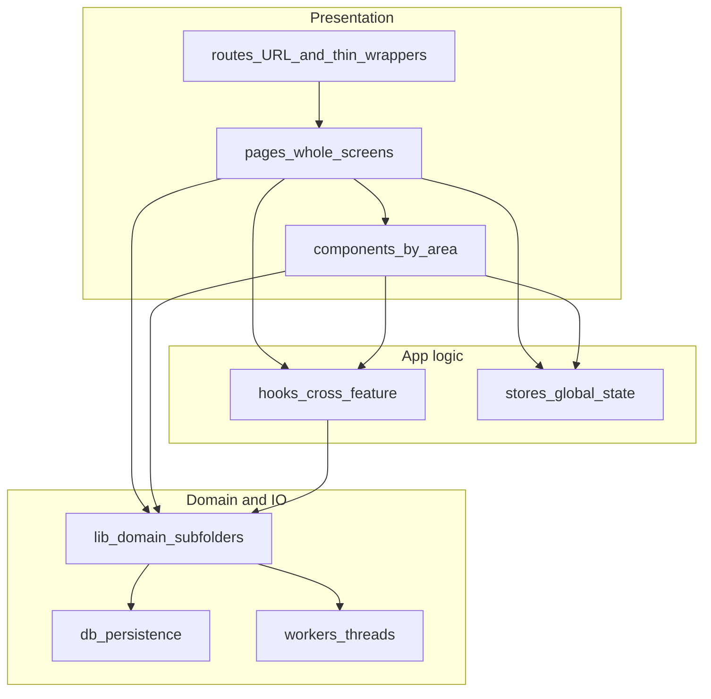
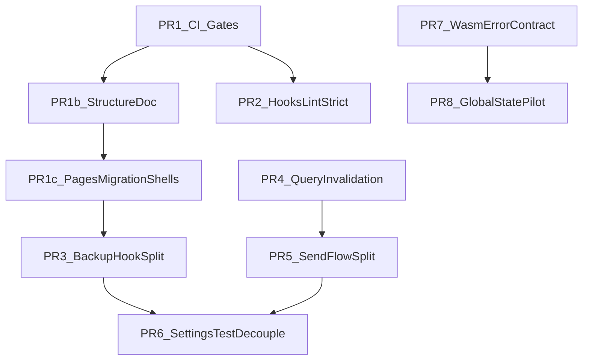

# Two-Week Remediation Roadmap

## Goal

Reduce the highest maintainability and regression risks in ~10 working days using small, reviewable PRs with clear sequencing, owner expectations, and validation gates.

**Add:** a single, written **frontend structure contract** so new code (and agents) default to the hybrid model instead of flat [`frontend/src/lib/`](frontend/src/lib/).

## Prioritization Principles

- Fix guardrails first so later refactors are safer.
- Prefer extraction and boundary-hardening over behavior changes.
- Keep each PR independently releasable and testable.
- Defer broad rewrites; focus on risk-reduction slices.
- Follow the [frontend structure doc](frontend/docs/FRONTEND_STRUCTURE.md) when placing extracted code.

## Frontend Folder Structure (Hybrid)

**Rules**

| Layer | Role |
|--------|------|
| [`frontend/src/routes/`](frontend/src/routes/) | TanStack route modules only: URL, `createFileRoute`, lazy shells, redirects. **No whole-page UI**—import from `pages/`. |
| [`frontend/src/pages/<area>/`](frontend/src/pages/) | Whole page components (`*Page.tsx`). Large screens may use a subfolder (e.g. `pages/wallet/SendPage/`). |
| [`frontend/src/components/<area>/`](frontend/src/components/) | Reusable feature UI (`lab`, `wallet`, `settings`, …). Co-locate tiny private hooks next to a component when truly local. |
| [`frontend/src/lib/<domain>/`](frontend/src/lib/) | Portable domain logic shared across routes—not a flat dump. Use subfolders such as `lib/lab/`, `lib/wallet/`, `lib/lightning/` for new and moved code. |
| [`frontend/src/hooks/`](frontend/src/hooks/), [`frontend/src/stores/`](frontend/src/stores/) | Cross-feature hooks and global client state. |
| [`frontend/src/db/`](frontend/src/db/), [`frontend/src/workers/`](frontend/src/workers/) | Persistence and worker boundaries; keep separate from “feature UI” unless a deliberate vertical slice is adopted later. |

**`pages/` migration status:** Wallet, settings, setup, privacy, library route shells, and part of lab live under `pages/`. **Lab is partially migrated**—four route files still hold inline page UI. Article **content** modules remain under `routes/library/articles/` (see backlog). Authoritative detail: [frontend/docs/FRONTEND_STRUCTURE.md](frontend/docs/FRONTEND_STRUCTURE.md).

| Area | Status |
|--------|--------|
| `wallet/` | **Migrated** — includes `WalletsPage`, `SendPage/`, etc. |
| `settings/`, `setup/`, `privacy/` | Migrated |
| `library/` | **Shells migrated** — index, history, favorites, article, tags in `pages/library/` |
| `lab/` | **Partial** — `BlocksPage`, `ControlPage`, `Layer2Page` done; transactions, block detail, tx detail still inline |

**Guardrails (reviews + agents)**

- **Do not add whole-page UI to `routes/`**; use `pages/<area>/` and thin route imports (see [frontend/docs/FRONTEND_STRUCTURE.md](frontend/docs/FRONTEND_STRUCTURE.md)).
- Prefer **no new single-purpose files at `lib/` root**; add under `lib/<domain>/` (or an agreed cross-cutting name like `lib/shared/` for truly generic helpers).
- **Reusable UI in `components/`**, **screen composition in `pages/`**; `lib/` stays mostly non-UI pure logic, types, and formatters.
- Optional later strictness: `lib` must not import from `components`; `routes` should not accumulate business logic.

**Relationship to a full “features/” layout:** Not required. The hybrid above matches TanStack file-based routes, `pages/` for screens, and existing `components/<area>/` usage; avoid duplicating `routes/` + `pages/` + `features/` for the same screen without a migration project.

## Week 1 (Days 1-5): Safety Rails + Highest-Leverage Decomposition

> **PR #32 (“Remediation basics”)** delivers the Day-1 foundation slice: PR-1, PR-1b, and PR-1c below, plus CI triggers for version branches (`v*.*`, `v*.*.*`).

### PR-1: Frontend CI quality gates

- **Scope**
  - Add frontend lint, unit test, and typecheck jobs to CI workflow.
  - Ensure failures block merge.
- **Files**
  - [.github/workflows/general.yml](.github/workflows/general.yml)
  - [frontend/package.json](frontend/package.json)
- **Effort**: Small (0.5-1 day)
- **Risk**: Low
- **Expected impact**: Immediate prevention of frontend quality regressions.
- **Validation**
  - CI runs lint + unit + typecheck on PRs targeting `main` and version branches (`v{n}.{m}`, `v{n}.{m}.{k}`).
  - No flaky baseline failures after 2 consecutive runs.

### PR-1b: Frontend structure doc (same day or immediately after PR-1)

- **Scope**
  - Add [frontend/docs/FRONTEND_STRUCTURE.md](frontend/docs/FRONTEND_STRUCTURE.md) containing the hybrid model table and guardrails above.
  - Link from [frontend/README.md](frontend/README.md) (and root [README.md](README.md) if appropriate).
- **Effort**: Small (< 0.5 day)
- **Risk**: Low
- **Expected impact**: Single placement contract for reviewers, contributors, and agents.
- **Validation**
  - Doc is linked from the main developer entrypoint.
  - PR descriptions for PR-3–PR-6 reference it for file placement.

### PR-1c: Routes → pages migration (shell thinning)

- **Scope**
  - Move whole-page UI out of `routes/` into `pages/` for areas not yet thinned, keeping route files as `createFileRoute` + import shells only.
  - **Delivered in PR #32:**
    - `pages/wallet/WalletsPage` ← `routes/wallet/wallets.tsx`
    - `pages/lab/BlocksPage`, `ControlPage`, `Layer2Page` ← `routes/lab/blocks.tsx`, `control.tsx`, `layer-2.tsx`
    - `pages/library/` — `LibraryIndexPage`, `HistoryPage`, `FavoritesPage`, `ArticlePage`, `TagsPage` ← corresponding `routes/library/*` shells
  - **Still backlog** (see below): remaining lab routes (`transactions`, block detail, tx detail); library article **content** modules under `routes/library/articles/` (registry glob change).
- **Effort**: Small-Medium (0.5–1 day, mechanical moves)
- **Risk**: Low-Medium (wide touch surface, behavior should be unchanged)
- **Expected impact**: Aligns codebase with hybrid structure; reduces route-file hotspot size.
- **Validation**
  - Route files contain no whole-page UI.
  - Existing unit and E2E tests pass; migration status table in structure doc matches repo.

### PR-2: Tighten lint signal for hooks correctness

- **Scope**
  - Promote `react-hooks/exhaustive-deps` from warning to error.
  - Resolve newly surfaced violations in touched files only.
- **Files**
  - [frontend/eslint.config.js](frontend/eslint.config.js)
  - hotspot files as needed (e.g. [frontend/src/components/settings/use-data-backups-card.ts](frontend/src/components/settings/use-data-backups-card.ts))
- **Effort**: Small-Medium (1 day)
- **Risk**: Low-Medium
- **Expected impact**: Reduces stale closure and dependency drift bugs.
- **Validation**
  - Lint passes with zero warnings budget.
  - No functional regression in related tests.

### PR-3: Break up backup/import orchestration hook (phase 1)

- **Scope**
  - Extract `useWalletBackupExport` and `useWalletBackupImport` from monolithic hook.
  - Preserve existing UI behavior and toast semantics.
  - **Placement:** new hooks under `components/settings/` per the structure doc—not loose `lib/` root files.
- **Files**
  - [frontend/src/components/settings/use-data-backups-card.ts](frontend/src/components/settings/use-data-backups-card.ts)
  - new hooks under [frontend/src/components/settings/](frontend/src/components/settings/)
  - [frontend/src/components/settings/DataBackupsCard.tsx](frontend/src/components/settings/DataBackupsCard.tsx)
- **Effort**: Medium (1.5-2 days)
- **Risk**: Medium
- **Expected impact**: Reduces local complexity and isolates side effects.
- **Validation**
  - Existing settings tests pass.
  - New focused unit tests for extracted hooks added.

### PR-4: Query invalidation contract hardening

- **Scope**
  - Define wallet query-key prefix convention and migrate top-impact call sites.
  - Keep compatibility list during transition.
  - **Placement:** invalidation helpers remain in wallet domain; path can evolve toward `lib/wallet/` in this PR or a tiny follow-up (document target in structure doc).
- **Files**
  - [frontend/src/lib/wallet-related-query-invalidation.ts](frontend/src/lib/wallet-related-query-invalidation.ts)
  - wallet query modules/hooks
- **Effort**: Medium (1 day)
- **Risk**: Medium
- **Expected impact**: Reduces stale data and missed invalidation risk.
- **Validation**
  - Cross-tab and wallet-switch tests remain green.
  - Invalidation list shrinks or is formally deprecated.

## Week 2 (Days 6-10): Hotspot Refactors + Boundary Hardening

### PR-5: Send flow decomposition (phase 1)

- **Scope**
  - Extract pure calculators/validators from [`pages/wallet/SendPage/`](frontend/src/pages/wallet/SendPage/) into small modules.
  - Keep [`routes/wallet/send.tsx`](frontend/src/routes/wallet/send.tsx) as a thin lazy-load shell (already migrated).
  - **Placement:** pure logic under `lib/wallet/` or `lib/send/`; UI orchestration under `pages/wallet/SendPage/` or `components/wallet/send/` per the structure doc.
- **Files**
  - [frontend/src/pages/wallet/SendPage/](frontend/src/pages/wallet/SendPage/)
  - [frontend/src/routes/wallet/send.tsx](frontend/src/routes/wallet/send.tsx) (shell only—no new logic)
  - new utilities/hooks under send-related directories per structure doc
- **Effort**: Medium-High (2 days)
- **Risk**: Medium-High
- **Expected impact**: Improves testability and lowers change blast radius in critical flow.
- **Validation**
  - Existing send page/route tests pass.
  - Add targeted unit tests for extracted pure functions.

### PR-6: Deflake and de-couple settings route tests

- **Scope**
  - Replace deep module mock chains with higher-level test harness utilities.
  - Keep only essential boundary mocks.
- **Files**
  - [frontend/src/routes/__tests__/settings.test.tsx](frontend/src/routes/__tests__/settings.test.tsx)
  - test helpers in [frontend/src/test-utils/](frontend/src/test-utils/)
- **Effort**: Medium (1-1.5 days)
- **Risk**: Medium
- **Expected impact**: More resilient tests and safer refactors.
- **Validation**
  - Lower mock count and simpler setup.
  - Stable local and CI pass rates.

### PR-7: Rust WASM error contract shaping

- **Scope**
  - Introduce stable error codes at WASM boundary (message remains for UX).
  - Avoid broad rewrite of internal error plumbing in this iteration.
- **Files**
  - [crypto/src/error.rs](crypto/src/error.rs)
  - [crypto/src/lib.rs](crypto/src/lib.rs)
- **Effort**: Medium (1-1.5 days)
- **Risk**: Medium
- **Expected impact**: Better diagnostics and forward-compatible API behavior.
- **Validation**
  - WASM boundary tests cover code+message mapping.
  - Frontend handles structured error payloads.

### PR-8: Crypto global state reduction spike (safe slice)

- **Scope**
  - Introduce explicit wallet/session handle for one narrow path (pilot), retaining compatibility.
  - Document migration plan for remaining APIs.
- **Files**
  - [crypto/src/lib.rs](crypto/src/lib.rs)
  - related consumers in frontend worker/interop layer
- **Effort**: High (2 days)
- **Risk**: High
- **Expected impact**: Validates path away from hidden global state.
- **Validation**
  - No regression in wallet load/send critical path.
  - Pilot path uses explicit state successfully.

## Sequence and Dependency Map

## Delivery Cadence

- **Day 1:** PR-1 (CI gates) **+ PR-1b structure doc + PR-1c pages shell migration** — delivered together in PR #32
- **Day 2:** PR-2
- **Days 3-4:** PR-3
- **Day 5:** PR-4
- **Days 6-7:** PR-5
- **Day 8:** PR-6
- **Day 9:** PR-7
- **Day 10:** PR-8 and retrospective

Reviewers use the structure doc as the default placement rule from Day 1 onward.

## Backlog (Explicitly Out of the 2-Week Critical Path)

- **`pages/` migration (remaining):** Extract inline page UI from `routes/lab/transactions.tsx`, `block.$height.tsx`, `block.current.tsx`, and `tx.$txid.tsx` into `pages/lab/`. Move library article **content** TSX modules from `routes/library/articles/` only when updating the glob in `lib/library/articles-registry.ts`—separate from shell migration (shells done in PR #32).
- **Gradual `lib/` migration:** Move prefixed clusters (`lab-*.ts`, `lightning-*.ts`, …) from flat `lib/` into `lib/lab/`, `lib/lightning/`, etc., in small PRs when touching those files.
- **Optional strictness:** Enforce `lib` must not import from `components`; keep routes thin via lint or review convention.

## Definition of Done (Program-Level)

- Frontend CI enforces lint/unit/typecheck on every PR.
- A checked-in **frontend structure** doc exists and is referenced from the main developer entrypoint.
- Hotspot extractions in PR-3 and PR-5 **follow** the documented placement (called out in PR descriptions).
- At least 2 major hotspot files reduced in complexity through extraction.
- One cross-cutting coupling risk reduced (query invalidation or global state path).
- No increase in flaky test behavior across 3 consecutive CI runs.
- Follow-up backlog created for remaining structural work with scoped tickets (including optional `lib/` subdirectory migration if not started in the two weeks).
