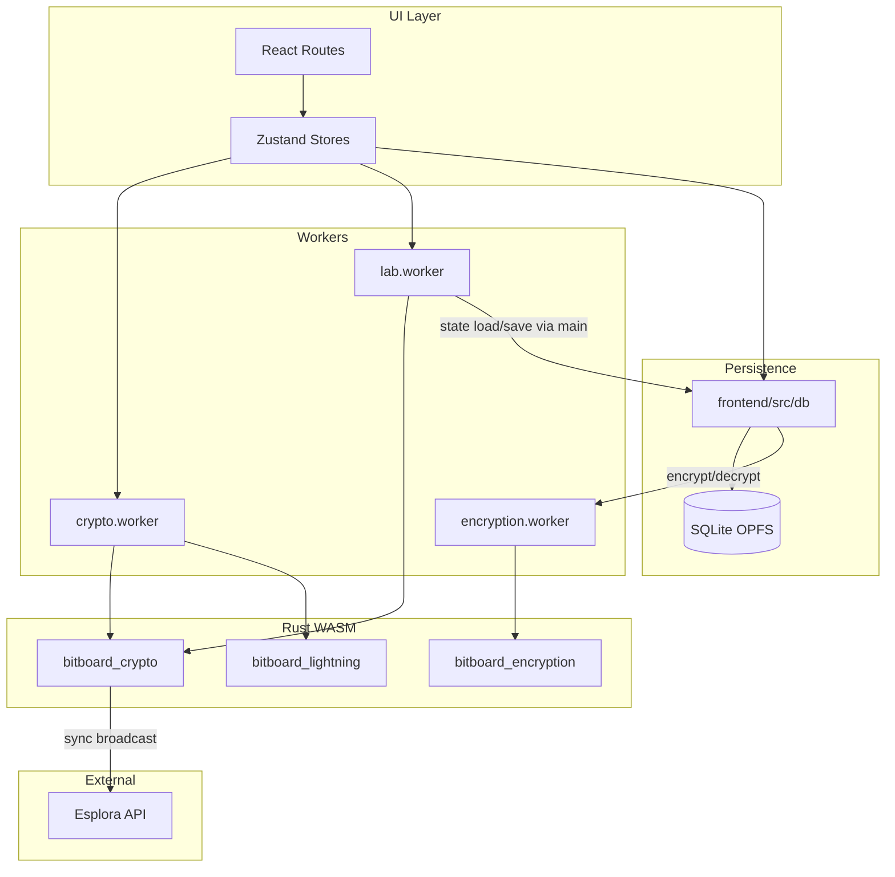

# Application Architecture

## Tech Stack

Bitboard Wallet is a PWA using the following technologies

### Frontend / UI
Language: TypeScript
Build system: Vite
PWA building: vite-plugin-pwa
Framework: React
API handling & data fetching: TanStack Query
Routing: TanStack Route
Global state: TanStack Query for async / worker / DB–backed data; Zustand for UI-only state (see [Client state: TanStack Query and Zustand](#client-state-tanstack-query-and-zustand))
Styling: Tailwind CSS + shadcn/ui
Animation: Motion
Crypto integration: Web workers for WASM
Unit tests: Vitest
Component tests: React Testing Library
End to end tests: Playwright

### Backend / Crypto
Language: Rust → WASM (via wasm-bindgen)
Off-main-thread execution: Web Workers (with Comlink for RPC-like interface)
Database: Sqlite via OPFS and wa-sqlite + AccessHandlePoolVFS (with encryption for sensitive data)
Query builder and schema migrations: Kysely (`Migrator`, tracked in `schema_migrations` per database file)
Encryption: AES-256-GCM + Argon2id (via argon2 Rust crate)
Crypto primitives: BDK (Bitcoin) + LDK (Lightning) via WASM bindings
Key generation: Web Crypto API (crypto.getRandomValues)
Blockchain API: Esplora (light client sync for on-chain)
Lightning node: raw `lightning` crate (rust-lightning) compiled to WASM via `bitboard-lightning` crate
Regtest library: bitcoinerlab/tester
Regtest / Signet / Testnet mode: Built-in via BDK configs

---

## Data and control flow

### Wallet flow

UI (React routes) → Zustand stores (`cryptoStore`, `walletStore`) → `getCryptoWorker()` (Comlink proxy) → `crypto.worker.ts` → WASM `bitboard_crypto` (thread-local wallet state). Sync and broadcast hit Esplora from inside WASM via `EsploraClient` and `WasmSleeper`.

### Persistence flow

UI / stores → `@/db` (hooks, `wallet-persistence`, `database`, `lab-database`) → SQLite (OPFS) via Kysely. Encryption (KDF + encrypt/decrypt) runs **entirely in the encryption worker**; `encryption.ts` delegates `encryptData` and `decryptData` to `getEncryptionWorker()`, so key material and plaintext never touch the main thread. The db layer depends only on the encryption worker for encryption (not the crypto worker).

### Lab flow

UI reads lab chain state from TanStack Query (`['lab','chainState']`); mutations and hydrate go through **`runLabOp`** → `getLabWorker()` → `lab.worker.ts` (in-memory `LabState` plus WASM). Worker state is loaded from SQLite only (never from a stale UI snapshot). For “send from wallet in lab”: `runLabOp` wraps `initLabWorkerWithState` → `prepareLabWalletTransaction` → `buildAndSignLabTransaction` → `addSignedTransactionToMempool` → `persistLabState` → `setQueryData`. Persistence uses `lab-factory` and `getLabDatabase()` on the main thread.

### Esplora

For **mainnet**, **testnet**, and **signet**, default and [whitelisted](frontend/src/lib/esplora-service-whitelist.ts) public Esplora bases are resolved to same-origin paths **`/api/esplora/{providerId}/{network}/…`**. Provider slugs include **`default`**, **`blockstream`**, and **`legacy`**. The **`legacy`** provider targets **testnet3** (Blockstream `/testnet/api`) and **standard signet** on mempool.space, whereas **`default`** uses **testnet4** and Mutinynet for signet. In development, `frontend/vite.config.ts` proxies those paths via `esploraViteProxyEntries()`. On **Vercel**, an **Edge** handler under `frontend/api/esplora/` forwards only allowlisted upstreams so the browser avoids third-party CORS. **Custom** Esplora URLs that are not on the whitelist still call the host directly; Settings shows a warning for those. **Regtest** continues to use `http://localhost:3002` (or a custom URL) without this proxy.

### Component diagram

---

## Client state: TanStack Query and Zustand

**Principle:** **TanStack Query is the primary tool for state that is produced or consumed through asynchronous pipelines**—especially anything that touches **Web Workers**, **WASM**, or **SQLite**. It models loading/error/success, serializes work through mutations and queries, and gives a single cache (`queryClient`) that stays aligned with persisted data when updates run **after** `await persist…` in the mutation function.

**Zustand is for UI and session concerns that do not duplicate worker- or DB-backed domain data.** Examples: theme, modal open/closed, current wizard step, form drafts that are not yet committed, or ephemeral UI flags. If a value can diverge from “what the worker or DB says” because it was updated from another source, it does not belong in Zustand alone—put the source of truth in TanStack Query (or derive from it) and keep Zustand out of that path.

**Why:** Mixing Zustand (or ad hoc React state) with TanStack Query for the **same** logical data creates sync bugs: the UI may read a stale cache or store while a mutation has already persisted to SQLite, or two writers may race. Lab chain state is the reference pattern: **`runLabOp`** + worker + **`persistLabState`**, then **`setQueryData`**; never push a React/Zustand snapshot into the worker as authority.

**Component `useState`:** Fine for strictly local UI (e.g. which accordion is open). Avoid mirroring server/worker/DB entities in component state when those entities are also in Query or Zustand—pick one source of truth per entity.

---

## Boundaries and responsibilities

### Crypto (Rust) — layers

The `crypto` crate is structured in three conceptual layers:

- **Pure / no I/O:** `mnemonic`, `descriptors`, `types`, `transaction`, `wallet`, and largely `lab_psbt`. Used only from `lib.rs` or internal tests. No network or host calls.
- **I/O:** `esplora` (network via `EsploraClient` and `WasmSleeper`), `wasm_sleep` (JS `setTimeout` for async). These modules perform or facilitate out-of-process communication.
- **WASM boundary / glue:** All public JS-facing API lives in `crypto/src/lib.rs` (mnemonic, descriptors, wallet create/load, sync, transaction build/sign, lab build/sign). `crypto/src/lab.rs` also exposes many `#[wasm_bindgen]` functions used by the lab worker (mining, tx build/sign, block effects, keypair, address validation). Key derivation (Argon2) is in the separate **bitboard-encryption** crate and used only by the encryption worker.

Wallet state lives in **thread-local** `ACTIVE_WALLET` and related `RefCell`s in WASM; a single crypto worker holds one logical wallet. Lab-related descriptors are copied into `EXTERNAL_DESCRIPTOR_FOR_LAB` / `INTERNAL_DESCRIPTOR_FOR_LAB` when the wallet is created or loaded.

### On-chain sends: `nLockTime` and fee sniping (design choice)

**Context:** BDK’s default transaction build uses the wallet’s synced chain tip to set a **non-zero** `nLockTime`. That follows common “fee sniping” guidance: tying the spend to the current best height (or a derived lock time) is meant to make certain reorg-based games marginally less attractive.

**Bitboard’s policy:** In `prepare_onchain_send` (`crypto/src/transaction.rs`), the app **overrides** that default with **`nLockTime = 0`** (via BDK’s `nlocktime(…::ZERO)` on the `TxBuilder`).

**Why:** A non-zero lock time means acceptance by the network depends on the **view of chain height** at the moment a node checks whether the transaction is **final**. Any mismatch (sync height vs. the node that handles broadcast, or timing right after a block) can surface as a rejected broadcast (for example Bitcoin Core’s **RPC `sendrawtransaction` error -26, “non-final”**). `nLockTime = 0` is always final under standard finality rules, so broadcasts are **robust** across Esplora sync, PWA, and regtest/CI.

**Trade-off:** We give up BDK’s **default** tip-based `nLockTime` and the extra bit of **theoretical** fee-sniping resistance that comes with it. For typical self-custody retail use, that is an intentional product choice: **reliable send** and predictable behavior matter more than that marginal effect. Wallets that always use `nLockTime = 0` are common for the same reason.

**Scope:** This applies to **on-chain** sends built through `prepare_onchain_send` in the `crypto` crate. Lab and other code paths that build transactions separately are not automatically covered by this section; call sites should document their own lock-time policy if it differs.

### Workers

- **crypto-api** (`frontend/src/workers/crypto-api.ts`): Type-only; defines the `CryptoService` interface. Implementation is in `crypto.worker.ts`, which loads the WASM once and forwards every method to the WASM module. State lives **inside WASM** (thread-locals).
- **lab.worker** (`frontend/src/workers/lab.worker.ts`): Own in-memory `LabState` (blocks, utxos, addresses, mempool, etc.). Loads the **same** WASM (`@/wasm-pkg/bitboard_crypto`) for `lab_*` functions (mine block, build/sign tx, block effects, keypair). It does **not** call the crypto worker; the **main thread** calls both workers when doing “wallet send in lab” (see `useSendMutations.ts` and lab-api’s `prepareLabWalletTransaction` / `addSignedTransactionToMempool`).

So: **two workers each load the same wallet WASM** (crypto and lab; two instances). The **encryption worker** loads only the WASM in `wasm-pkg/bitboard_encryption/` (Argon2id KDF) and performs AES-GCM encrypt/decrypt using Web Crypto in the worker; derived keys and plaintext exist only in that worker, and it has no wallet or Bitcoin code. Wallet-backed lab sends rely on the **crypto** worker’s loaded wallet (descriptors stored in WASM when the wallet is loaded). Comlink passes only serializable data; lab state is sent in/out via `loadState` / `getStateSnapshot`; persistence is done on the main thread via `lab-factory.ts` and `getLabDatabase()`.

### Persistence

- **DB:** `frontend/src/db`: `database.ts` / `lab-database.ts`, schema, Kysely, storage adapter (OPFS). The app uses **two** SQLite files in OPFS (`bitboard-wallet` and `bitboard-lab`), each opened via `kysely-wasqlite-worker`. Wallet metadata is in the `wallets` table; sensitive payload in `wallet_secrets` (encrypted).
- **SQLite migrations:** All schema changes must go through **Kysely’s `Migrator`** (`frontend/src/db/migrations/`). Each database file has its own migration history in `schema_migrations` and a lock table `schema_migrations_lock` (required by Kysely). Add new migration modules under `frontend/src/db/migrations/wallet/` or `frontend/src/db/migrations/lab/` with an **ISO 8601 date-time prefix** in the filename (lexicographic order defines run order), register them in `wallet-migration-provider.ts` or `lab-migration-provider.ts`, and run them via `runWalletMigrations` / `runLabMigrations`. Do **not** ship ad-hoc DDL in `database.ts` or `lab-database.ts`. Do **not** edit migration files that have already been released; add a new forward migration instead. Wallet migrations typically omit `down` when rollback would be unsafe. **Wallet** migrations are retried a few times with a short delay (intermittent OPFS/worker errors); if they still fail, a JSON diagnostic is written to OPFS as `wallet-schema-migration-failure.json` (best effort) before the error propagates. **Lab** migrations use the same retry pattern but do not write that report (lab state can be reset).
- **Encryption:** `encryption.ts` delegates to `getEncryptionWorker()` for `encryptData` and `decryptData`; the worker performs Argon2id KDF (WASM in `wasm-pkg/bitboard_encryption/`) and AES-GCM via Web Crypto. **Persistence depends only on the encryption worker**; key derivation and symmetric encrypt/decrypt are isolated there (no key material on the main thread).
- **Sensitive data:** Mnemonics and descriptor wallets live in `WalletSecrets`; encrypted at rest in `wallet_secrets`; decrypted only in memory when needed (e.g. to load the wallet into the crypto worker). Lab DB stores WIFs in `lab_addresses` (lab-only, not production keys). Sensitive data exists in memory only in the worker or main thread during unlock and during operations; it is not logged.

---

## Dependencies and coupling

### Dependency directions

- **UI / routes** → stores, db (hooks, persistence), workers (via stores).
- **Stores** → worker factories (`getCryptoWorker`, `getLabWorker`), db (e.g. `sqliteStorage`, `walletStore`).
- **db** → `getEncryptionWorker()` from `encryption.ts` (encrypt/decrypt) and `kdf.ts` (deriveKeyBytes); `lab-factory` (main thread) → `getLabDatabase`, `ensureLabMigrated`.
- **Workers** → WASM only; no worker imports from `@/db` or from the other worker.

### Circular dependencies

There is **no** strict cycle: db → encryption worker (for encrypt/decrypt and KDF); workers do not import db or each other. Lab state is loaded/saved from the **main thread** in lab-factory, not from inside the lab worker.

### Notable coupling

- **Persistence → encryption worker:** The db layer uses `getEncryptionWorker()` from `encryption.ts` (encryptData/decryptData) and `kdf.ts` (deriveKeyBytes). Key derivation and AES-GCM encrypt/decrypt run in the encryption worker (WASM Argon2 in `wasm-pkg/bitboard_encryption/` plus Web Crypto in the worker); it has no wallet or Bitcoin code.
- **Duplicate WASM load:** Two workers (crypto and lab) each instantiate `@/wasm-pkg/bitboard_crypto`. This is acceptable (separate processes, no shared mutable state) but should be kept in mind—there is no single shared WASM instance.
- **Lab vs wallet types:** `lab-api` and `crypto-types` are separate; `TransactionDetails` (crypto) and lab’s tx details are different types. No circular type dependency; wallet and lab have separate type surfaces.

### Who may import whom

- **db** may import the encryption worker factory for encryption (`encryption.ts`: encryptData/decryptData; `kdf.ts`: deriveKeyBytes).
- **Workers** must not import db or app stores.