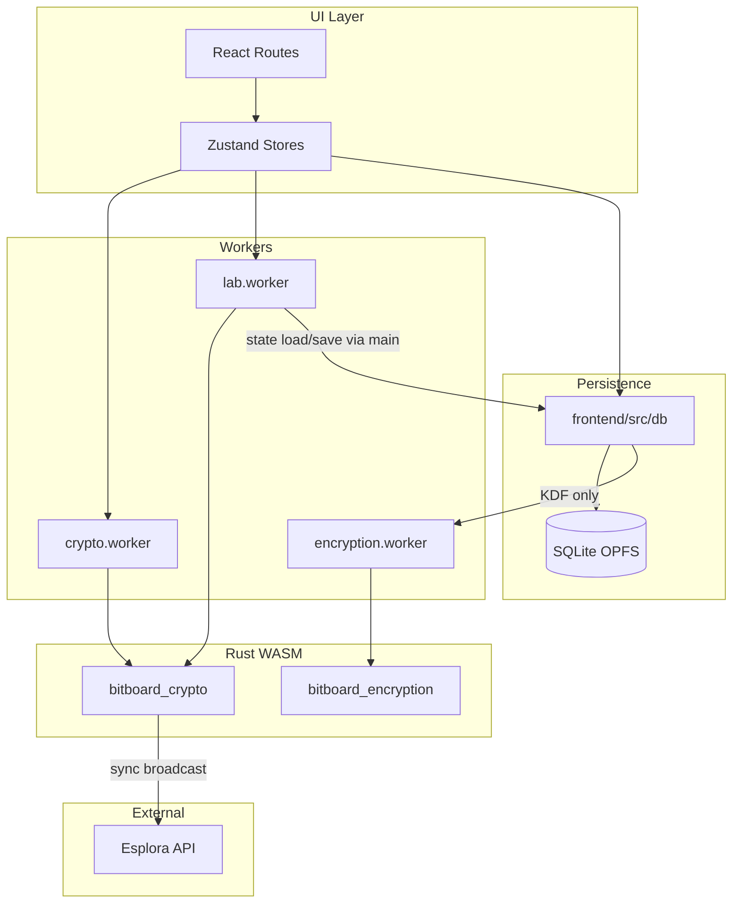

# Application Architecture

## Tech Stack

Bitboard Wallet is a PWA using the following technologies

### Frontend / UI
Language: TypeScript
Build system: Vite
PWA building: vite-plugin-pwa
Framework: React
API handling & data fetching: TanStack Query
Routing: TanStack Route
Global state management: Zustand
Styling: Tailwind CSS + shadcn/ui
Animation: Motion
Crypto integration: Web workers for WASM
Unit tests: Vitest
Component tests: React Testing Library
End to end tests: Playwright

### Backend / Crypto
Language: Rust → WASM (via wasm-bindgen)
Off-main-thread execution: Web Workers (with Comlink for RPC-like interface)
Database: Sqlite via OPFS and wa-sqlite + AccessHandlePoolVFS (with encryption for sensitive data)
Query builder: Kysely
Encryption: AES-256-GCM + Argon2id (via argon2 Rust crate)
Crypto primitives: BDK (Bitcoin) + LDK (Lightning) via WASM bindings
Key generation: Web Crypto API (crypto.getRandomValues)
Blockchain API: Esplora (light client sync for on-chain)
Lightning node: ldk-node
Regtest library: bitcoinerlab/tester
Regtest / Signet / Testnet mode: Built-in via ldk-node / BDK configs

---

## Data and control flow

### Wallet flow

UI (React routes) → Zustand stores (`cryptoStore`, `walletStore`) → `getCryptoWorker()` (Comlink proxy) → `crypto.worker.ts` → WASM `bitboard_crypto` (thread-local wallet state). Sync and broadcast hit Esplora from inside WASM via `EsploraClient` and `WasmSleeper`.

### Persistence flow

UI / stores → `@/db` (hooks, `wallet-persistence`, `database`, `lab-database`) → SQLite (OPFS) via Kysely. Encryption uses `encryption.ts` and `kdf.ts`; KDF calls `getEncryptionWorker().deriveKeyBytes()`, so the **db layer depends only on the encryption worker** for key derivation (not the crypto worker).

### Lab flow

UI / `labStore` → `getLabWorker()` → `lab.worker.ts` (in-memory `LabState` plus the same WASM for mining/signing). For “send from wallet in lab”: the main thread orchestrates `labWorker.prepareLabWalletTransaction` → `cryptoWorker.buildAndSignLabTransaction` → `labWorker.addSignedTransactionToMempool`. Lab state is persisted via `lab-factory` and `getLabDatabase()` on the main thread.

### Esplora

The frontend uses relative URLs. `frontend/vite.config.ts` proxies `/esplora-proxy/{signet|testnet|mainnet}` to mempool.space. WASM receives the same path (e.g. `/esplora-proxy/signet`) and performs fetch from the crypto worker.

### Component diagram

---

## Boundaries and responsibilities

### Crypto (Rust) — layers

The `crypto` crate is structured in three conceptual layers:

- **Pure / no I/O:** `mnemonic`, `descriptors`, `types`, `transaction`, `wallet`, and largely `lab_psbt`. Used only from `lib.rs` or internal tests. No network or host calls.
- **I/O:** `esplora` (network via `EsploraClient` and `WasmSleeper`), `wasm_sleep` (JS `setTimeout` for async). These modules perform or facilitate out-of-process communication.
- **WASM boundary / glue:** All public JS-facing API lives in `crypto/src/lib.rs` (mnemonic, descriptors, wallet create/load, sync, transaction build/sign, lab build/sign). `crypto/src/lab.rs` also exposes many `#[wasm_bindgen]` functions used by the lab worker (mining, tx build/sign, block effects, keypair, address validation). Key derivation (Argon2) is in the separate **bitboard-encryption** crate and used only by the encryption worker.

Wallet state lives in **thread-local** `ACTIVE_WALLET` and related `RefCell`s in WASM; a single crypto worker holds one logical wallet. Lab-related descriptors are copied into `EXTERNAL_DESCRIPTOR_FOR_LAB` / `INTERNAL_DESCRIPTOR_FOR_LAB` when the wallet is created or loaded.

### Workers

- **crypto-api** (`frontend/src/workers/crypto-api.ts`): Type-only; defines the `CryptoService` interface. Implementation is in `crypto.worker.ts`, which loads the WASM once and forwards every method to the WASM module. State lives **inside WASM** (thread-locals).
- **lab.worker** (`frontend/src/workers/lab.worker.ts`): Own in-memory `LabState` (blocks, utxos, addresses, mempool, etc.). Loads the **same** WASM (`@/wasm-pkg/bitboard_crypto`) for `lab_*` functions (mine block, build/sign tx, block effects, keypair). It does **not** call the crypto worker; the **main thread** calls both workers when doing “wallet send in lab” (see `useSendMutations.ts` and lab-api’s `prepareLabWalletTransaction` / `addSignedTransactionToMempool`).

So: **two workers each load the same wallet WASM** (crypto and lab; two instances). The **encryption worker** loads only the WASM in `wasm-pkg/bitboard_encryption/` (Argon2id KDF); it has no wallet or Bitcoin code. Wallet-backed lab sends rely on the **crypto** worker’s loaded wallet (descriptors stored in WASM when the wallet is loaded). Comlink passes only serializable data; lab state is sent in/out via `loadState` / `getStateSnapshot`; persistence is done on the main thread via `lab-factory.ts` and `getLabDatabase()`.

### Persistence

- **DB:** `frontend/src/db`: `database.ts` / `lab-database.ts`, migrations, schema, Kysely, storage adapter (OPFS). Wallet metadata in the `wallets` table; sensitive payload in `wallet_secrets` (encrypted).
- **Encryption:** `encryption.ts` (AES-256-GCM), `kdf.ts` (Argon2 via `getEncryptionWorker().deriveKeyBytes()`). **Persistence depends only on the encryption worker** for key derivation (WASM in `wasm-pkg/bitboard_encryption/`).
- **Sensitive data:** Mnemonics and descriptor wallets live in `WalletSecrets`; encrypted at rest in `wallet_secrets`; decrypted only in memory when needed (e.g. to load the wallet into the crypto worker). Lab DB stores WIFs in `lab_addresses` (lab-only, not production keys). Sensitive data exists in memory only in the worker or main thread during unlock and during operations; it is not logged.

---

## Dependencies and coupling

### Dependency directions

- **UI / routes** → stores, db (hooks, persistence), workers (via stores).
- **Stores** → worker factories (`getCryptoWorker`, `getLabWorker`), db (e.g. `sqliteStorage`, `walletStore`).
- **db** → `getEncryptionWorker()` in `kdf.ts` only (for KDF); `lab-factory` (main thread) → `getLabDatabase`, `ensureLabMigrated`.
- **Workers** → WASM only; no worker imports from `@/db` or from the other worker.

### Circular dependencies

There is **no** strict cycle: db → encryption worker (for KDF only); workers do not import db or each other. Lab state is loaded/saved from the **main thread** in lab-factory, not from inside the lab worker.

### Notable coupling

- **Persistence → encryption worker:** The only db–worker coupling is `db/kdf.ts` → `getEncryptionWorker()`. Key derivation is delegated to the encryption worker (WASM in `wasm-pkg/bitboard_encryption/`), which has no wallet or Bitcoin code.
- **Duplicate WASM load:** Two workers (crypto and lab) each instantiate `@/wasm-pkg/bitboard_crypto`. This is acceptable (separate processes, no shared mutable state) but should be kept in mind—there is no single shared WASM instance.
- **Lab vs wallet types:** `lab-api` and `crypto-types` are separate; `TransactionDetails` (crypto) and lab’s tx details are different types. No circular type dependency; wallet and lab have separate type surfaces.

### Who may import whom

- **db** may import the encryption worker factory for KDF only (`kdf.ts`).
- **Workers** must not import db or app stores.