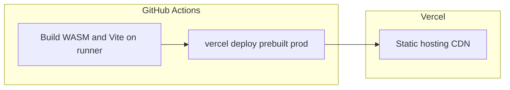

# Deploying to Vercel

## Canonical pipeline: GitHub Actions → prebuilt → Vercel

**Production deployments are meant to go through GitHub Actions**, not through “build on Vercel’s servers” when you push to Git.

| Stage | Where it runs | What happens |
|--------|----------------|--------------|
| **Build** | **GitHub Actions** (`ubuntu-latest`) | Rust + `wasm-pack` + `npm ci` + `vercel build --prod` — the full `npm run build` (WASM, `tsc`, Vite) runs on the runner. |
| **Publish** | **Vercel CLI** in the same job | `vercel deploy --prebuilt --prod` uploads the build output; Vercel serves it as static assets + CDN. |

Vercel’s role is **hosting and HTTPS**, not compiling the wallet on Vercel’s default image. That matches CI (same class of machine as the E2E job), keeps supply-chain clarity, and avoids fighting Vercel’s environment for Rust/WASM.



**Wallet workflow:** [`.github/workflows/deploy-vercel.yml`](../.github/workflows/deploy-vercel.yml)  
**Triggers:** push to `main`, or **Run workflow** manually.

**Landing page workflow:** [`.github/workflows/deploy-vercel-landing.yml`](../.github/workflows/deploy-vercel-landing.yml) — same prebuilt pattern without Rust/WASM (see [Landing page](#landing-page-second-vercel-project)).

---

## One-time setup for the canonical pipeline (wallet PWA)

### 1. Create the Vercel project (hosting only)

1. Sign in at [vercel.com](https://vercel.com) and **Import** this Git repository.
2. **Root Directory:** `frontend`.
3. **Framework:** Vite (or Other with output `dist`).
4. **Output Directory:** `dist` (must match Vite).
5. **Node.js:** 24 (see `frontend/package.json` `engines`).

**Install / Build commands in the dashboard:** you can leave them **unset** so [`frontend/vercel.json`](../frontend/vercel.json) applies when the CLI runs `vercel build` on GitHub. Do **not** assume Vercel will “just run `npm run build`” on push without extra setup (see [Optional: build on Vercel](#optional-build-on-vercel-git-integration) below).

### 2. Stop duplicate or failing builds on Vercel

If the repo stays connected to Vercel, pushes to GitHub can still create **Vercel-driven deployments** (with a build on Vercel’s infrastructure) in addition to the deployment from GitHub Actions. That toolchain usually **does not** match what CI does (Rust, `wasm-pack`, same Node as GHA), so you either maintain a separate “build on Vercel” setup or you **stop Vercel from building on Git** and rely on **prebuilt** deploys from the Action only.

#### What happens when the project is linked to Git

With a [connected Git repository](https://vercel.com/docs/git), Vercel **creates a new deployment for each new commit** pushed to that repo (subject to [Ignored Build Step](#option-b-ignore-git-driven-builds-keep-the-repo-connected) behavior and deduplication: if that commit was already deployed, Vercel may reuse the existing deployment instead of building again). In practice:

- **Production:** Pushes to your **production branch** (often `main`) trigger **production** deployments.
- **Previews:** Other branches and pull requests typically get **preview** deployments and preview URLs.

That is **independent** of GitHub Actions: a single `git push` can therefore produce **two** flows you care about unless you configure one of the options below — (1) a Vercel Git deployment, and (2) your workflow’s `vercel deploy --prebuilt --prod`.

#### Option A: Disconnect Git (simplest: no automatic Git deploys at all)

1. In the [Vercel dashboard](https://vercel.com/dashboard), open the **project** → **Settings** → **Git**.
2. Under **Connected Git Repository**, choose **Disconnect** ([docs](https://vercel.com/docs/project-configuration/git-settings#disconnect-your-git-repository)).

After this, **pushes no longer create deployments** from Vercel’s Git integration. Production updates come only from **GitHub Actions** (or manual `vercel deploy` using your token). **Trade-off:** you lose **automatic preview deployments** from Vercel for branches/PRs unless you add something else (for example [Deploy Hooks](https://vercel.com/docs/deploy-hooks) or a separate preview workflow).

#### Option B: Ignore Git-driven builds (keep the repo connected)

1. Open **Settings** → **Build and Deployment** → **Ignored Build Step** ([docs](https://vercel.com/docs/project-configuration/project-settings#ignored-build-step)).
2. Choose **Don’t build anything** — Vercel will not run your Install/Build for Git-triggered deployments — **or** choose **Custom** and use a command that exits **`0`** to cancel the build (exit **`1`** means “run the build as usual”).

> **Note:** Per Vercel’s docs, canceled builds may still count toward [deployment limits](https://vercel.com/docs/limits#deployments-per-day-hobby); the important part for this repo is avoiding a **second, incompatible** build and keeping **production** on the prebuilt pipeline.

Deployments that **`vercel deploy --prebuilt`** creates from CI **do not** use this Git “ignored build” path in the same way; they upload the output your job already built.

#### Summary

| Approach | Git still connected? | Auto deploy on push from Vercel? | Production from GHA prebuilt? |
|----------|----------------------|----------------------------------|-------------------------------|
| **A. Disconnect Git** | No | No | Yes (recommended pattern) |
| **B. Ignored Build Step** | Yes | Deployments are created then **canceled** / not built (see Vercel docs) | Yes |

If you need **both** automatic Vercel previews **and** production only from GHA, use a **second Vercel project** or a more tailored ignore script (for example only skip when `VERCEL_ENV === 'production'`) — that is outside this doc’s default setup.

### 3. Environment variables (Production)

In **Settings → Environment Variables → Production**, add anything the app needs at **build** time (see `frontend/src/vite-env.d.ts`). **`VITE_API_BASE_URL`** is only for a future HTTP API client — it is **not** your `*.vercel.app` URL.

**Open Graph (`og:image`, etc.):** Production builds run with **`vercel build` on GitHub Actions**, not on Vercel’s build machines. Vercel therefore prints that **system environment variables** (for example `VERCEL_URL`) are **not** available, and `vite` cannot infer your public URL from them. Add a **GitHub Actions repository variable** named **`BITBOARD_SITE_ORIGIN`** (canonical HTTPS origin, no trailing slash), for example `https://wallet.example.com`. The wallet deploy workflows read it with the GitHub API after checkout and export **`VITE_SITE_ORIGIN`** for `npm run build`, so `frontend/vite.config.ts` can emit absolute social preview URLs. You may still define **`VITE_SITE_ORIGIN`** in Vercel for local `vercel build` after `vercel pull`, but **do not rely on system `VERCEL_*` URLs when building on the runner**.

**Do not** set **`VITE_ARGON2_CI=1`** for Production. The deploy workflow clears inherited `VITE_ARGON2_CI`; `vite build` also rejects `VITE_ARGON2_CI=1` in production mode (`frontend/vite.config.ts`).

### 4. GitHub Actions secrets

1. Create a **Vercel token** (account **Settings → Tokens**) with deploy access to the project/team.

2. **`VERCEL_ORG_ID` (scope / “org” in the CLI)** — This is **not** the Team URL or name. Use the **`team_…` id** shown on the project **Settings → General** page (often labeled **Team ID**). That value is what GitHub Actions should store as `VERCEL_ORG_ID`. On a **Hobby** (personal) account, the same page may show a **user**-scoped id instead (e.g. a different prefix); use whatever Vercel shows as the scope for this project.

3. **`VERCEL_PROJECT_ID`** — Vercel labels this separately from Team ID. On **Project → Settings → General**, **scroll down**: below project name, Node version, etc., you should find **Project ID** starting with **`prj_`**. If the page is long or the layout hides it, use either:
   - **Local CLI (reliable):** from `frontend/`, run `npx vercel@latest link` (log in if prompted), then read **`frontend/.vercel/project.json`**: it contains `"projectId"` and `"orgId"` — use those for `VERCEL_PROJECT_ID` and `VERCEL_ORG_ID` respectively. Do **not** commit `.vercel/` (it is gitignored).
   - **Dashboard:** [Vercel’s docs](https://vercel.com/docs/project-configuration/general-settings#project-id) describe finding **Project ID** under General.

| GitHub secret | Vercel source (typical) |
|---------------|-------------------------|
| `VERCEL_TOKEN` | Account **Settings → Tokens** |
| `VERCEL_ORG_ID` | **Team ID** `team_…` (or scope id from **General** / `vercel link` output) |
| `VERCEL_PROJECT_ID` | **Project ID** `prj_…` on **General** (scroll), or `projectId` in `.vercel/project.json` after `vercel link` |

| GitHub variable (repository) | Purpose |
|------------------------------|---------|
| `BITBOARD_SITE_ORIGIN` | Canonical HTTPS origin (no trailing slash), e.g. `https://wallet.example.com`. Read at deploy time into `VITE_SITE_ORIGIN` for absolute `og:image` when **`vercel build` runs on GitHub Actions**. Set under **Settings → Secrets and variables → Actions → Variables**. |

After this, a push to **`main`** (or a manual workflow run) runs **`vercel pull`** (production env) → **`vercel build --prod`** → **`vercel deploy --prebuilt --prod`**.

**Local debugging:** run **`vercel pull`** and **`vercel build`** from the **repository root** with **`--cwd frontend`** (same as CI). Before **`vercel deploy --prebuilt --prod`**, run **`mkdir -p frontend/frontend`** from the repo root (same workaround as CI), then **`cd frontend`** and deploy.

---

## What the Action runs (summary)

- Installs **Rust** (`wasm32-unknown-unknown`), **wasm-pack**, **Node 24**.
- Sets **`VITE_ARGON2_CI`** to empty for that job so production never uses fast Argon2 by mistake.
- Reads **`BITBOARD_SITE_ORIGIN`** via the GitHub API into **`VITE_SITE_ORIGIN`** after checkout (optional; needed for absolute `og:image` when building on the runner). Requires **`permissions: actions: read`**.
- Runs **`vercel pull --environment=production --cwd frontend`** and **`vercel build --prod --cwd frontend`** from the **repo root**, strips **`settings.rootDirectory`** from **`frontend/.vercel/project.json`** after pull (avoids doubled paths during install — see [vercel/community#2793](https://github.com/vercel/community/discussions/2793)), strips again after **`vercel build`** if needed, then **`mkdir -p frontend/frontend`** and **`vercel deploy --prebuilt --prod`** with **`working-directory: frontend`**.

The `vercel build` step uses your linked project’s settings plus [`frontend/vercel.json`](../frontend/vercel.json), so install/build commands match what Vercel would use for a prebuilt deploy.

### If `vercel deploy --prebuilt` says `…/frontend/frontend` does not exist

The CLI **validates** a filesystem path derived from the dashboard **Root Directory** (`frontend`) even for **prebuilt** deploys (see [Vercel Community](https://community.vercel.com/t/vercel-deploy-prebuilt-now-requiring-access-to-root-directory/2137)). In a monorepo that can resolve to **`frontend/frontend`**, which is not a real folder. The workflow creates an **empty** `frontend/frontend` directory on the runner so that check passes; nothing is deployed from it (the prebuilt output is under **`frontend/.vercel/output`**).

### If `vercel build` fails with `spawn sh ENOENT` during `npm ci`

That often means the CLI tried to run the install script with a **working directory that does not exist**, because **Root Directory** in project settings was applied twice (e.g. job already in `frontend/` and settings also say `frontend` → `frontend/frontend`). The workflow avoids that by using **`--cwd frontend` from the repo root** and removing **`rootDirectory`** from the pulled **`project.json`**. See [vercel/community#2793](https://github.com/vercel/community/discussions/2793).

---

## HTTP caching (`frontend/vercel.json`)

Vercel applies the headers in [`frontend/vercel.json`](../frontend/vercel.json):

- **`/assets/*`:** long cache for hashed assets.
- **`/`, `/index.html`, PWA files (`/sw.js`, `/workbox-*.js`, `/registerSW.js`, `/manifest.webmanifest`):** `max-age=0, must-revalidate` so updates roll out quickly.

---

## HTTP security headers

Both the wallet ([`frontend/vercel.json`](../frontend/vercel.json)) and the landing site ([`landing-page/vercel.json`](../landing-page/vercel.json)) send defense-in-depth response headers on **every path** via a catch-all `source` of `/(.*)`.

**Why a catch-all for the wallet:** Vercel matches header rules to the **incoming request path**. The SPA rewrite serves `index.html` for deep links such as `/wallet/receive`, but the browser still requests `/wallet/receive`. Rules limited to `/` and `/index.html` would **not** attach `Content-Security-Policy` (and related headers) to those navigations. The catch-all ensures HTML and the SPA behave consistently on all routes.

### Wallet PWA

In addition to caching, [`frontend/vercel.json`](../frontend/vercel.json) sets:

- **`Content-Security-Policy`** — Tight baseline with allowances required by the stack: bundled scripts and WASM (`script-src` includes `'wasm-unsafe-eval'`), Vite **blob** workers (`worker-src` includes `blob:`), React **inline** `style={{…}}` (`style-src` includes `'unsafe-inline'`), fonts **self-hosted** from the build (no third-party font CDNs; `font-src` is `'self'` and `data:`), **`connect-src`** including `https:` and `wss:` for configurable Esplora endpoints and NWC relays, and **`img-src`** including `https:` for flexibility. **`upgrade-insecure-requests`** matches the product rule that non–**regtest** Esplora URLs must use HTTPS (see `validateEsploraUrl` in the app); fetching plain **HTTP** from the deployed **HTTPS** origin is already blocked as active mixed content for remote hosts. Local **regtest** URLs are partially covered via `http://127.0.0.1:*` and `http://localhost:*` in `connect-src` where browsers apply CSP port wildcards.
- **`Strict-Transport-Security`** — `max-age=31536000; includeSubDomains; preload`. Remove `preload` from the header value until you intend to submit the apex domain to the preload list and are sure **all** subdomains will stay HTTPS-only.
- **`X-Content-Type-Options: nosniff`**, **`X-Frame-Options: DENY`**, **`Referrer-Policy: strict-origin-when-cross-origin`**
- **`Permissions-Policy`** — Disables unused features; **`camera=(self)`** keeps QR scanning (`getUserMedia`) working on the app origin.
- **`Cross-Origin-Opener-Policy: same-origin`**

`Cross-Origin-Embedder-Policy: require-corp` is **not** set: it can break WASM, workers, or third-party resources without a full cross-origin isolation review.

### Landing site

[`landing-page/vercel.json`](../landing-page/vercel.json) uses the same non-CSP headers as the wallet. The **CSP is stricter** (for example `connect-src 'self'` only, no `wasm-unsafe-eval`, no `worker-src blob:`), which fits the static marketing build. **`camera=()`** is safe because the landing app does not use the camera.

### Verifying after deploy

```bash
curl -sI "https://YOUR_WALLET_HOST/" | grep -iE 'content-security|strict-transport|x-frame|referrer|permissions|cross-origin'
curl -sI "https://YOUR_WALLET_HOST/wallet/receive" | grep -iE 'content-security|strict-transport'
```

Repeat with the landing host. In the browser, open DevTools → Console and filter for **Content Security Policy** while exercising unlock, Lab, WASM paths, Esplora-backed screens, NWC, and QR scan.

### Optional: enforce CSP in two phases

To reduce risk when changing the policy, you can deploy the same directive value as **`Content-Security-Policy-Report-Only`** first (optionally with a **`report-to`** or **`report-uri`** endpoint), watch reports, then switch to enforcing **`Content-Security-Policy`** only. The repository ships with an **enforcing** policy by default.

---

## Smoke test after deploy

- Open the production URL and confirm the app loads.
- Open a client-side route and **hard refresh**; SPA rewrites in `vercel.json` should still serve the app.

---

## Landing page (second Vercel project)

The marketing site under [`landing-page/`](../landing-page/) is a **separate Vercel project**: **Root Directory** `landing-page`, **Framework** Vite, **Output** `dist`, **Node** 24. Build is only `npm ci` + `vite build` (imports from `../frontend/common` — full repo checkout required). Optionally disable Git-triggered Vercel builds and ship only from GitHub Actions, as for the wallet.

### GitHub secrets

Reuse **`VERCEL_TOKEN`** and **`VERCEL_ORG_ID`**. Add a **fourth** secret for the landing project only:

| Secret | Purpose |
|--------|---------|
| **`VERCEL_LANDING_PROJECT_ID`** | `prj_…` of the **landing** Vercel project (not the wallet’s `VERCEL_PROJECT_ID`) |

Link locally from `landing-page/` with `npx vercel link` if you need `projectId`/`orgId` from `landing-page/.vercel/project.json` (gitignored).

### Workflow

[`.github/workflows/deploy-vercel-landing.yml`](../.github/workflows/deploy-vercel-landing.yml) runs **`vercel pull` / `vercel build` / `vercel deploy --prebuilt`** with **`--cwd landing-page`**, strips **`settings.rootDirectory`** from **`landing-page/.vercel/project.json`**, and runs **`mkdir -p landing-page/landing-page`** before deploy (same prebuilt path validation quirk as the wallet: an empty nested directory satisfies the CLI check).

**Local debugging:** from the repo root, `vercel pull` and `vercel build` with **`--cwd landing-page`**; before **`vercel deploy --prebuilt --prod`**, **`mkdir -p landing-page/landing-page`**, then **`cd landing-page`** and deploy.

[`landing-page/vercel.json`](../landing-page/vercel.json) defines **security headers** (and can be extended later with cache headers or rewrites if you want).

---

## Optional: build on Vercel (Git integration)

Use this only if you want **Vercel to compile** the project on push (e.g. quick experiments without GHA). Vercel’s default image **does not** include **Rust** or **`wasm-pack`**, so `npm run build` fails unless you install them first.

[`frontend/vercel.json`](../frontend/vercel.json) defines **`installCommand`** (runs `scripts/vercel-install-wasm-toolchain.sh` then `npm ci`) and **`buildCommand`** (puts `~/.cargo/bin` on `PATH`, then `npm run build`). First cold builds can take **many minutes**.

**Canonical production flow remains GitHub Actions → prebuilt deploy** — faster, consistent with CI, and avoids relying on Vercel’s build timeouts for heavy Rust compiles.
