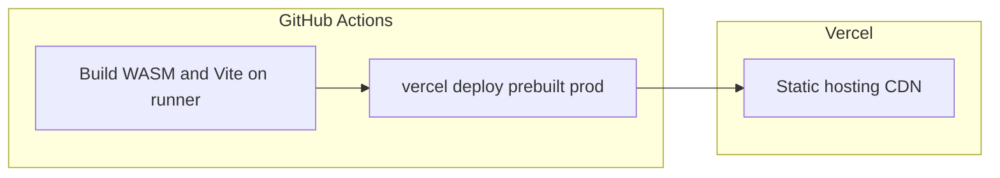

# Deploying to Vercel

## Canonical pipeline: GitHub Actions → prebuilt → Vercel

**Production deployments are meant to go through GitHub Actions**, not through “build on Vercel’s servers” when you push to Git.

| Stage | Where it runs | What happens |
|--------|----------------|--------------|
| **Build** | **GitHub Actions** (`ubuntu-latest`) | Rust + `wasm-pack` + `npm ci` + `vercel build --prod` — the full `npm run build` (WASM, `tsc`, Vite) runs on the runner. |
| **Publish** | **Vercel CLI** in the same job | `vercel deploy --prebuilt --prod` uploads the build output; Vercel serves it as static assets + CDN. |

Vercel’s role is **hosting and HTTPS**, not compiling the wallet on Vercel’s default image. That matches CI (same class of machine as the E2E job), keeps supply-chain clarity, and avoids fighting Vercel’s environment for Rust/WASM.

**Workflow file:** [`.github/workflows/deploy-vercel.yml`](../.github/workflows/deploy-vercel.yml)  
**Triggers:** push to `main`, or **Run workflow** manually.

---

## One-time setup for the canonical pipeline

### 1. Create the Vercel project (hosting only)

1. Sign in at [vercel.com](https://vercel.com) and **Import** this Git repository.
2. **Root Directory:** `frontend`.
3. **Framework:** Vite (or Other with output `dist`).
4. **Output Directory:** `dist` (must match Vite).
5. **Node.js:** 24 (see `frontend/package.json` `engines`).

**Install / Build commands in the dashboard:** you can leave them **unset** so [`frontend/vercel.json`](../frontend/vercel.json) applies when the CLI runs `vercel build` on GitHub. Do **not** assume Vercel will “just run `npm run build`” on push without extra setup (see [Optional: build on Vercel](#optional-build-on-vercel-git-integration) below).

### 2. Stop duplicate or failing builds on Vercel

If the repo stays connected to Vercel, **Git pushes can still trigger a Vercel-side build** that does not match the GHA toolchain unless you add the optional WASM install script. To avoid **two** deploys or a **redundant** slow/failing build:

- **Disable** automatic production deployments from Git for this project, **or**
- Set an **Ignored Build Step** that always skips (e.g. `exit 0`),

so **only** the GitHub Action performs production releases.

### 3. Environment variables (Production)

In **Settings → Environment Variables → Production**, add anything the app needs at **build** time (see `frontend/src/vite-env.d.ts`). **`VITE_API_BASE_URL`** is only for a future HTTP API client — it is **not** your `*.vercel.app` URL.

**Do not** set **`VITE_ARGON2_CI=1`** for Production. The deploy workflow clears inherited `VITE_ARGON2_CI`; `vite build` also rejects `VITE_ARGON2_CI=1` in production mode (`frontend/vite.config.ts`).

### 4. GitHub Actions secrets

1. Create a **Vercel token** (account **Settings → Tokens**) with deploy access to the project/team.

2. **`VERCEL_ORG_ID` (scope / “org” in the CLI)** — This is **not** the Team URL or name. Use the **`team_…` id** shown on the project **Settings → General** page (often labeled **Team ID**). That value is what GitHub Actions should store as `VERCEL_ORG_ID`. On a **Hobby** (personal) account, the same page may show a **user**-scoped id instead (e.g. a different prefix); use whatever Vercel shows as the scope for this project.

3. **`VERCEL_PROJECT_ID`** — Vercel labels this separately from Team ID. On **Project → Settings → General**, **scroll down**: below project name, Node version, etc., you should find **Project ID** starting with **`prj_`**. If the page is long or the layout hides it, use either:
   - **Local CLI (reliable):** from `frontend/`, run `npx vercel@latest link` (log in if prompted), then read **`frontend/.vercel/project.json`**: it contains `"projectId"` and `"orgId"` — use those for `VERCEL_PROJECT_ID` and `VERCEL_ORG_ID` respectively. Do **not** commit `.vercel/` (it is gitignored).
   - **Dashboard:** [Vercel’s docs](https://vercel.com/docs/project-configuration/general-settings#project-id) describe finding **Project ID** under General.

| GitHub secret | Vercel source (typical) |
|---------------|-------------------------|
| `VERCEL_TOKEN` | Account **Settings → Tokens** |
| `VERCEL_ORG_ID` | **Team ID** `team_…` (or scope id from **General** / `vercel link` output) |
| `VERCEL_PROJECT_ID` | **Project ID** `prj_…` on **General** (scroll), or `projectId` in `.vercel/project.json` after `vercel link` |

After this, a push to **`main`** (or a manual workflow run) runs **`vercel pull`** (production env) → **`vercel build --prod`** → **`vercel deploy --prebuilt --prod`**.

**Local debugging:** run **`vercel pull`** and **`vercel build`** from the **repository root** with **`--cwd frontend`** (same as CI). Run **`vercel deploy --prebuilt --prod`** from **inside `frontend/`** (no `--cwd`), matching the deploy step in the workflow.

---

## What the Action runs (summary)

- Installs **Rust** (`wasm32-unknown-unknown`), **wasm-pack**, **Node 24**.
- Sets **`VITE_ARGON2_CI`** to empty for that job so production never uses fast Argon2 by mistake.
- Runs **`vercel pull --environment=production --cwd frontend`** and **`vercel build --prod --cwd frontend`** from the **repo root**, strips **`settings.rootDirectory`** from **`frontend/.vercel/project.json`** when present (avoids doubled paths during install — see [vercel/community#2793](https://github.com/vercel/community/discussions/2793)), then **`vercel deploy --prebuilt --prod`** with **`working-directory: frontend`** (no `--cwd`; deploy’s path logic can otherwise resolve to `frontend/frontend`).

The `vercel build` step uses your linked project’s settings plus [`frontend/vercel.json`](../frontend/vercel.json), so install/build commands match what Vercel would use for a prebuilt deploy.

### If `vercel build` fails with `spawn sh ENOENT` during `npm ci`

That often means the CLI tried to run the install script with a **working directory that does not exist**, because **Root Directory** in project settings was applied twice (e.g. job already in `frontend/` and settings also say `frontend` → `frontend/frontend`). The workflow avoids that by using **`--cwd frontend` from the repo root** and removing **`rootDirectory`** from the pulled **`project.json`**. See [vercel/community#2793](https://github.com/vercel/community/discussions/2793).

---

## HTTP caching (`frontend/vercel.json`)

Vercel applies the headers in [`frontend/vercel.json`](../frontend/vercel.json):

- **`/assets/*`:** long cache for hashed assets.
- **`/`, `/index.html`, PWA files (`/sw.js`, `/workbox-*.js`, `/registerSW.js`, `/manifest.webmanifest`):** `max-age=0, must-revalidate` so updates roll out quickly.

---

## Smoke test after deploy

- Open the production URL and confirm the app loads.
- Open a client-side route and **hard refresh**; SPA rewrites in `vercel.json` should still serve the app.

---

## Optional: build on Vercel (Git integration)

Use this only if you want **Vercel to compile** the project on push (e.g. quick experiments without GHA). Vercel’s default image **does not** include **Rust** or **`wasm-pack`**, so `npm run build` fails unless you install them first.

[`frontend/vercel.json`](../frontend/vercel.json) defines **`installCommand`** (runs `scripts/vercel-install-wasm-toolchain.sh` then `npm ci`) and **`buildCommand`** (puts `~/.cargo/bin` on `PATH`, then `npm run build`). First cold builds can take **many minutes**.

**Canonical production flow remains GitHub Actions → prebuilt deploy** — faster, consistent with CI, and avoids relying on Vercel’s build timeouts for heavy Rust compiles.
