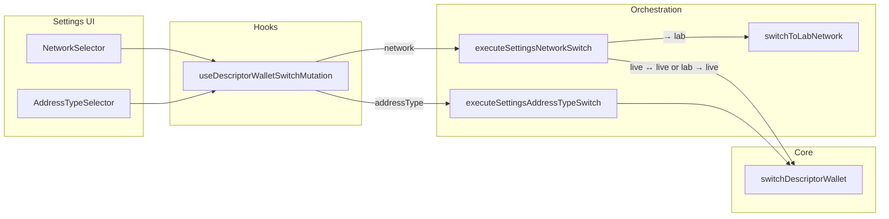
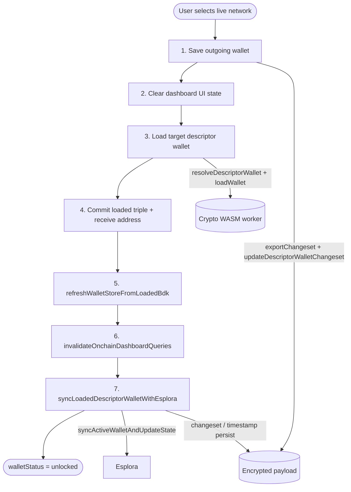
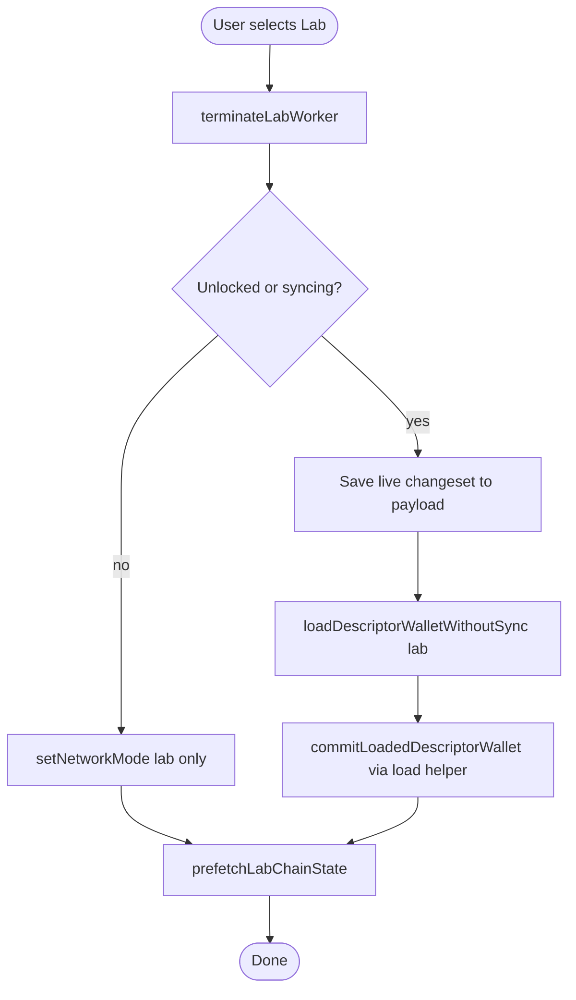

# Descriptor wallet switching

Bitboard stores many **descriptor wallets** per Bitboard wallet (`wallet_id`): one row per `(network, addressType, accountId)` triple in the encrypted `wallet_secrets` payload. At runtime **one** BDK wallet is loaded in the crypto WASM worker at a time.

Switching network or address type in Settings means: persist the outgoing descriptor wallet’s BDK **changeset**, load the target descriptor wallet into WASM, update session/UI state, and (on live networks) refresh the dashboard from BDK and sync with Esplora.

For how on-chain balance/history and stale indicators work after a switch, see [`onchain-bitboard-wallet-model.md`](onchain-bitboard-wallet-model.md).

## Terminology

| Term | Meaning |
|------|---------|
| **Descriptor wallet** | One `(network, addressType, accountId)` slot: descriptors + `changeSet` + metadata in `DescriptorWalletData`. |
| **Committed triple** | Persisted preference in `walletStore` (`networkMode`, `addressType`, `accountId`). |
| **Loaded descriptor wallet** | `loadedDescriptorWallet` — the triple WASM was last loaded for; set together with commit after a successful `loadWallet`. |
| **Live network** | `regtest`, `signet`, `testnet`, or `mainnet` — Esplora-backed on-chain sync applies. |
| **Lab** | Local SQLite simulator; no Esplora, no `lastSuccessfulEsploraSyncAt`. |

## Entry points

Settings UI does not call the core switch function directly. It goes through a mutation hook and thin orchestrators:

**Locked wallet shortcut:** If `walletStatus` is not `unlocked` or `syncing`, network/address changes only update the persisted preference (`setNetworkMode` / `setAddressType`). WASM load and Esplora run on the next unlock.

## Live network switch (unlocked session)

When the user picks a **live** target network while already unlocked (including **lab → live**), the app runs `switchDescriptorWallet` in [`settings-switch-wallet.ts`](../frontend/src/lib/wallet/settings-switch-wallet.ts).

### Phase diagram

### Step-by-step

1. **Save outgoing descriptor wallet**  
   Awaits on-chain load/sync/save quiescence, then exports via `exportChangesetForPersistence` (blocked during in-flight lifecycle and while `syncPhase === 'sync-error'`) and persists under the **current** `(network, addressType, accountId)` via `updateDescriptorWalletChangeset`. **Skipped** when `sync-error` — last good persisted outgoing state is preserved. Skipped safely if WASM has no wallet yet (`isBenignNoActiveWalletError`). Load runs under `withWalletWriterLock`.

2. **Clear dashboard UI state**  
   Set `currentAddress`, `balance`, `transactions`, and `lastSyncTime` to empty/null so the UI never shows the previous network’s totals during load.

3. **Load target descriptor wallet**  
   - `resolveDescriptorWallet` — decrypt payload (workers only), find or lazily create the target row.  
   - `loadWalletHandlingPersistedChainMismatch` — `loadWallet` with persisted `changeSet`; on network/changeset mismatch, retry with an empty chain (`usedEmptyChainFallback`).

4. **Commit session state**  
   `getCurrentAddress` → `commitLoadedDescriptorWallet` updates `networkMode`, `addressType`, `accountId`, and `loadedDescriptorWallet`.

5. **Hydrate dashboard from BDK (before Esplora)**  
   `refreshWalletStoreFromLoadedBdk` reads `getBalance` / `getTransactionList` from WASM into `walletStore`.  
   `invalidateOnchainDashboardQueries` refetches per-descriptor-wallet Esplora metadata (`lastSuccessfulEsploraSyncAt`) for stale banners.

6. **Esplora sync**  
   `walletStatus` → `syncing`, then `syncLoadedDescriptorWalletWithEsplora`:
   - Runs `syncActiveWalletAndUpdateState` (incremental or full scan).
   - On success: `setLastSyncTime`, persist `lastSuccessfulEsploraSyncAt`, and on full scan also persist changeset + `fullScanDone`.
   - On failure: toast, `refreshWalletStoreFromLoadedBdk` again (keep BDK-local view), return `syncFailed` — **does not reject** the switch; user can retry via dashboard Sync.

7. **Finish**  
   Always `walletStatus` → `unlocked` so Sync remains usable after a failed Esplora step.

### When is a full Esplora scan used?

`fullScanNeeded` is true if any of:

- Switch between two **live** networks (network card only; not address-type switch). This always forces a full scan today to avoid pathological sync states when moving between chains (e.g. stale incremental sync anchoring); a more selective incremental-vs-full policy may replace it later.
- Target descriptor wallet has `fullScanDone === false`.
- Persisted changeset could not be loaded and an empty chain was used (`usedEmptyChainFallback`).

Defined in `switchDescriptorWallet`; executed inside `syncLoadedDescriptorWalletWithEsplora`.

### Live ↔ live routing

[`network-mode-switch.ts`](../frontend/src/lib/settings/network-mode-switch.ts) dispatches:

| From | To | Behavior |
|------|-----|----------|
| Live | Live | `switchDescriptorWallet` (if unlocked) |
| Live | Lab | `switchToLabNetwork` (see Lab section) |
| Lab | Live | `switchDescriptorWallet` + `terminateLabWorker` |
| Any | Same | no-op |

## Address type switch

Same core function, different UX copy. [`execute-settings-address-type-switch.ts`](../frontend/src/lib/settings/execute-settings-address-type-switch.ts) calls `switchDescriptorWallet` with `phaseContext: 'addressType'`: network and account stay fixed; only `addressType` changes.

Esplora and BDK hydration behave like a live network switch (unless the committed network is lab — address type switches on lab still go through `switchDescriptorWallet`, but the target branch skips Esplora when `targetNetworkMode === 'lab'`).

## Lab mode (simplified path)

Lab does not use Esplora, BDK dashboard hydration for stale UX, or `lastSuccessfulEsploraSyncAt`. On-chain activity on the lab dashboard comes from the **lab SQLite DB**, not the loaded BDK wallet’s tx graph.

### Switching **to** lab

[`switch-to-lab-network.ts`](../frontend/src/lib/lab/switch-to-lab-network.ts):

- **Save (optional):** Same export + `updateDescriptorWalletChangeset` for the **previous live** network before leaving it.
- **Load:** `loadDescriptorWalletWithoutSync` — resolve + `loadWallet`, commit triple, **no** `refreshWalletStoreFromLoadedBdk`, **no** Esplora.
- **Warm:** Prefetch lab chain state for React Query.
- **Locked:** Only persisted `networkMode` → `lab`; WASM load happens on unlock.

### Switching **from** lab to live

Uses the full live `switchDescriptorWallet` path (save/load/sync/Esplora), then `terminateLabWorker` in `afterDescriptorSwitch`.

### What lab skips (compared to live)

| Step | Live switch | Lab switch |
|------|-------------|------------|
| Persist outgoing changeset | Yes (if WASM active) | Yes, when leaving live for lab |
| `loadWallet` target | Yes | Yes (lab network in WASM) |
| `refreshWalletStoreFromLoadedBdk` | Yes | No |
| `invalidateOnchainDashboardQueries` | Yes | No |
| `syncLoadedDescriptorWalletWithEsplora` | Yes | No |
| `lastSuccessfulEsploraSyncAt` write | On Esplora success | Never |
| Lab worker / SQLite chain | No | Yes (activity UI) |

## Related: unlock (not Settings switch)

First load after password entry uses [`loadDescriptorWalletAndSync`](../frontend/src/lib/wallet/wallet-utils.ts) from `WalletUnlock` / `useActiveWalletLoadQuery`. It mirrors the live switch **load + BDK hydrate + background Esplora** pattern but is a separate entry point (always full scan on unlock for non-lab). Documented here because it shares helpers with switching:

- `resolveDescriptorWallet`
- `loadWalletHandlingPersistedChainMismatch`
- `refreshWalletStoreFromLoadedBdk`
- `syncActiveWalletAndUpdateState` / changeset persist

## File map

| Role | File |
|------|------|
| Settings UI — network | [`NetworkSelector.tsx`](../frontend/src/components/settings/NetworkSelector.tsx) |
| Settings UI — address type | [`AddressTypeSelector.tsx`](../frontend/src/components/settings/AddressTypeSelector.tsx) |
| Switch mutation + status lines | [`useDescriptorWalletSwitchMutation.ts`](../frontend/src/hooks/useDescriptorWalletSwitchMutation.ts) |
| Network routing (lab ↔ live) | [`network-mode-switch.ts`](../frontend/src/lib/settings/network-mode-switch.ts) |
| Address type routing | [`execute-settings-address-type-switch.ts`](../frontend/src/lib/settings/execute-settings-address-type-switch.ts) |
| Phase/status copy | [`network-switch-status-messages.ts`](../frontend/src/lib/settings/network-switch-status-messages.ts) |
| **Core switch orchestration** | [`settings-switch-wallet.ts`](../frontend/src/lib/wallet/settings-switch-wallet.ts) |
| Switch **to** lab | [`switch-to-lab-network.ts`](../frontend/src/lib/lab/switch-to-lab-network.ts) |
| Esplora sync after load | [`wallet-utils.ts`](../frontend/src/lib/wallet/wallet-utils.ts) — `syncLoadedDescriptorWalletWithEsplora`, `syncActiveWalletAndUpdateState`, `loadWalletHandlingPersistedChainMismatch`, `loadDescriptorWalletWithoutSync`, `loadDescriptorWalletAndSync` |
| Payload find/create/update | [`descriptor-wallet-manager.ts`](../frontend/src/lib/wallet/descriptor-wallet-manager.ts) |
| BDK → dashboard store | [`onchain-bdk-store-sync.ts`](../frontend/src/lib/wallet/onchain-bdk-store-sync.ts) |
| Stale banner query invalidation | [`onchain-dashboard-sync.ts`](../frontend/src/lib/wallet/onchain-dashboard-sync.ts) |
| Esplora timestamp persist | [`onchain-esplora-sync-metadata.ts`](../frontend/src/lib/wallet/onchain-esplora-sync-metadata.ts) |
| Session triple + status | [`walletStore.ts`](../frontend/src/stores/walletStore.ts) |
| WASM load/sync/export | [`cryptoStore.ts`](../frontend/src/stores/cryptoStore.ts) + crypto worker |
| Encrypted payload CAS | [`wallet-persistence.ts`](../frontend/src/db/wallet-persistence.ts) |
| Unlock bootstrap query | [`useActiveWalletLoadQuery.ts`](../frontend/src/hooks/useActiveWalletLoadQuery.ts) |

## Error contracts (live switch)

- **Load phase fails** (resolve, decrypt, `loadWallet`): `switchDescriptorWallet` rejects; toast; caller must **not** treat the new network as committed (orchestrators rely on commit happening only after successful load inside the same function).
- **Esplora phase fails** after successful load: function **resolves**; `walletStatus` returns to `unlocked`; BDK-local balance/txs remain; stale banner may show using persisted `lastSuccessfulEsploraSyncAt`.

See also [`doc/SECURITY.md`](../doc/SECURITY.md) for how decrypted payload scope relates to descriptor wallets at rest.
