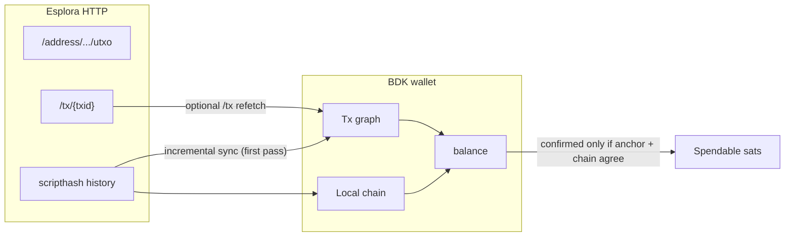
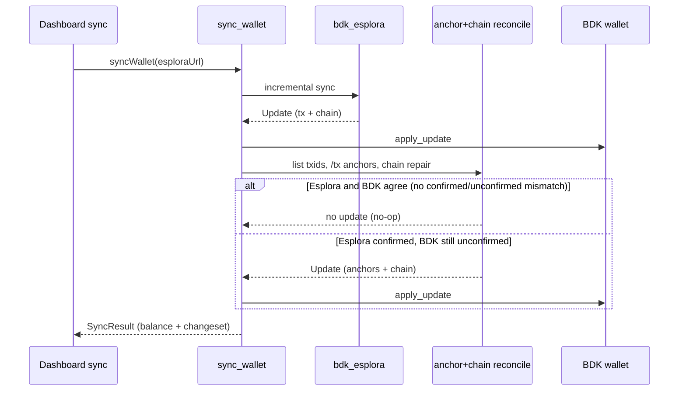

# Esplora / BDK anchor+chain reconcile

Bitboard **invokes** a post-sync reconcile step after every incremental Esplora sync (`sync_wallet` in WASM). In most syncs that step is a cheap no-op; it only runs the full **repair job** when Esplora and BDK disagree on whether a receive is confirmed. This document explains **why that pass exists**, what symptom it fixes, and how it differs from Full rescan.

For on-chain balance semantics and descriptor-wallet switching, see also:

- [`onchain-bitboard-wallet-model.md`](onchain-bitboard-wallet-model.md)
- [`descriptor-wallet-switching.md`](descriptor-wallet-switching.md)

## Symptom (what goes wrong without the fix)

After funding a receive address on regtest (or similar fresh-confirm flows), the dashboard can show:

| Source | What you see |
|--------|----------------|
| **Esplora** (`/address/.../utxo`, `/tx/{txid}`) | Confirmed UTXO; `/tx` has `block_height`, `block_hash`, and `block_time` |
| **BDK balance** | `untrusted_pending` (dashboard: **Pending incoming**), `confirmed` = 0 |
| **Sync UI** | Sync completes successfully — no sync-error banner |

The wallet **does** see the coins (headline total includes them), but they are **not spendable** for send or for tests that require confirmed sats.

This is confusing because Esplora and the dashboard agree on the *amount*, but disagree on whether it is **settled**.

## Why BDK does not treat “Esplora confirmed” as spendable

BDK splits balance into [confirmed, trusted_pending, untrusted_pending, immature](https://docs.rs/bdk_chain/latest/bdk_chain/struct.Balance.html). External receives that are not yet confirmed in the wallet’s **local best chain** stay in `untrusted_pending`.

Confirmation in BDK is a **two-part** condition ([`Wallet` docs](https://docs.rs/bdk_wallet/latest/bdk_wallet/struct.Wallet.html)):

1. **Anchor metadata** on the transaction in the tx graph (`block_height`, `block_hash`, `block_time`).
2. **The anchor block exists in the wallet’s local chain** (the persisted `LocalChain` checkpoints).

Both must hold before a receive moves from “Pending incoming” to spendable **confirmed** balance. Esplora saying “confirmed UTXO” on HTTP is not enough by itself.

## How `bdk_esplora` incremental sync can leave receives stuck

During incremental sync, `bdk_esplora`:

1. Learns transactions from **scripthash history** first.
2. For each tx status, calls `insert_anchor_or_seen_at_from_status`:
   - If status has **all** of `block_height`, `block_hash`, and `block_time` → records an **anchor**.
   - Otherwise → records **`seen_at`** → **untrusted pending**.
3. Skips `/tx/{txid}` refetch when the txid was already inserted in the scripthash pass (`inserted_txs` guard).
4. Extends the local chain from Esplora’s latest blocks when chain tip + blocks are available.

So a receive can remain pending when **either**:

| Gap | Effect |
|-----|--------|
| **Incomplete status on scripthash** | Tx stored as `seen_at` even though `/tx/{txid}` already has full anchor fields |
| **Chain not extended** | Anchor applied in tx graph, but local chain lacks the anchor block height |
| **Wrong hash at anchor height** | Tip agrees with Esplora while an intermediate checkpoint has a stale/wrong block hash; anchor block never matches chain |

### What “hash at anchor height” means

This is **not** a hash of the receive address, scriptPubKey, or transaction. It is the **block hash** (`BlockHash`): the 32-byte identifier of a **Bitcoin block header**, computed as double-SHA256 over the header fields (version, previous block hash, merkle root, time, bits, nonce). Esplora exposes it as `status.block_hash` on `/tx/{txid}` and as `id` on `/blocks`.

When a transaction confirms, BDK stores an **anchor** roughly of the form:

- height **187** (example from CI)
- hash **`5d079811…`** — the block that included that transaction

The wallet also keeps a **local chain**: a sparse list of `(height → block hash)` checkpoints it believes lie on the best chain. For the receive to become spendable, the hash at the anchor height in the local chain must **equal** the anchor’s `block_hash`.

**Wrong hash at anchor height** means: the wallet has a checkpoint at that height, but it stores a **different** block hash than the one Esplora (and the tx anchor) say mined the block. Example from our integration test: height 177 stores `0xab…` locally, while `/tx` says the funding tx confirmed in block `0x3c…` at height 177 — BDK keeps the receive pending because the anchor does not match the chain entry.

**Typical causes in Bitboard:**

| Cause | How it happens |
|-------|----------------|
| **Partial chain extension** | Incremental sync advances the tip but does not rewrite an older checkpoint that was wrong or placeholder |
| **Agreement-at-tip-only** | Chain repair walks back from the tip, finds height 188 matches Esplora, stops, and never fixes height 187 |
| **Persisted chain from another context** | Descriptor switch / empty-chain fallback / earlier sync left checkpoints that do not match the current Esplora regtest chain (same height, different network history) |
| **Missing height, then wrong fill** | Chain had a gap; a later update inserted a hash at that height from stale data before Esplora’s `/block-height/{n}` was used |

It is **not** a user-facing error string — it is an internal failure mode our reconcile pass detects and repairs by re-inserting the Esplora/anchor block hash at that height via `CheckPoint::insert`.

Esplora endpoints can lag or disagree briefly (especially in CI: cold indexer, block just mined). `/address/.../utxo` and `/tx/{txid}` may look “ready” while scripthash history still returned partial status during the sync pass.

BDK documents this model explicitly: chain sources must supply anchors or `seen_at`; promotion to confirmed is the applicator’s job ([BDK PR #2135](https://github.com/bitcoindevkit/bdk/pull/2135)). `bdk_esplora` does **not** run a second repair pass when those inputs are inconsistent.

## What Bitboard’s fix does

After each incremental `bdk_esplora` sync and `apply_update`, WASM **invokes** anchor+chain reconcile ([`crypto/src/esplora_tx_anchor_reconcile.rs`](../crypto/src/esplora_tx_anchor_reconcile.rs)). The repair job itself runs **only when Esplora and BDK disagree** on confirmation for at least one relevant transaction:

| BDK (after incremental sync) | Esplora `/tx/{txid}` | Reconcile action |
|------------------------------|----------------------|------------------|
| Unconfirmed (`seen_at` / untrusted pending) | **Confirmed** with full anchor (`block_height`, `block_hash`, `block_time`) | **Repair** — refetch anchors, extend/repair local chain, `apply_update` |
| Unconfirmed | Unconfirmed (mempool) | **No-op** — both agree the receive is still pending; sync succeeds |
| Confirmed | (any) | **No-op** — tx not a reconcile candidate |

### When reconcile is a no-op (shortcuts)

These checks happen inside the same pass; there is no separate guard module.

1. **No BDK-unconfirmed candidates** — if the wallet has no unconfirmed canonical txs or unconfirmed UTXOs (and no untrusted-pending outputs to scan), reconcile returns immediately with **no Esplora HTTP** and no second `apply_update`.
2. **Esplora agrees txs are still unconfirmed** — for each candidate txid, `/tx` is fetched; if none report a full confirmed anchor, `build_anchor_and_chain_reconcile_update` returns `None` and reconcile skips chain extension and `apply_update`. This is the normal path for **genuine mempool receives**.

Only when step 2 finds at least one **Esplora-confirmed** tx that BDK still treats as unconfirmed does reconcile proceed to chain repair.

### Repair steps (when inconsistency is detected)

1. **Find candidate txids** — unconfirmed canonical txs and unconfirmed UTXOs; when `untrusted_pending > 0`, also scan `list_output()`.
2. **Re-fetch `/tx/{txid}`** (with retries) and build anchor updates from complete status.
3. **Extend/repair local chain** so every anchor block height has the **same hash as the anchor**, and fill gaps from anchor height through Esplora tip (`/blocks`, `/blocks/tip/*`, `/block-height/{n}` fallbacks).
4. **`apply_update`** with both `tx_update.anchors` and `chain: Some(...)` — anchor-only updates are not applied without chain extension.
5. **Up to two passes**; if unconfirmed UTXOs remain whose Esplora `/tx` status already has a **full confirmed anchor**, sync **fails** with an explicit error (surfaces sync-error instead of silent pending). Genuine **mempool-only** receives (Esplora still unconfirmed) are left pending and sync **succeeds**.

Entry point: `sync_wallet` → `apply_esplora_anchor_reconcile_passes` in [`crypto/src/lib.rs`](../crypto/src/lib.rs).

This is a **surgical** version of what Full rescan effectively does: re-learn confirmation metadata and rebuild chain alignment, without rescanning every revealed script pubkey.

## What we deliberately did *not* do

| Approach | Why not |
|----------|---------|
| **Test retries / long polls** | Masks product bug; regtest send test uses strict fund → one sync → assert |
| **Full rescan after every dashboard Sync** | Heavy; can interact badly with descriptor switches; incremental sync is the correct UX |
| **Treat Esplora UTXO list as spendable in UI** | Would allow spending funds BDK cannot build transactions for |

If Full rescan fixes balance but incremental sync + reconcile does not, that indicates reconcile or chain persistence still needs work — not that the test should call Full rescan.

## Frontend follow-up sync (secondary)

[`syncActiveWalletAndUpdateState`](../frontend/src/lib/wallet/wallet-utils.ts) may still call `syncWallet` twice when `confirmedSats === 0 && untrustedPendingSats > 0` after the first call. The **primary** repair is in WASM (each `syncWallet` invocation runs reconcile). The frontend repeat is an extra timing buffer for slow indexers, not the main fix.

## When Full rescan is still appropriate

Full rescan remains the right tool for:

- Import / first load (`setupInitial`, post-unlock scan)
- Live network or address-type switch when history must be rediscovered
- User-initiated **Full rescan** after `BadLocalChainStateError` or persistent mismatch

It is not required for normal post-funding dashboard sync once reconcile is working.

## Tests and diagnostics

| Location | Role |
|----------|------|
| [`crypto/tests/esplora_tx_anchor_reconcile_tests.rs`](../crypto/tests/esplora_tx_anchor_reconcile_tests.rs) | Rust integration tests (seen_at → confirmed, chain repair, wrong hash at anchor height, empty `/blocks` fallback) |
| [`frontend/tests/e2e/helpers/regtest-onchain-balance-diagnostics.ts`](../frontend/tests/e2e/helpers/regtest-onchain-balance-diagnostics.ts) | CI failure report: Esplora vs dashboard, `pending_incoming_only`, `/tx` anchor readiness |
| [`frontend/tests/e2e/send.spec.ts`](../frontend/tests/e2e/send.spec.ts) `@regtest` | Strict e2e contract that exposed this bug in CI |

## Related BDK / Esplora reading

- [Book of BDK — Sync with Esplora](https://bookofbdk.com/cookbook/syncing/esplora/) (three-step sync model)
- [BDK Balance](https://docs.rs/bdk_chain/latest/bdk_chain/struct.Balance.html) (`untrusted_pending` semantics)
- [Esplora API — transaction status fields](https://github.com/Blockstream/esplora/blob/master/API.md)
