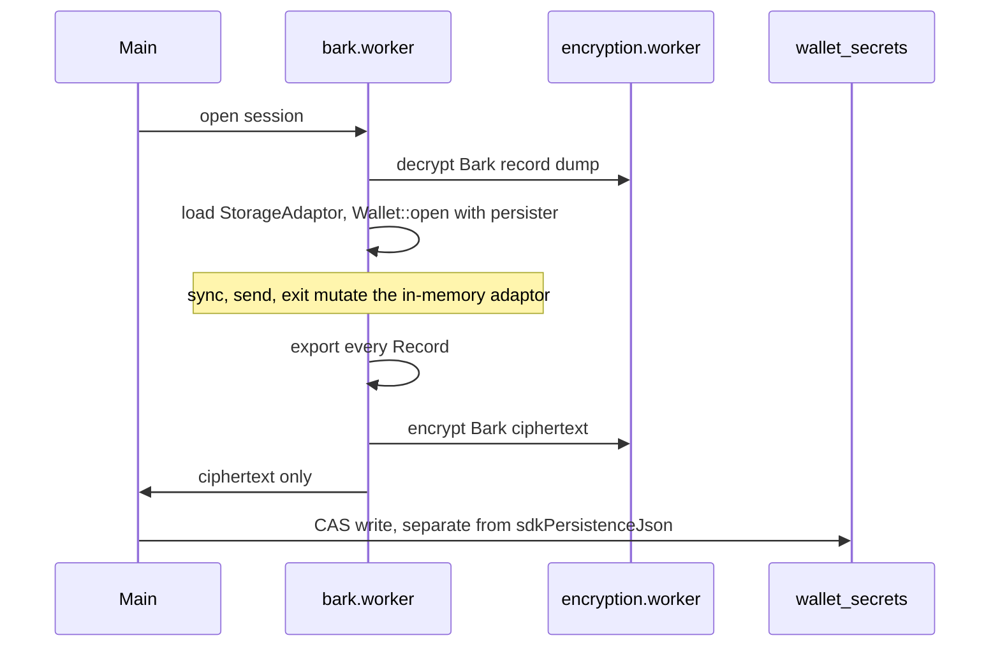

# Encrypted Bark persister

Planning note. Nothing here is implemented. Bark protocol state still lives in Bark's IndexedDB via `bark::persist::platform_default`.

Related:

- Current rail decision: [bark-signet-rail.plan.md](../bark/bark-signet-rail.plan.md) (IndexedDB for protocol state; encrypted `barkRail` is metadata only)
- Metadata record: `StoredBarkRail` in `frontend/src/lib/wallet/wallet-domain-types.ts`
- Session open: `bark_open_session` in `bitboard-bark/src/session.rs`
- Arkade pattern to copy: [persistence/arkade.md](../persistence/arkade.md), `flushSdkPersistenceNowOrThrow` in `frontend/src/workers/arkade.worker.ts`
- Bark SDK (0.7.1): `OpenWalletArgs.persister`, `bark::persist::adaptor::StorageAdaptor`, `StorageAdaptorWrapper`, `MemoryStorageAdaptor`

---

## Problem

The unilateral-exit chain is already on disk. `BarkPersister::store_vtxos` writes `Vtxo<Full>` when a coin is created or received. `Wallet::get_full_vtxo` reads that chain back. Listings use the bare `WalletVtxo` only to keep the chain out of memory.

On WASM that store is Bark's IndexedDB database, keyed by wallet fingerprint. It is not encrypted. A restore from the mnemonic alone cannot rebuild the chain until the server answers `get_vtxo`. If the server is gone and IndexedDB is gone, the exit cannot start.

`barkRail` inside encrypted `wallet_secrets` holds the fingerprint, server URL, receive index, and last successful sync time. It does not hold VTXOs.

Arkade solved the same gap by keeping protocol state in `sdkPersistenceJson` and flushing that string through the encryption worker after each WASM call. Bark should do the equivalent, using Bark's storage adaptor so Bitboard does not own Second's schema.

---

## Shape

Pass `OpenWalletArgs.persister` into `Wallet::open`. On WASM, `datadir` is ignored once a persister is set, and `platform_default`'s IndexedDB backend is no longer used.

Implement `StorageAdaptor` (five methods: `put`, `get`, `delete`, `query_sorted`, `get_all`). `StorageAdaptorWrapper` already implements `BarkPersister`. The record layout — partitions, primary keys, sort keys, and the `Vtxo<Full>` bytes — stays inside bark-wallet. A bark-wallet upgrade that only changes those records still loads, as long as the blob stores their `Record` bytes.

`MemoryStorageAdaptor` is the in-memory reference. The session holds that map. The encrypted blob is a dump of every record, written at operation boundaries.

Plaintext records stay in the Bark worker. The main thread handles ciphertext only, same as Arkade.

### Flush boundary

Export after each wallet operation returns, before the worker answers the UI. One `Wallet::sync` is one export, including the many internal `put`s inside that call.

A killed tab during sync reopens on the previous blob and repeats the sync. A killed tab during an Arkoor, a round, or an exit step that the server has already accepted must not reopen on a blob from before that call. That is why the export sits on the return path of the operation, the same place Arkade calls `flushSdkPersistenceNowOrThrow`.

Exporting on every `StorageAdaptor::put` would re-encrypt the whole chain many times inside one sync.

### Separate ciphertext

Bark's record dump is its own field, next to `barkRail`, or its own ciphertext column. It does not live inside `sdkPersistenceJson`.

`persistSdkJsonToEncryptedPayload` re-encrypts the Arkade account blob. Sharing one string would make every Arkade flush rewrite every Bark exit chain, and every Bark flush rewrite Arkade. Full VTXOs are tens of kilobytes each; a deep-exit wallet is megabytes. Arkade already caps `sdkPersistenceJson` at 10 MB of UTF-8. A binary record dump stays under a similar cap longer than base64-inside-JSON.

Unlock decrypts the Bark blob before `Wallet::open`. That cost stays on the Bark session path.

### Sort order

`query_sorted` must follow Bark's sort keys. Listings and coin selection depend on that order (expiry, then amount). A map that returns rows in insertion order will select the wrong coins. Bark's upstream adaptor test suite is not a public crate; recheck ordering here with cases that cover a full-range query, a limited query, and records that have no sort key (`get_all` returns those, `query_sorted` does not).

---

## Out of scope for this design

- Implementing `BarkPersister` directly. That trait is about fifty methods, and the blanket impl on `StorageAdaptor` already covers them.
- A `BarkPersister` that forwards each call into wa-sqlite or Kysely. Bitboard's SQLite stays app metadata.
- Re-declaring VTXO, movement, round, or exit tables in this repo. Second migrates the bytes inside `Record`.
- Calling `get_full_vtxo` during sync in order to "store" the chain. That method only reads what `store_vtxos` already wrote.

---

## Migration

Existing Signet wallets have their protocol state in IndexedDB. The new persister does not see it.

Signet can be wiped; the rail plan already accepts that for development databases. A keep-the-coins migration opens the IndexedDB adaptor once, copies `get_all` from each partition into the new adaptor, exports the encrypted blob, then deletes the IndexedDB database. Do that before dropping the `indexed-db` feature from `bitboard-bark`.

---

## Work, in order

1. In-memory `StorageAdaptor` plus a versioned export/import of `Record` bytes. Ordering tests for `query_sorted`.
2. `bark_open_session` loads the dump and passes `OpenWalletArgs { persister, lock_manager, .. }`. `MemoryLockManager` is enough; the wasm lock manager is already in-process, and two tabs stay out of scope.
3. Encryption-worker channel and CAS write, modeled on the Arkade flush, aimed at the Bark field only.
4. Flush after every Bark worker call that can change protocol state (sync, reveal, board, arkoor, collaborative exit, emergency exit).
5. One-time IndexedDB copy, then remove the `indexed-db` feature.

The adaptor and the open-path wiring are the small part. The flush, the separate ciphertext, and the IndexedDB migration are the rest.
