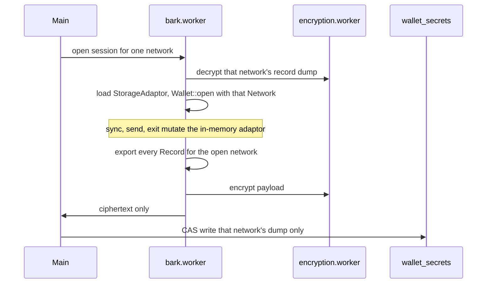

# Encrypted Bark persister

Planning note. Nothing here is implemented. Bark protocol state still lives in Bark's IndexedDB via `bark::persist::platform_default`.

Related:

- Current rail decision: [bark-signet-rail.plan.md](../bark/bark-signet-rail.plan.md) (IndexedDB for protocol state; encrypted `barkRail` is metadata only)
- Mainnet follow-up, which depends on this design: [bark_mainnet_rail plan](../../.cursor/plans/bark_mainnet_rail_438a6fd8.plan.md)
- Metadata record: `StoredBarkRail` in `frontend/src/lib/wallet/wallet-domain-types.ts`
- Session open: `bark_open_session` in `bitboard-bark/src/session.rs`
- Arkade pattern to copy: [persistence/arkade.md](../persistence/arkade.md), `flushSdkPersistenceNowOrThrow` in `frontend/src/workers/arkade.worker.ts`
- Bark SDK (0.7.1): `OpenWalletArgs.persister`, `bark::persist::adaptor::StorageAdaptor`, `StorageAdaptorWrapper`, `MemoryStorageAdaptor`

---

## Problem

The unilateral-exit chain is already on disk. `BarkPersister::store_vtxos` writes `Vtxo<Full>` when a coin is created or received. `Wallet::get_full_vtxo` reads that chain back. Listings use the bare `WalletVtxo` only to keep the chain out of memory.

On WASM that store is Bark's IndexedDB database, keyed by wallet fingerprint. It is not encrypted. A restore from the mnemonic alone cannot rebuild the chain until the server answers `get_vtxo`. If the server is gone and IndexedDB is gone, the exit cannot start.

`barkRail` inside encrypted `wallet_secrets` holds the fingerprint, server URL, receive index, and last successful sync time. It does not hold VTXOs.

The fingerprint is not a network key. `WalletSeed` derives it from the mnemonic, and the same mnemonic produces the same fingerprint on Signet and on Mainnet. IndexedDB is named with that fingerprint alone. `Wallet::create` refuses to overwrite a database that already has properties, and `Wallet::open` then follows the network stored in those properties, not the network passed to `open`. One fingerprint database cannot hold a Signet wallet and a Mainnet wallet.

Arkade solved the encryption gap by keeping protocol state in `sdkPersistenceJson` on each account and flushing that string through the encryption worker after each WASM call. Bark should do the equivalent, using Bark's storage adaptor so Bitboard does not own Second's schema, with one record dump per network the way each Arkade account has its own `sdkPersistenceJson`.

---

## Shape

Pass `OpenWalletArgs.persister` into `Wallet::open`. On WASM, `datadir` is ignored once a persister is set, and `platform_default`'s IndexedDB backend is no longer used.

Implement `StorageAdaptor` (five methods: `put`, `get`, `delete`, `query_sorted`, `get_all`). `StorageAdaptorWrapper` already implements `BarkPersister`. The record layout — partitions, primary keys, sort keys, and the `Vtxo<Full>` bytes — stays inside bark-wallet. A bark-wallet upgrade that only changes those records still loads, as long as the blob stores their `Record` bytes.

`MemoryStorageAdaptor` is the in-memory reference. The session holds the map for the network that is open. The encrypted blob is a dump of every record in that map, written at operation boundaries.

### One dump per network

`WalletSecretsPayload.barkRail` becomes `barkRails`, a partial map keyed by `'signet' | 'mainnet'`. The key is the network. The rail record does not repeat it.

Each rail keeps the metadata `barkRail` holds today: server URL, fingerprint, receive index, and last successful sync time. It also holds that network's versioned record dump. Mainnet starts absent and is created on the first successful open of a Mainnet session.

A later network is a new map key. It is not a new schema. Testnet4 and Mutinynet are not keys in this design.

Session open loads only the active network's dump into the in-memory adaptor, then calls `Wallet::open` with that `bitcoin::Network`. `MemoryLockManager` is enough; the wasm lock manager is already in-process, and two tabs stay out of scope. Switching networks drops that wallet and opens the other dump. The app already aborts the worker on a network switch and then calls `refreshBarkSessionAfterNetworkSwitch`.

Plaintext records stay in the Bark worker. The main thread handles ciphertext only, same as Arkade.

### Flush boundary

Export after each wallet operation returns, before the worker answers the UI. One `Wallet::sync` is one export, including the many internal `put`s inside that call.

A killed tab during sync reopens on the previous blob for that network and repeats the sync. A killed tab during an Arkoor, a round, or an exit step that the server has already accepted must not reopen on a blob from before that call. That is why the export sits on the return path of the operation, the same place Arkade calls `flushSdkPersistenceNowOrThrow`.

Exporting on every `StorageAdaptor::put` would re-encrypt the whole chain many times inside one sync.

The flush replaces the open network's dump and leaves the other network's dump as it was read. A Signet sync does not re-export the Mainnet chain. A Bark flush does not rewrite `sdkPersistenceJson`. An Arkade flush does not rewrite `barkRails`.

### Separate ciphertext

The record dump lives on its rail. It does not live inside `sdkPersistenceJson`, and there is not one wallet-wide Bark dump shared by Signet and Mainnet.

`persistSdkJsonToEncryptedPayload` re-encrypts the Arkade account blob. Sharing one string would make every Arkade flush rewrite every Bark exit chain, and every Bark flush rewrite Arkade. Sharing one Bark dump across networks would make every Signet flush rewrite the Mainnet chain. Full VTXOs are tens of kilobytes each; a deep-exit wallet is megabytes. Arkade already caps `sdkPersistenceJson` at 10 MB of UTF-8. Cap each Bark dump on its own, the same way. One network's exit chain does not evict the other. A compact encoding of `Record` bytes stays under that cap longer than folding the dump into `sdkPersistenceJson`.

Unlock decrypts the open network's dump before `Wallet::open`. That cost stays on the Bark session path.

### Sort order

`query_sorted` must follow Bark's sort keys. Listings and coin selection depend on that order (expiry, then amount). A map that returns rows in insertion order will select the wrong coins. Bark's upstream adaptor test suite is not a public crate; recheck ordering here with cases that cover a full-range query, a limited query, and records that have no sort key (`get_all` returns those, `query_sorted` does not).

---

## Out of scope for this design

- Implementing `BarkPersister` directly. That trait is about fifty methods, and the blanket impl on `StorageAdaptor` already covers them.
- A `BarkPersister` that forwards each call into wa-sqlite or Kysely. Bitboard's SQLite stays app metadata.
- Re-declaring VTXO, movement, round, or exit tables in this repo. Second migrates the bytes inside `Record`.
- Calling `get_full_vtxo` during sync in order to "store" the chain. That method only reads what `store_vtxos` already wrote.
- Opening a second IndexedDB database per network. The split is the encrypted map. IndexedDB goes away after the migration below.
- A Mainnet session, Mainnet server URLs, or `ark1p` send addresses. Those land after this persister exists.

---

## Migration

Existing Signet wallets have their protocol state in IndexedDB, under the fingerprint name. The new persister does not see it. Every wallet created so far was opened as Signet, so that copy belongs on the signet rail only.

Signet can be wiped; the rail plan already accepts that for development databases. A keep-the-coins migration opens the IndexedDB adaptor once, copies `get_all` from each partition into the new adaptor, exports the encrypted dump onto `barkRails.signet`, then deletes the IndexedDB database. Do that before dropping the `indexed-db` feature from `bitboard-bark`.

A legacy singular `barkRail` with `network: 'signet'` becomes `barkRails.signet`, metadata only, until the IndexedDB copy fills in the dump. Mainnet has no IndexedDB source. Its rail appears on the first successful Mainnet open, with an empty adaptor.

---

## Work, in order

1. In-memory `StorageAdaptor` plus a versioned export/import of `Record` bytes. Ordering tests for `query_sorted`.
2. Replace singular `barkRail` with `barkRails` keyed by `'signet' | 'mainnet'`. Each rail carries its own record dump. `bark_open_session` takes the network, loads that dump, and passes `OpenWalletArgs { persister, lock_manager, .. }` into `Wallet::open` for that `bitcoin::Network`. `MemoryLockManager` is enough.
3. Encryption-worker channel and CAS write, modeled on the Arkade flush, aimed at the open network's dump only.
4. Flush after every Bark worker call that can change protocol state (sync, reveal, board, arkoor, collaborative exit, emergency exit).
5. One-time IndexedDB copy into the signet rail, then remove the `indexed-db` feature.

The adaptor and the open-path wiring are the small part. The per-network flush, the separate dumps, and the IndexedDB migration are the rest.
