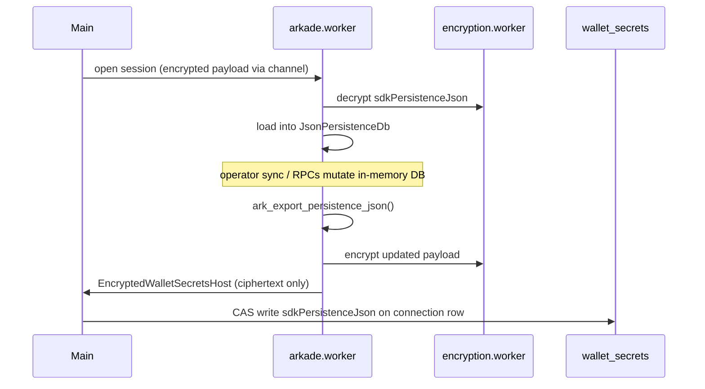

# Arkade persistence

Arkade (VTXO / offchain) is a **separate rail** from on-chain BDK. Balance and history come from the Ark operator and `bitboard-ark` WASM — not from `descriptorWallets[].changeSet`.

For the wallet model and balance buckets, see [arkade wallet model](../arkade-bitboard-wallet-model.md). For save/sync orchestration, see [wallet rail lifecycle](../wallet-rail-lifecycle.md#arkade-rail).

## Encrypted payload (`wallet_secrets`)

Each Ark Service Provider (ASP) is one row in `WalletSecretsPayload.arkadeOperatorConnections`:

```typescript
interface StoredArkadeOperatorConnection {
  id: string
  label: string
  networkMode: ArkadeSupportedNetworkMode
  operatorUrl: string
  delegatorUrl?: string
  operatorSignerPkHex: string      // canonical from operator getInfo
  createdAt: string
  lastSessionOpenedAt?: string
  lastSuccessfulOperatorSyncAt?: string
  sdkPersistenceJson?: string      // full BitboardArkPersistence envelope
}
```

`activeArkadeConnectionIdByNetwork` selects which connection is active per live network (`mainnet`, `testnet`, `signet`).

**Size limit:** `sdkPersistenceJson` must not exceed 10 MB UTF-8 (`ARKADE_SDK_PERSISTENCE_JSON_MAX_BYTES` in `arkade-sdk-persistence-types.ts`).

## Rust persistence envelope (`bitboard-ark`)

File: `bitboard-ark/src/persistence.rs`

| Type | Purpose |
|------|---------|
| `BitboardArkPersistence` | Top-level JSON envelope (`version`, `engine`, `operator_identity`, `autonomous_mode`, `wallet_db`, `swap_storage`) |
| `WalletDbSnapshot` | Boarding outputs, secret keys, VTXO snapshot, exit watches, operator trust |
| `OffchainVtxoSnapshot` | VTXO list + unilateral exit materials map (keyed by leaf tx) |
| `JsonPersistenceDb` | In-memory mutex-backed DB implementing ark-client `Persistence` |

**Current version:** `BITBOARD_ARK_PERSISTENCE_VERSION = 8`

`BitboardArkPersistence::parse_import()` migrates legacy v3–v7 blobs on load. Unsupported or corrupt blobs start from an empty `wallet_db` on session open. `autonomous_mode` (default **false**) is a per-ASP trust posture on the envelope: when true, session open uses `cached_operator_info` and does not call the operator.

### Offchain receive cursor

`wallet_db.offchain_next_derivation_index` is a **single scalar** — the next index to assign on reveal. The main thread may read this field (via `parseArkadeSdkPersistenceJson`) to merge monotonic receive indices without decrypting the full blob on every operation.

Do **not** persist arrays of derivation indices in `sdkPersistenceJson`; that pattern bloated encrypted secrets and caused failed writes.

## Worker persistence flow



Key modules:

| Module | Role |
|--------|------|
| `frontend/src/workers/arkade.worker.ts` | Session, export, legacy IndexedDB cleanup |
| `frontend/src/workers/arkade-persistence-channel.ts` | Worker ↔ encryption channel |
| `frontend/src/lib/arkade/arkade-encrypted-persistence-manager.ts` | Channel setup coordination |
| `frontend/src/lib/arkade/arkade-sdk-persistence.ts` | Merge helpers, export/import |
| `frontend/src/lib/arkade/arkade-payload-merge.ts` | Monotonic index merge on save |
| `frontend/src/lib/arkade/arkade-persistence-store-sync.ts` | Sync persisted state with UI store |

Main thread code (`EncryptedWalletSecretsHost`) handles **ciphertext only** — plaintext `sdkPersistenceJson` stays in the arkade worker.

## Zustand and UI state

| Store | Persisted? | Contents |
|-------|------------|----------|
| `walletStore` (Arkade fields) | No | Transient dashboard: balance, payments, receive address |
| Unilateral-exit job/prefs/failure caches | Session only | Hydrated from `unilateral_exit_frontend` in `sdkPersistenceJson` |
| `unilateralExitControlStore` | No | Selection, graph epoch (memory only) |

Unilateral-exit WASM fields (`unilateral_exit_materials_by_leaf_tx`, watches, step wait, pending deductions, `unilateral_exit_frontend`) are documented in [unilateral-exit.md](unilateral-exit.md).

## Legacy IndexedDB

Arkade previously used IndexedDB databases named `bitboard-arkade-{walletId}-{networkMode}`. On session open, `arkade.worker.ts` deletes these databases. All Arkade state now lives in `sdkPersistenceJson` inside encrypted wallet secrets.

## Versioning summary

| Layer | Version mechanism |
|-------|-------------------|
| `BitboardArkPersistence.version` | Rust constant (8); `parse_import` migrates v3–v7 |
| Connection metadata | `lastSuccessfulOperatorSyncAt` mirrors on-chain `lastSuccessfulEsploraSyncAt` semantics |
| Frontend merge | `arkade-payload-merge.ts` ensures receive index only increases |
