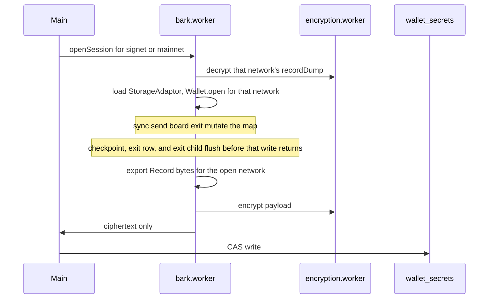

# Bark persistence

Bark (Second's Ark wallet) is a **separate rail** from on-chain BDK and from Arkade. Balances and VTXOs come from the Bark server and `bitboard-bark` WASM. They are not added to the on-chain total or the Arkade total.

For save/sync orchestration, see [wallet rail lifecycle](../wallet-rail-lifecycle.md).

## Encrypted payload (`wallet_secrets`)

Each Bark network is one entry in `WalletSecretsPayload.barkRails`:

```typescript
type BarkRailNetwork = 'signet' | 'mainnet'

interface StoredBarkRail {
  serverUrl: string
  fingerprint: string
  lastSuccessfulSyncAt?: string
  receiveKeyIndex?: number
  recordDump?: string // versioned Bark Record bytes, standard base64
  pendingEmergencyClaim?: { txid: string; vtxoIds: string[] }
}

barkRails?: Partial<Record<BarkRailNetwork, StoredBarkRail>>
```

The map key is the network. The rail record does not repeat it. Signet `serverUrl` is `https://ark.signet.2nd.dev`. Mainnet `serverUrl` is `https://ark.second.tech`. A flush rewrites only the open network's dump. `pendingEmergencyClaim` is metadata on that rail, not a Bark protocol record. It remembers a broadcast claim until Bark reports those VTXOs claim-in-progress or claimed, or the app Esplora reports the transaction gone. A dump flush keeps the field.

**Size limit:** each `recordDump` must not exceed 10 MB of UTF-8 (`BARK_RECORD_DUMP_MAX_BYTES` in `wallet-domain-types.ts`). An over-cap dump is kept on the payload. Session open refuses it. Dropping it would open an empty wallet and lose the exit chain.

## Rust record store (`bitboard-bark`)

File: `bitboard-bark/src/record_store.rs`

| Type | Purpose |
|------|---------|
| `SharedRecordStore` | In-memory `StorageAdaptor` (put, get, delete, query_sorted, get_all) |
| Encoded dump | `version: 1` plus `Vec<Record>`, postcard bytes, standard base64 |

`StorageAdaptorWrapper` implements `BarkPersister`. Bitboard does not re-declare VTXO, movement, or exit tables. `query_sorted` uses Bark's `SortKey` order and skips records that have no sort key.

`bark_open_session` loads the open network's dump, then `Wallet::open` with that persister and `MemoryLockManager`. `datadir` is unset, so Bark does not open its platform IndexedDB. An empty dump string means there is no encrypted dump yet. A corrupt dump or an unknown version fails the open.

`bark_export_record_dump` exports the open network. A wallet-action checkpoint, exit row, or exit child is encrypted and written before that Bark write returns, so a tab killed during board, offboard, or exit progress reloads the checkpoint and the next sync resumes it. Other puts stay in memory until the call returns. A missing flush hook on WASM fails the write. The mid-call flush does not stamp `lastSuccessfulSyncAt`.

## Worker persistence flow



Key modules:

| Module | Role |
|--------|------|
| `frontend/src/workers/bark.worker.ts` | Session, export, flush after mutating calls |
| `frontend/src/workers/bark-persistence-channel.ts` | Worker ↔ encryption channel |
| `frontend/src/workers/bark-worker-metadata.ts` | CAS write of the open network's rail only |
| `frontend/src/lib/bark/bark-rail-metadata.ts` | Merge helpers that leave the other network and Arkade untouched |

Main thread code handles **ciphertext only**. Plaintext records stay in the Bark worker.

A flush replaces the open network's `recordDump` and leaves the other network's dump and every `sdkPersistenceJson` as they were read. An Arkade flush leaves both Bark dumps as they were read. The `wallet_secrets` row is still one ciphertext, so the row is re-encrypted either way.

A checkpoint, exit-row, or exit-child put or delete flushes during the call, before Bark continues to broadcast or the next step. That write does not change `lastSuccessfulSyncAt`. Flush also runs after open, reveal, sync, board prepare, board submit, Arkoor, on-chain send, offboard, and emergency-exit start, progress, CPFP, cancel, and drain. A failed call still flushes when the session is open, so a checkpoint written before the error is not dropped. Peek, balance, history, VTXO list, estimates, exit list, and exit topology do not flush. A revision conflict re-reads the payload and applies the dump again, leaving the other network and a pending emergency claim in place.

`Wallet::open` receives the in-memory persister. Bark does not open IndexedDB. An empty `recordDump` starts a new in-memory store.
