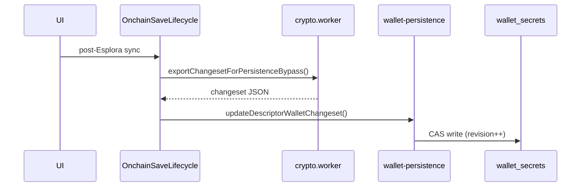

# Bitcoin on-chain persistence

On-chain state is a **BDK descriptor wallet** per `(network, addressType, accountId)` combination. The authoritative chain view lives in a BDK `ChangeSet` serialized to JSON and stored inside the encrypted wallet secrets payload.

For balance authority and how on-chain relates to other rails, see [on-chain wallet model](../onchain-bitboard-wallet-model.md). For load/sync/save orchestration, see [wallet rail lifecycle](../wallet-rail-lifecycle.md#on-chain-rail).

## What is persisted

Each entry in `WalletSecretsPayload.descriptorWallets` (`DescriptorWalletData`):

| Field | Purpose |
|-------|---------|
| `network` | `bitcoin`, `testnet`, `signet`, or `regtest` |
| `addressType` | `segwit` or `taproot` |
| `accountId` | BIP44-style account index |
| `externalDescriptor` / `internalDescriptor` | BDK descriptor strings |
| `changeSet` | BDK `ChangeSet` JSON (UTXOs, tx graph, address index) |
| `fullScanDone` | Whether a full Esplora scan has completed at least once |
| `lastSuccessfulEsploraSyncAt` | ISO timestamp of last successful sync (non-lab) |

Type definition: `frontend/src/lib/wallet/wallet-domain-types.ts`.

### Plaintext settings (not encrypted)

Custom Esplora base URLs are stored per network in the `settings` table as `custom_esplora_url_{network}` (`wallet-utils.ts`). These are not secret.

## WASM runtime (`crypto` crate)

| Concern | Location |
|---------|----------|
| Serialize / deserialize changeset | `crypto/src/wallet.rs` |
| Active wallet thread-local | `crypto/src/lib.rs` — `ACTIVE_WALLET`, `ACCUMULATED_CHANGESET` |
| Export for persistence | `export_changeset()` |
| Ephemeral sessions (no global active wallet) | `crypto/src/wallet_session.rs` |

The crypto worker loads descriptors and changeset on unlock; the in-memory BDK wallet is the working copy until save.

## Persistence flow

1. **Load:** `resolveDescriptorWallet` decrypts payload via secrets channel → crypto worker loads BDK (`descriptor-wallet-manager.ts`).
2. **Sync:** Esplora sync runs in WASM; results stay in the active changeset.
3. **Save:** `onchain-save-lifecycle-orchestrator.ts` exports changeset, then `updateDescriptorWalletChangeset()` merges into `descriptorWallets[]` and CAS-writes encrypted payload.

Key modules:

- `frontend/src/lib/wallet/descriptor-wallet-manager.ts` — load/update descriptor entries
- `frontend/src/lib/wallet/lifecycle/onchain-save-lifecycle-orchestrator.ts` — save orchestration
- `frontend/src/lib/wallet/lifecycle/onchain-descriptor-mutation-guard.ts` — export guard during save

## Derived from `changeSet` (not separate fields)

Balance, transaction history, and the receive address cursor are **persisted inside** `changeSet` — there are no dedicated columns or Zustand keys for them:

| Derived state | Encoded in changeset as |
|---------------|-------------------------|
| Balance | UTXO set |
| Transaction list | Local tx graph |
| Current / next receive address | Address index |

After unlock, the crypto worker loads the changeset into BDK; `walletStore` and TanStack Query then expose these as **runtime views** refreshed after Esplora sync. They are not written to their own persistence keys.

## Not persisted

| State | Where it lives |
|-------|----------------|
| Send flow draft | `sendStore` |
| Sync errors, lifecycle phase | On-chain lifecycle orchestrator snapshots |
| Dashboard "last synced" display time | `walletStore.lastSyncTime` (memory; canonical copy in `DescriptorWalletData.lastSuccessfulEsploraSyncAt`) |

Zustand `wallet-storage` persists only navigation context: `networkMode`, `addressType`, `accountId`, `activeWalletId`.

## Lab interaction

When switching to lab network mode, the app exports the current descriptor changeset before loading the lab wallet in WASM (`switch-to-lab-network.ts`). Lab entity wallets use a separate persistence path; see [lab.md](lab.md).

## Chain mismatch handling

If persisted network does not match the active network mode, `persisted-chain-mismatch.ts` classifies the situation so the UI can prompt recovery instead of silently loading wrong-chain state.

## Versioning

BDK changesets are opaque JSON blobs. Network and descriptor metadata are validated on load. There is no separate on-chain persistence version field — schema evolution is handled by BDK and descriptor validation at load time.
