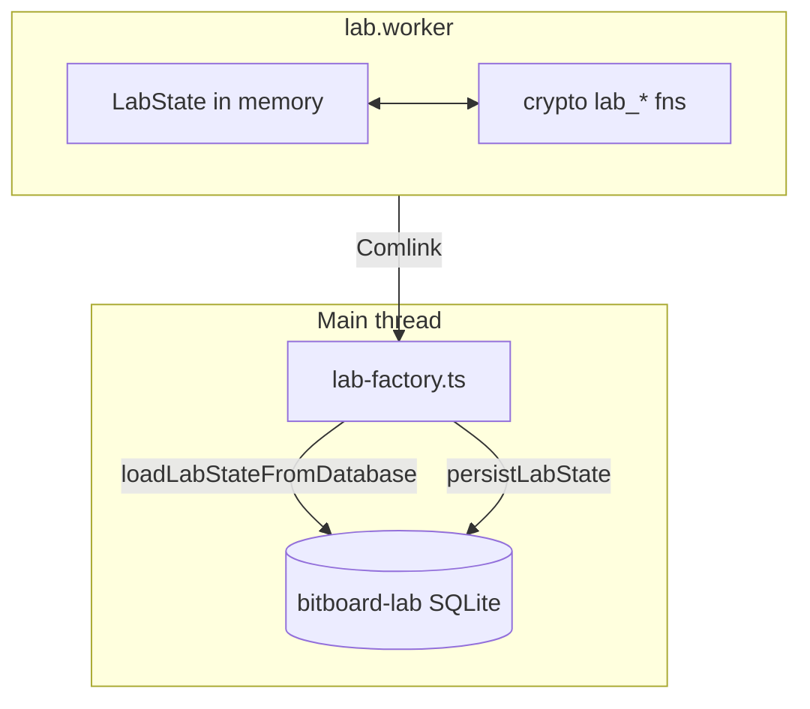

# Lab persistence

The Lab is a **chain simulator** with its own SQLite database (`bitboard-lab`), separate from the main wallet file. It models blocks, UTXOs, mempool, and optional "lab entities" (extra simulated wallets) for testing and education.

Lab state is **not** encrypted — it is a local sandbox. WIFs and mnemonics for lab entities are stored in plaintext in the lab database.

## Database (`bitboard-lab`)

Schema types: `frontend/src/db/lab-schema.ts`  
Migrations: `frontend/src/db/migrations/lab/`

| Table group | Tables | Purpose |
|-------------|--------|---------|
| Chain state | `blocks`, `utxos` | Confirmed chain and UTXO set |
| Keys & identity | `lab_addresses`, `lab_entities`, `lab_address_owners` | Addresses with WIF; entity wallets with descriptors and changesets; ownership mapping |
| Transactions | `lab_mempool`, `lab_transactions`, `lab_tx_details` | Mempool and confirmed tx views |
| Operation metadata | `lab_mine_operations`, `lab_tx_operations` | Mining attribution, spend/change hints (UI does not rely on string inference alone) |
| Parameters | `lab_parameter_presets` | Block weight limit, miner subsidy |

### Lab entities

Each `lab_entities` row is a simulated wallet:

| Column | Purpose |
|--------|---------|
| `mnemonic` | Entity seed phrase |
| `changeset_json` | BDK changeset (via `crypto/src/lab_entity_wallet.rs`) |
| `external_descriptor` / `internal_descriptor` | BDK descriptors |
| `entity_name` | User-chosen name, or null for anonymous (`Anonymous-{id}`) |
| `is_dead` | Soft-delete flag |

Lab entity wallets are **separate** from the main app's `ACTIVE_WALLET` in the crypto worker.

## Runtime vs durable state

1. **Worker:** `lab.worker.ts` holds authoritative in-memory `LabState`. WASM handles mining, signing, and chain effects.
2. **Main thread:** `lab-factory.ts` loads full state on startup and writes snapshots after mutations.
3. **Batching:** Inserts are chunked (`LAB_PERSIST_INSERT_BATCH_SIZE = 200`) to avoid oversized single statements on large chains.

## Cross-tab sync

After a successful persist commit, `notifyLabStatePersistedAfterCommit` (`lab-cross-tab-sync.ts`) notifies other tabs. Writes are serialized with the `bitboard-lab-writer` Web Lock (`opfs-writer-lock.ts`).

## Main wallet in lab mode

When the user switches to lab network mode, the app exports the current main-wallet descriptor changeset before loading the lab wallet in WASM (`switch-to-lab-network.ts`). On-chain persistence for the real wallet remains in `bitboard-wallet`; see [bitcoin-onchain.md](bitcoin-onchain.md).

## Backup

Lab backup is an **unsigned** ZIP of the lab SQLite file. Import is replace-only (no merge). Distinct from wallet backup, which is signed. See [general.md](general.md#backup-and-import).

## Debug

`localStorage` key `bitboard_lab_debug` enables lab pipeline debug logging (`lab-pipeline-debug.ts`). This is development-only and not part of durable chain state.

## What is **not** in lab SQLite

| State | Where |
|-------|-------|
| Main wallet encrypted secrets | `bitboard-wallet` / `wallet_secrets` |
| UI selection, panel layout | React component state |
| TanStack Query cache for lab API | Memory (refetched after load) |
