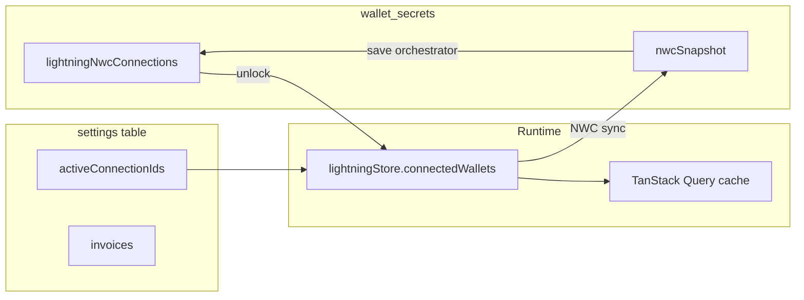

# Lightning persistence

Lightning in Bitboard uses **NWC (Nostr Wallet Connect)**. Connection secrets and cached operator snapshots live in encrypted wallet secrets; the UI store keeps connection selection and invoices in plaintext settings.

The `bitboard-lightning` WASM crate has **no wallet persistence** — it only exposes helpers such as `generate_node_id()` from LDK `KeysManager` (`bitboard-lightning/src/lib.rs`).

For the Lightning wallet model, see [lightning wallet model](../lightning-bitboard-wallet-model.md). For save orchestration, see [wallet rail lifecycle](../wallet-rail-lifecycle.md#lightning-rail).

## Encrypted payload (`wallet_secrets`)

Connections are stored in `WalletSecretsPayload.lightningNwcConnections`:

```typescript
interface StoredNwcLightningConnection {
  id: string
  label: string
  networkMode: LightningNetworkMode
  connectionString: string   // full nostr+walletconnect:// URI including secret
  createdAt: string
  nwcSnapshot?: NwcConnectionSnapshot
}

interface NwcConnectionSnapshot {
  balanceSats: number
  balanceUpdatedAt: string
  payments: LightningPayment[]
  paymentsUpdatedAt: string
}
```

The snapshot lets the dashboard show last-known balance and payment history offline after unlock, without re-querying NWC on every page load.

### Key modules

| Module | Role |
|--------|------|
| `frontend/src/lib/lightning/lightning-wallet-secrets.ts` | Load/save/add/remove connections in encrypted payload |
| `frontend/src/lib/lightning/lightning-wallet-snapshot-persistence.ts` | Merge NWC snapshot patches after sync |
| `frontend/src/lib/wallet/lifecycle/lightning-save-lifecycle-orchestrator.ts` | Orchestrated persist after connection changes or sync |

## Zustand `lightningStore` (`lightning-storage`)

Persisted via `sqliteStorage` → `settings` table:

| Field | Persisted |
|-------|-----------|
| `activeConnectionIds` | Yes — per-wallet active NWC connection |
| `invoices` | Yes — locally tracked invoice metadata |
| `connectedWallets` (with decrypted NWC strings) | **No** — memory only |

On unlock, connections are loaded from encrypted secrets into `connectedWallets`. On lock, `purgeLightningConnectionsFromMemory` clears decrypted strings from memory.

## Persistence flow



1. **Load (unlock):** `loadLightningConnectionsForWallet` decrypts payload, maps to `ConnectedLightningWallet`, hydrates store.
2. **Sync:** NWC backend fetches balance/payments; results update TanStack Query and optionally snapshot patches.
3. **Save:** `lightning-save-lifecycle-orchestrator` writes connection list changes and snapshot merges via `updateWalletSecretsPayloadWithRetry`.

## What is **not** persisted

| State | Where |
|-------|-------|
| Live NWC connection handles | In-memory during session |
| Real-time payment stream | TanStack Query (refetched on sync) |
| Connection health / error banners | UI + query error state |

## Security notes

- Full NWC URIs (including secrets) are **only** in the encrypted `wallet_secrets` payload.
- Never stored in `localStorage`, `sessionStorage`, or plaintext `settings`.
- See [SECURITY.md](../../doc/SECURITY.md).
