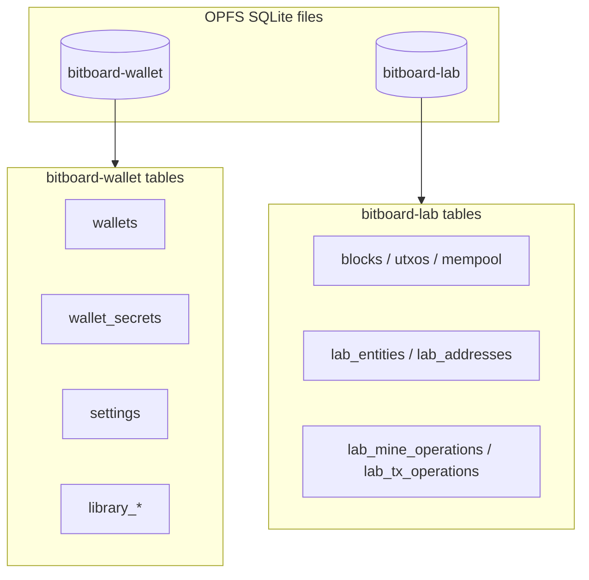

# Persistence architecture overview

Bitboard stores durable state in **SQLite over OPFS** (Origin Private File System), not IndexedDB. Sensitive wallet data is encrypted at rest; WASM workers hold ephemeral runtime state that is flushed back to SQLite through per-rail lifecycle orchestrators.

This folder documents **what** is persisted, **where**, and **how** reads and writes are coordinated. For rail load/sync/save orchestration, see [wallet rail lifecycle](../wallet-rail-lifecycle.md). For application-wide data flow, see [application architecture](../../doc/ARCHITECTURE.md).

## Documents in this folder

| Document | Scope |
|----------|--------|
| [bitcoin-onchain.md](bitcoin-onchain.md) | BDK descriptor wallets, changesets, Esplora sync metadata |
| [lightning.md](lightning.md) | NWC connections, encrypted snapshots, Lightning store |
| [arkade.md](arkade.md) | Operator connections, `sdkPersistenceJson`, Arkade WASM envelope |
| [unilateral-exit.md](unilateral-exit.md) | Unilateral-exit materials, watches, job/prefs/failure stores |
| [lab.md](lab.md) | Lab simulator chain state, entities, mempool |
| [general.md](general.md) | Shared wallet DB, encryption, Zustand settings, library, backups |

## Storage backends



| OPFS basename | Constant | Entry module | Purpose |
|---------------|----------|--------------|---------|
| `bitboard-wallet` | `WALLET_SQLITE_OPFS_BASENAME` | `frontend/src/db/database.ts` | Wallet metadata, encrypted secrets, UI settings, library |
| `bitboard-lab` | `LAB_SQLITE_OPFS_BASENAME` | `frontend/src/db/lab-database.ts` | Chain simulator state |

There is **no IndexedDB fallback**. If OPFS or SQLite is unavailable, the app shows `SecureStorageUnavailableBanner` and does not silently degrade.

**Legacy:** Arkade previously used per-wallet IndexedDB databases (`bitboard-arkade-{walletId}-{networkMode}`). These are deleted on session open; Arkade state now lives in `sdkPersistenceJson` inside encrypted wallet secrets.

## Two persistence layers

### 1. Encrypted wallet secrets (`wallet_secrets`)

The `wallet_secrets` row holds the mnemonic and a JSON payload (`WalletSecretsPayload`) encrypted with the user's wallet password (Argon2id + AES-256-GCM). All rail-specific secrets for a Bitboard wallet share this blob:

```typescript
interface WalletSecretsPayload {
  descriptorWallets: DescriptorWalletData[]           // on-chain
  lightningNwcConnections: StoredNwcLightningConnection[]
  arkadeOperatorConnections: StoredArkadeOperatorConnection[]
  activeArkadeConnectionIdByNetwork: Partial<Record<ArkadeSupportedNetworkMode, string>>
}
```

Writes use **optimistic concurrency** on the `revision` column (`updateWalletSecretsPayloadWithRetry`, max 8 retries). See `frontend/src/db/wallet-persistence.ts`.

### 2. Plaintext settings (`settings`)

Zustand stores that opt into `persist` use `sqliteStorage` (`frontend/src/db/storage-adapter.ts`), which reads and writes key/value rows in the `settings` table. This holds UI preferences, feature flags, and non-secret configuration (e.g. custom Esplora URLs).

Passwords, mnemonics, and NWC URIs are **never** stored in `localStorage` or `sessionStorage` (see [SECURITY.md](../../doc/SECURITY.md)).

## WASM runtime vs durable state

| Worker | WASM crate | Runtime (ephemeral) | Flushed to |
|--------|------------|---------------------|------------|
| `crypto.worker` | `crypto` | `ACTIVE_WALLET`, BDK changeset | `descriptorWallets[].changeSet` in encrypted payload |
| `arkade.worker` | `bitboard-ark` | `JsonPersistenceDb` | `sdkPersistenceJson` on active operator connection |
| `lab.worker` | `crypto` (`lab_*`) | In-memory `LabState` | Lab SQLite via `lab-factory.ts` on main thread |
| `encryption.worker` | `bitboard-encryption` | Session password in worker memory | Not persisted (except near-zero wrapper; see [general.md](general.md)) |

Plaintext secrets never cross the main thread: workers communicate with `encryption.worker` over a `MessageChannel` (`secrets-channel.ts`).

## Concurrency and teardown

| Mechanism | Lock name | Used for |
|-----------|-----------|----------|
| Web Locks API | `bitboard-wallet-writer` | Wallet SQLite + `wallet_secrets` CAS writes |
| Web Locks API | `bitboard-lab-writer` | Lab SQLite snapshot writes |
| CAS | `wallet_secrets.revision` | Concurrent encrypted payload updates |

Factory reset (`wipe-all-app-data-opfs-and-reload.ts`) tears down workers, blocks storage adapters, and removes OPFS files.

## TanStack Query vs persistence

**Principle:** TanStack Query caches async pipeline results (balances, tx lists, operator sync). Durable state is written **before** `setQueryData`. Zustand holds UI preferences and transient dashboard snapshots — not authoritative chain or operator data.

Each rail has a save orchestrator that gates persistence on lifecycle phase. See [wallet rail lifecycle](../wallet-rail-lifecycle.md).

## Schema migrations

| Database | Mechanism | Failure handling |
|----------|-----------|------------------|
| `bitboard-wallet` | Kysely forward migrations in `frontend/src/db/migrations/wallet/` | Report at OPFS `wallet-schema-migration-failure.json` |
| `bitboard-lab` | Kysely forward migrations in `frontend/src/db/migrations/lab/` | Same pattern via lab migrator |

Zustand stores may carry their own `version` + `migrate` (e.g. `featureStore`, `periodicSyncStore`). Arkade SDK JSON has an independent version in Rust (`BITBOARD_ARK_PERSISTENCE_VERSION`, currently **6**).

## Key file index

| Area | Primary paths |
|------|---------------|
| Wallet DB | `frontend/src/db/database.ts`, `schema.ts`, `wallet-persistence.ts` |
| Lab DB | `frontend/src/db/lab-database.ts`, `lab-schema.ts`, `workers/lab-factory.ts` |
| Zustand adapter | `frontend/src/db/storage-adapter.ts` |
| Domain types | `frontend/src/lib/wallet/wallet-domain-types.ts` |
| On-chain WASM | `crypto/src/wallet.rs`, `crypto/src/lib.rs` |
| Arkade WASM | `bitboard-ark/src/persistence.rs` |
| Encryption | `bitboard-encryption/`, `frontend/src/db/encryption.ts` |
