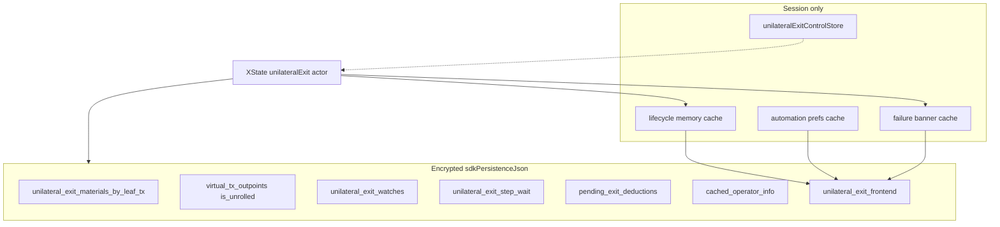

# Unilateral exit persistence

Durable state for unilateral exit lives in **encrypted `sdkPersistenceJson`**. Abort and `CLEAR_JOB` only clear the **frontend job** bundle. WASM materials, watches, pending deductions, and on-chain broadcasts survive abort (`ARK-EXIT-23`).

Protocol and orchestration: [unilateral-exit.md](../unilateral-exit.md). Staged VTXO lifecycle refactor: [unilateral-exit-vtxo-lifecycle-refactor.md](../unilateral-exit-vtxo-lifecycle-refactor.md). Arkade envelope overview: [arkade.md](arkade.md). Wallet-model balance timing: [arkade-bitboard-wallet-model.md](../arkade-bitboard-wallet-model.md).



Memory caches are keyed by `walletId:networkMode:connectionId` (`arkadeWalletScopeKey`). Durable fields are per operator connection inside that connection's envelope — no `jobsByKey` map.

---

## WASM / encrypted `sdkPersistenceJson`

Flushed through the Arkade save lifecycle into `StoredArkadeOperatorConnection.sdkPersistenceJson`. Types: [`bitboard-ark/src/persistence.rs`](../../bitboard-ark/src/persistence.rs). Materials encode/decode: [`unilateral_exit_materials.rs`](../../bitboard-ark/src/unilateral_exit_materials.rs). Frontend bundle I/O: [`unilateral-exit-frontend-sdk-persistence.ts`](../../frontend/src/lib/wallet/lifecycle/unilateral-exit-frontend-sdk-persistence.ts).

**Envelope version:** `BITBOARD_ARK_PERSISTENCE_VERSION = 8`. `parse_import` migrates v3–v7. v5 stored materials **per VTXO row**; v6 keys them by **leaf txid** (`unilateral_exit_materials_by_leaf_tx`). v7 adds `unilateral_exit_frontend` (job, automation prefs, last failure). v8 adds envelope `autonomous_mode` (default false). Missing v7 field on a v6 blob is `None` and triggers a one-shot overlay from legacy SQLite `settings` rows.

| Field | Where | Role |
|-------|-------|------|
| `virtual_tx_outpoints` | `OffchainVtxoSnapshot` | VTXO list including sticky `is_unrolled` / `is_spent` / `is_swept` |
| `unilateral_exit_materials_by_leaf_tx` | `OffchainVtxoSnapshot` | Chain JSON + virtual PSBTs for autonomous unroll |
| `unilateral_exit_watches` | `WalletDbSnapshot` | Exit watches that survive a full snapshot replace (`ARK-EXIT-12`) |
| `unilateral_exit_step_wait` | `WalletDbSnapshot` | Current step txid, index, `started_at` for relay-wait UI |
| `pending_exit_deductions` | `WalletDbSnapshot` | Balance-line records during unroll before `is_unrolled` |
| `cached_operator_info` | `WalletDbSnapshot` | Last `getInfo` snapshot for autonomous mode |
| `autonomous_mode` | `BitboardArkPersistence` | Per-ASP trust posture; default false; session open skips operator RPC when true |
| `unilateral_exit_frontend` | `WalletDbSnapshot` | Frontend job bookmark, automation prefs, last failure |

### Materials (`UnilateralExitMaterialsRecord`)

```text
cached_at, chain_json, virtual_psbts[]  { virtual_txid, psbt_hex }
```

Filled on operator sync for exit-eligible VTXOs (`ARK-EXIT-07`). Proceed fails fast with `autonomous_exit_materials_missing` when a selected leaf lacks a record (`ARK-EXIT-08`), including when autonomous mode is off. `merge_unilateral_exit_materials_maps` keeps prior leaf entries when a new snapshot omits them.

### Sticky `is_unrolled`

Local stamp after a published virtual tx reaches **6 confirmations**: leaves via `mark_leaf_virtual_tx_vtxos_unrolled_in_snapshot` (all vouts on that txid); intermediate (en-passant) hosts via `reconcile_intermediate_ark_virtual_txs_unrolled_on_esplora` on operator sync. `merge_sticky_unrolled_flags` preserves the flag when the ASP lags.

### Watches (`UnilateralExitWatchRecord`)

```text
vtxo_txid, vout, amount_sats, registered_at, published_vtxo_txid?, branch_txids[]
```

Registered when a leaf is marked unrolled. Cleared only on completion, hard unroll failure, or reconcile evidence (operator spent or on-chain spent). After each operator sync, `reconcile_exiting_vtxo_watches` runs targeted lookups — never clear exiting state because the full `list_vtxos` omitted a row (`ARK-SYNC-03`).

### Step wait (`UnilateralExitStepWaitRecord`)

```text
step_txid, step_index, started_at
```

`ensure_unilateral_exit_step_wait` reuses `started_at` when the same step is already tracked. Cleared when the current step reaches 1 confirmation or the branch is complete. Frontend also mirrors relay wait as `currentStepRelayedSinceUnix` in the frontend job bundle (regtest `/raw` 404 workaround).

### Pending deductions

First unroll broadcast writes a unilateral pending deduction while the VTXO is still spendable in the snapshot. After local `is_unrolled`, `reconcile_pending_exit_deductions` drops the record; the same sats move to the **exiting** sub-bucket. See the wallet-model [balance timing table](../arkade-bitboard-wallet-model.md#unilateral-vs-collaborative-exit-balance-timing).

### Frontend bundle (`UnilateralExitFrontendPersistence`)

Optional on `WalletDbSnapshot`. `None` means the envelope has never been written in v7 (legacy blob or new connection) and should overlay leftover SQLite settings once. `Some` with empty `selected_leaf_outpoints` is an explicit empty job — do **not** re-read settings.

```text
job.selected_leaf_outpoints[]     { txid, vout }
job.current_step_relayed_since_unix
job.job_started_at_unix
automation_prefs.enabled
automation_prefs.fee_preset_label
automation_prefs.max_fee_rate_sat_per_vb
last_failure?                     reason_code, outpoints, timestamps, vtxo_ids
```

A job exists iff `selected_leaf_outpoints.length > 0`. The machine writes this on `START_MANUAL` / `START_AUTOMATIC` (new `job_started_at_unix`, cleared relay wait) and on `HYDRATE_OR_START` (`ensureActiveJob`, which preserves those timestamps when the outpoints are unchanged). It clears the job on complete, terminate, abort, and `CLEAR_JOB`. Failures (including user abort) stay in `last_failure`.

`context.automationEnabled` is the only job-level manual/automatic switch; prefs changes still flow as `AUTOMATION_PREFS_CHANGED`.

| `last_failure.reason_code` | When |
|----------------------------|------|
| `asp_swept_targets` | Viability: ASP swept job leaves |
| `branch_funding_lost` | Viability: foreign spend of branch funding |
| `user_aborted` | `ABORT_ORCHESTRATION` (includes `vtxo_ids` for copy) |

Granular WASM setters (`ark_set_unilateral_exit_job` / `_automation_prefs` / `_failure`) flush `sdkPersistenceJson` only — they do not operator-sync.

**Legacy settings overlay:** first session open after upgrade reads `unilateral-exit-lifecycle-storage`, `unilateral-exit-automation-prefs`, and `unilateral-exit-failure-storage` from the `settings` table when the envelope field is `None`, writes the merged bundle, then deletes that scope's key from each JSON (drops the settings row when the map is empty). Inactive v4 job rows (`jobActive: false`) overlay as an empty job.

### Control store (not persisted)

[`unilateralExitControlStore.ts`](../../frontend/src/stores/unilateralExitControlStore.ts) holds leaf selection and graph epoch in memory only. On unlock, hydrate selection from the **job cache** when persisted outpoints are still present (`shouldHydratePersistedUnilateralExitJob`).

Zustand stores for job/prefs/failure are **session caches** (no `sqliteStorage`). Hydration: `hydrateUnilateralExitFrontendPersistenceFromSdk` before `HYDRATE_OR_START` / `WALLET_CONFIGURED`. Lock/`WALLET_RESET` clears the memory cache for the scope; durable state stays in the envelope.

---

## Hydrate and authority

1. Unlock / Arkade load → `hydrateUnilateralExitFromPersistence` in [`unilateral-exit-runtime.ts`](../../frontend/src/lib/wallet/lifecycle/unilateral-exit/unilateral-exit-runtime.ts).
2. If persisted outpoints are present → `HYDRATE_OR_START` (always via `checkingProgress`).
3. If the job bookmark is empty, hydrate does **not** invent a job from leftover WASM in-progress exits. Those rows stay visible on the control page; the user starts again explicitly. Crash recovery is “persisted outpoints are still there.”
4. While the job exists, topology/progress outpoints come from the **actor** (`resolveUnilateralExitTopologyOutpoints` / `resolveUnilateralExitJobOutpoints`). Never skip when lifecycle outpoints are empty but persistence still has them.
5. Hydrate waits until Arkade load/sync is quiet (or until in-progress sats/outpoints are already visible) before sending `HYDRATE_OR_START`. WASM reporting no in-progress exits does **not** clear a persisted job — that is pre-broadcast crash recovery. The machine clears the job bookmark on complete / abort / terminate.

TanStack Query caches progress/topology/balance for display. During an active job it does **not** poll or refetch `getUnilateralExitProgress`; actors seed the progress cache after WASM reads. Durable writes happen in WASM export (encrypted payload). `actor.context.progress` is authoritative over the query cache.
