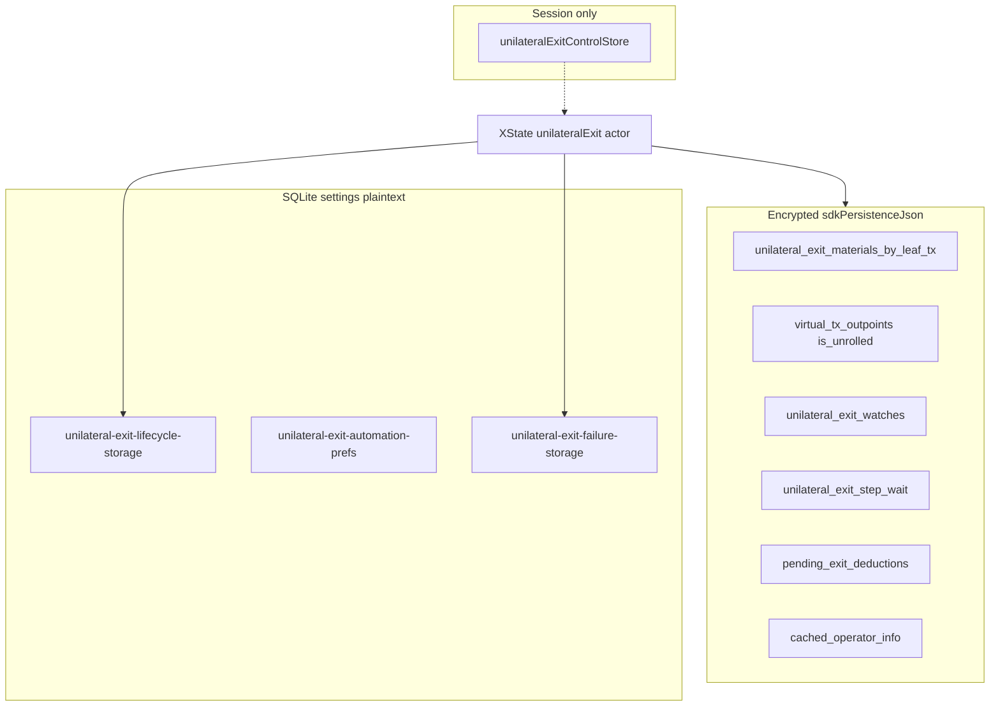

# Unilateral exit persistence

Durable state for unilateral exit lives in **two layers**. Abort and `CLEAR_JOB` only touch the **frontend job** layer. WASM materials, watches, pending deductions, and on-chain broadcasts survive abort (`ARK-EXIT-23`).

Protocol and orchestration: [unilateral-exit.md](../unilateral-exit.md). Arkade envelope overview: [arkade.md](arkade.md). Wallet-model balance timing: [arkade-bitboard-wallet-model.md](../arkade-bitboard-wallet-model.md).



Keys for Zustand stores are `walletId:networkMode:connectionId` (`unilateralExitWalletScopeKey`).

---

## WASM / encrypted `sdkPersistenceJson`

Flushed through the Arkade save lifecycle into `StoredArkadeOperatorConnection.sdkPersistenceJson`. Types: [`bitboard-ark/src/persistence.rs`](../../bitboard-ark/src/persistence.rs). Materials encode/decode: [`unilateral_exit_materials.rs`](../../bitboard-ark/src/unilateral_exit_materials.rs).

**Envelope version:** `BITBOARD_ARK_PERSISTENCE_VERSION = 6`. `parse_import` migrates v3–v5. v5 stored materials **per VTXO row**; v6 keys them by **leaf txid** (`unilateral_exit_materials_by_leaf_tx`). Sibling outpoints on the same leaf share one materials record.

| Field | Where | Role |
|-------|-------|------|
| `virtual_tx_outpoints` | `OffchainVtxoSnapshot` | VTXO list including sticky `is_unrolled` / `is_spent` / `is_swept` |
| `unilateral_exit_materials_by_leaf_tx` | `OffchainVtxoSnapshot` | Chain JSON + virtual PSBTs for autonomous unroll |
| `unilateral_exit_watches` | `WalletDbSnapshot` | Exit watches that survive a full snapshot replace (`ARK-EXIT-12`) |
| `unilateral_exit_step_wait` | `WalletDbSnapshot` | Current step txid, index, `started_at` for relay-wait UI |
| `pending_exit_deductions` | `WalletDbSnapshot` | Balance-line records during unroll before `is_unrolled` |
| `cached_operator_info` | `WalletDbSnapshot` | Last `getInfo` snapshot for autonomous mode |

### Materials (`UnilateralExitMaterialsRecord`)

```text
cached_at, chain_json, virtual_psbts[]  { virtual_txid, psbt_hex }
```

Filled on operator sync for exit-eligible VTXOs (`ARK-EXIT-07`). Proceed fails fast with `autonomous_exit_materials_missing` when a selected leaf lacks a record (`ARK-EXIT-08`), including when autonomous mode is off. `merge_unilateral_exit_materials_maps` keeps prior leaf entries when a new snapshot omits them.

### Sticky `is_unrolled`

Local stamp after the leaf virtual tx reaches **6 confirmations** (`mark_leaf_virtual_tx_vtxos_unrolled_in_snapshot` — all vouts on that txid). `merge_sticky_unrolled_flags` preserves the flag when the ASP lags. Intermediate (en-passant) hosts are marked when their txs are **visible** on Esplora (`reconcile_intermediate_ark_virtual_txs_unrolled_on_esplora` on operator sync).

### Watches (`UnilateralExitWatchRecord`)

```text
vtxo_txid, vout, amount_sats, registered_at, published_vtxo_txid?, branch_txids[]
```

Registered when a leaf is marked unrolled. Cleared only on completion, hard unroll failure, or reconcile evidence (operator spent or on-chain spent). After each operator sync, `reconcile_exiting_vtxo_watches` runs targeted lookups — never clear exiting state because the full `list_vtxos` omitted a row (`ARK-SYNC-03`).

### Step wait (`UnilateralExitStepWaitRecord`)

```text
step_txid, step_index, started_at
```

`ensure_unilateral_exit_step_wait` reuses `started_at` when the same step is already tracked. Cleared when the current step reaches 1 confirmation or the branch is complete. Frontend also mirrors relay wait as `currentStepRelayedSinceUnix` in the job store (regtest `/raw` 404 workaround).

### Pending deductions

First unroll broadcast writes a unilateral pending deduction while the VTXO is still spendable in the snapshot. After local `is_unrolled`, `reconcile_pending_exit_deductions` drops the record; the same sats move to the **exiting** sub-bucket. See the wallet-model [balance timing table](../arkade-bitboard-wallet-model.md#unilateral-vs-collaborative-exit-balance-timing).

---

## Zustand / SQLite `settings`

Plaintext rows in the wallet `settings` table via `sqliteStorage`. Not secrets. Hydration: `waitForPersistedStoreHydration` before `HYDRATE_OR_START`.

### Job: `unilateral-exit-lifecycle-storage` (v5)

File: [`unilateral-exit-lifecycle-persistence.ts`](../../frontend/src/lib/wallet/lifecycle/unilateral-exit-lifecycle-persistence.ts)

`jobsByKey` → `PersistedUnilateralExitJob`. A job exists iff `selectedLeafOutpoints.length > 0`.

| Field | Meaning |
|-------|---------|
| `selectedLeafOutpoints` | Sorted job leaves; empty means no frontend job |
| `currentStepRelayedSinceUnix` | When the active step was first known relayed; null when not waiting |
| `jobStartedAtUnix` | Job start; copied into failure records; cleared on `clearJob` |

v5 drops `jobActive`. Inactive v4 rows (`jobActive: false`, including aborted jobs that still listed outpoints) migrate to an empty bookmark.

The machine writes this on `START_MANUAL` / `START_AUTOMATIC` (`setActiveJob`, new `jobStartedAtUnix` and cleared relay wait) and on `HYDRATE_OR_START` (`ensureActiveJob`, which preserves those timestamps when the outpoints are unchanged). It clears the bookmark on complete, terminate, abort, and `CLEAR_JOB`. Failures (including user abort) are stored separately in the failure bookmark.

### Automation prefs: `unilateral-exit-automation-prefs` (v1)

File: [`unilateral-exit-automation-prefs-persistence.ts`](../../frontend/src/lib/wallet/lifecycle/unilateral-exit-automation-prefs-persistence.ts)

`prefsByKey` → `{ enabled, feePresetLabel, maxFeeRateSatPerVb }`. Changes flow into the actor as `AUTOMATION_PREFS_CHANGED`. `context.automationEnabled` is the only job-level manual/automatic switch.

### Failure: `unilateral-exit-failure-storage` (v2)

File: [`unilateral-exit-failure-persistence.ts`](../../frontend/src/lib/wallet/lifecycle/unilateral-exit-failure-persistence.ts)

One last failure per scope, for the control-page banner:

| `reasonCode` | When |
|--------------|------|
| `asp_swept_targets` | Viability: ASP swept job leaves |
| `branch_funding_lost` | Viability: foreign spend of branch funding |
| `user_aborted` | `ABORT_ORCHESTRATION` (includes `vtxoIds` for copy) |

### Control store (not persisted)

[`unilateralExitControlStore.ts`](../../frontend/src/stores/unilateralExitControlStore.ts) holds leaf selection and graph epoch in memory only. On unlock, hydrate selection from the **job store** when persisted outpoints are still present (`shouldHydratePersistedUnilateralExitJob`).

---

## Hydrate and authority

1. Unlock / Arkade load → `hydrateUnilateralExitFromPersistence` in [`unilateral-exit-runtime.ts`](../../frontend/src/lib/wallet/lifecycle/unilateral-exit/unilateral-exit-runtime.ts).
2. If persisted outpoints are present → `HYDRATE_OR_START` (always via `checkingProgress`).
3. If the job bookmark is empty, hydrate does **not** invent a job from leftover WASM in-progress exits. Those rows stay visible on the control page; the user starts again explicitly. Crash recovery is “persisted outpoints are still there.”
4. While the job exists, topology/progress outpoints come from the **actor** (`resolveUnilateralExitTopologyOutpoints` / `resolveUnilateralExitJobOutpoints`). Never skip when lifecycle outpoints are empty but persistence still has them.
5. Stale-job clearing waits until Arkade load/sync is quiet and WASM reports no in-progress exit **sats**. Non-overlapping en-passant outpoints are not stale by themselves.

TanStack Query caches progress/topology/balance for display. During an active job it does **not** poll or refetch `getUnilateralExitProgress`; actors seed the progress cache after WASM reads. Durable writes happen in WASM export (encrypted payload) and Zustand persist (settings). `actor.context.progress` is authoritative over the query cache.
