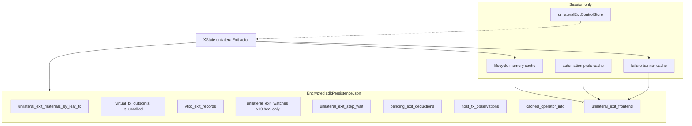

# Unilateral exit persistence

Durable state for unilateral exit lives in **encrypted `sdkPersistenceJson`**. Abort and `CLEAR_JOB` only clear the **frontend job** bundle. WASM materials, VTXO exit records, pending deductions, and on-chain broadcasts survive abort (`ARK-EXIT-23`).

Protocol and orchestration: [unilateral-exit.md](../unilateral-exit.md). Staged VTXO lifecycle refactor: [unilateral-exit-vtxo-lifecycle-refactor.md](../unilateral-exit-vtxo-lifecycle-refactor.md). Arkade envelope overview: [arkade.md](arkade.md). Wallet-model balance timing: [arkade-bitboard-wallet-model.md](../arkade-bitboard-wallet-model.md).



Memory caches are keyed by `walletId:networkMode:arkadeAccountId` (`arkadeWalletScopeKey`). Durable fields are per Arkade account inside that account's envelope — no `jobsByKey` map.

---

## WASM / encrypted `sdkPersistenceJson`

Flushed through the Arkade save lifecycle into `StoredArkadeAccount.sdkPersistenceJson`. Types: [`bitboard-ark/src/persistence.rs`](../../bitboard-ark/src/persistence.rs). Materials encode/decode: [`unilateral_exit_materials.rs`](../../bitboard-ark/src/unilateral_exit_materials.rs). Frontend bundle I/O: [`unilateral-exit-frontend-sdk-persistence.ts`](../../frontend/src/lib/wallet/lifecycle/unilateral-exit-frontend-sdk-persistence.ts).

**Envelope version:** `BITBOARD_ARK_PERSISTENCE_VERSION = 11`. `parse_import` accepts 3–11. Published 0.3.3 wallets used v3; missing fields default (`unilateral_exit_frontend` is `None`, `host_tx_observations` is empty, `vtxo_exit_records` is empty, `autonomous_mode` is false). When `unilateral_exit_frontend` is `None`, a one-shot overlay reads leftover SQLite `settings` rows. On open / first B, empty `vtxo_exit_records` heal from leftover pending unilateral deductions, v10 watches, and snapshot `is_unrolled && !is_spent` rows; leftover watches are then cleared so they are not a second write path.

| Field | Where | Role |
|-------|-------|------|
| `virtual_tx_outpoints` | `OffchainVtxoSnapshot` | VTXO list including sticky `is_unrolled` / `is_spent` / `is_swept` |
| `unilateral_exit_materials_by_leaf_tx` | `OffchainVtxoSnapshot` | Chain JSON + virtual PSBTs for autonomous unroll |
| `unilateral_exit_watches` | `WalletDbSnapshot` | Leftover v10 import only; heal into records then clear. Not a write path (`ARK-EXIT-12`) |
| `unilateral_exit_step_wait` | `WalletDbSnapshot` | Current step txid, index, `started_at` for relay-wait UI |
| `pending_exit_deductions` | `WalletDbSnapshot` | Collaborative retain records; unilateral rows are a derived mirror of tagged…host_confirmed (not an independent proceed write) |
| `vtxo_exit_records` | `WalletDbSnapshot` | Per-outpoint exit pipeline (`ARK-EXIT-27`); spend-lock, lists, recover/renew exclusion |
| `host_tx_observations` | `WalletDbSnapshot` | Per virtual host txid: broadcast attempt, Esplora relay/confirmations, never-seen probe budget (`ARK-EXIT-28`) |
| `cached_operator_info` | `WalletDbSnapshot` | Last `getInfo` snapshot for autonomous mode |
| `autonomous_mode` | `BitboardArkPersistence` | Per-ASP trust posture; default false; session open skips operator RPC when true |
| `unilateral_exit_frontend` | `WalletDbSnapshot` | Frontend job bookmark, automation prefs, last failure |

### Materials (`UnilateralExitMaterialsRecord`)

```text
cached_at, chain_json, virtual_psbts[]  { virtual_txid, psbt_hex }
```

Filled on operator sync for exit-eligible VTXOs (`ARK-EXIT-07`). Fail fast with `autonomous_exit_materials_missing` when a selected leaf lacks a record or a seized-branch lookup cannot read `tree`/`ark` hosts from materials (`ARK-EXIT-08` / `ARK-EXIT-33`), including when autonomous mode is off. `merge_unilateral_exit_materials_maps` keeps prior leaf entries when a new snapshot omits them.

### Sticky `is_unrolled`

Local stamp after a published virtual tx reaches **6 confirmations**: any `tree` / `ark` host (terminals included) via the unified reconciler on load, operator sync, proceed, progress, list, and complete (`ARK-EXIT-29`). `merge_sticky_unrolled_flags` preserves the flag when the ASP lags, only for hosts with 6-conf observations or VTXO exit records at `unrolled` / `complete_ready`. Tag-time records must not keep the flag.

### Watches (`UnilateralExitWatchRecord`) — leftover v10 heal only

```text
vtxo_txid, vout, amount_sats, registered_at, published_vtxo_txid?, branch_txids[]
```

The field remains on the envelope so v10 blobs import. After heal, it is cleared. Survival across snapshot replace is VTXO exit records at `unrolled` / `complete_ready` (`ARK-EXIT-12`). After each operator sync, `reconcile_exiting_vtxo_watches` iterates those records — never clear exiting state because the full `list_vtxos` omitted a row (`ARK-SYNC-03`).

### Step wait (`UnilateralExitStepWaitRecord`)

```text
step_txid, step_index, started_at
```

`ensure_unilateral_exit_step_wait` reuses `started_at` when the same step is already tracked. Cleared when the current step reaches 1 confirmation or the branch is complete. Frontend also mirrors relay wait as `currentStepRelayedSinceUnix` in the frontend job bundle (regtest `/raw` 404 workaround).

### VTXO exit records (`VtxoExitRecord`)

```text
phase, tagged_at, host_txid, amount_sats
```

Keyed by `"{txid}:{vout}"` on `WalletDbSnapshot` (same layer as observations, so replacing `offchain_vtxo_snapshot` cannot drop pipeline membership). Idle is no row. Phases: `tagged` | `host_broadcast_attempted` | `host_relayed` | `host_confirmed` | `unrolled` | `complete_ready` | `exited` | `funding_lost`. `funding_lost` is a terminal side-branch: not pipeline, not startable, not completable; still locks collaborative spend while the coin remains in gross (`ARK-EXIT-33`).

`START_MANUAL` / `START_AUTOMATIC` invoke WASM `tag_unilateral_exit_plan` **before** writing the frontend job bookmark (`taggingPlan`). Abort calls `untag_unilateral_exit_plan_if_safe`: delete only `tagged` rows with no `host_tx_observations` row for that `host_txid`. Hydrate of an existing bookmark re-tags (idempotent).

### Pending deductions

Collaborative pending deductions are unchanged. Unilateral pending rows are no longer written independently at proceed; they are a derived mirror of records in `tagged`…`host_confirmed` (or unused for in-progress union). After local `is_unrolled`, the same sats are already out of gross spendable via the **exiting** sub-bucket. See the wallet-model [balance timing table](../arkade-bitboard-wallet-model.md#unilateral-vs-collaborative-exit-balance-timing).

### Frontend bundle (`UnilateralExitFrontendPersistence`)

Optional on `WalletDbSnapshot`. `None` means the envelope has never stored a frontend bundle (published v3, leftover branch blob, or new account) and should overlay leftover SQLite settings once. `Some` with empty `selected_leaf_outpoints` is an explicit empty job — do **not** re-read settings.

```text
job.selected_leaf_outpoints[]     { txid, vout }
job.current_step_relayed_since_unix
job.job_started_at_unix
automation_prefs.enabled
automation_prefs.fee_preset_label
automation_prefs.max_fee_rate_sat_per_vb
last_failure?                     reason_code, outpoints, timestamps, vtxo_ids
```

A job exists iff `selected_leaf_outpoints.length > 0`. The machine writes this on `START_MANUAL` / `START_AUTOMATIC` **after** WASM tag succeeds (new `job_started_at_unix`, cleared relay wait) and on `HYDRATE_OR_START` after the same tag RPC (`ensureActiveJob`, which preserves those timestamps when the outpoints are unchanged). Tag failure does not leave a new job bookmark. It clears the job on complete, terminate, abort, and `CLEAR_JOB`. Failures (including user abort) stay in `last_failure`.

`context.automationEnabled` is the only job-level manual/automatic switch; prefs changes still flow as `AUTOMATION_PREFS_CHANGED`.

| `last_failure.reason_code` | When |
|----------------------------|------|
| `asp_swept_targets` | Viability: ASP swept job leaves |
| `branch_funding_lost` | Viability: foreign spend of first-step prevout (commitment) or tree/ark VTXO |
| `user_aborted` | `ABORT_ORCHESTRATION` (includes `vtxo_ids` for copy) |

Granular WASM setters (`ark_set_unilateral_exit_job` / `_automation_prefs` / `_failure`) flush `sdkPersistenceJson` only — they do not operator-sync.

**Legacy settings overlay:** first session open after upgrade reads `unilateral-exit-lifecycle-storage`, `unilateral-exit-automation-prefs`, and `unilateral-exit-failure-storage` from the `settings` table when the envelope field is `None`, writes the merged bundle, then deletes that scope's key from each JSON (drops the settings row when the map is empty). Inactive SQLite job rows (`jobActive: false`) overlay as an empty job.

### Control store (not persisted)

[`unilateralExitControlStore.ts`](../../frontend/src/stores/unilateralExitControlStore.ts) holds leaf selection and graph epoch in memory only. On unlock, hydrate selection from the **job cache** when persisted outpoints are still present (`shouldHydratePersistedUnilateralExitJob`). Do **not** seed selection from leftover WASM in-progress rows. Lock/`WALLET_RESET` resets the control store.

Zustand stores for job/prefs/failure are **session caches** (no `sqliteStorage`). Hydration: `hydrateUnilateralExitFrontendPersistenceFromSdk` before `HYDRATE_OR_START` / `WALLET_CONFIGURED`. Lock/`WALLET_RESET` clears the memory cache for the scope; durable state stays in the envelope.

---

## Hydrate and authority

1. Unlock / Arkade load → `hydrateUnilateralExitFromPersistence` in [`unilateral-exit-runtime.ts`](../../frontend/src/lib/wallet/lifecycle/unilateral-exit/unilateral-exit-runtime.ts).
2. If persisted outpoints are present → `HYDRATE_OR_START` (always via `taggingPlan`, then `checkingProgress`).
3. If the job bookmark is empty, hydrate does **not** invent a job from leftover WASM in-progress exits. Those rows stay visible on the control page; the user starts again explicitly, including re-selecting a not-yet-unrolled leftover leaf (`ARK-EXIT-26`). Crash recovery is “persisted outpoints are still there.”
4. While the job exists, topology/progress outpoints come from the **actor** (`resolveUnilateralExitTopologyOutpoints` / `resolveUnilateralExitJobOutpoints`). Never skip when lifecycle outpoints are empty but persistence still has them.
5. Hydrate waits until Arkade load/sync is quiet (or until in-progress sats/outpoints are already visible) before sending `HYDRATE_OR_START`. WASM reporting no in-progress exits does **not** clear a persisted job — that is pre-broadcast crash recovery. The machine clears the job bookmark on complete / abort / terminate.

TanStack Query caches progress/topology/balance for display. During an active job it does **not** poll or refetch `getUnilateralExitProgress`; actors seed the progress cache after WASM reads. Durable writes happen in WASM export (encrypted payload). `actor.context.progress` is authoritative over the query cache.

---

## Host-tx observations (`HostTxObservationRecord`)

```text
txid, registered_at, relayed, confirmations, never_seen_probes, last_probed_at
```

Registered immediately before broadcast of that proceed step (`ARK-EXIT-28`). After five eligible `never_seen` misses, **delete** the observation and rewind that host’s VTXO records to **`tagged`** (keep the rows). Also delete when every VTXO on that host is `exited` or `funding_lost` (or every snapshot vout `is_spent`). Observation plus the unified 6-conf reconciler **feed** `is_unrolled` and record phase advances.

VTXO exit records (`ARK-EXIT-27`) are the list and spend-lock source of truth. Candidates, in-progress, complete-ready, and recover/renew exclusion are record-derived. Envelope version is **11**.

Freeze and abort matrix: [unilateral-exit-vtxo-lifecycle-refactor.md](../future/unilateral-exit-vtxo-lifecycle-refactor.md#stage-0-freeze-agreed).
