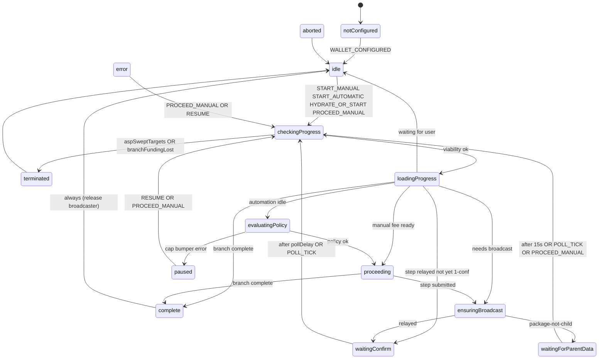
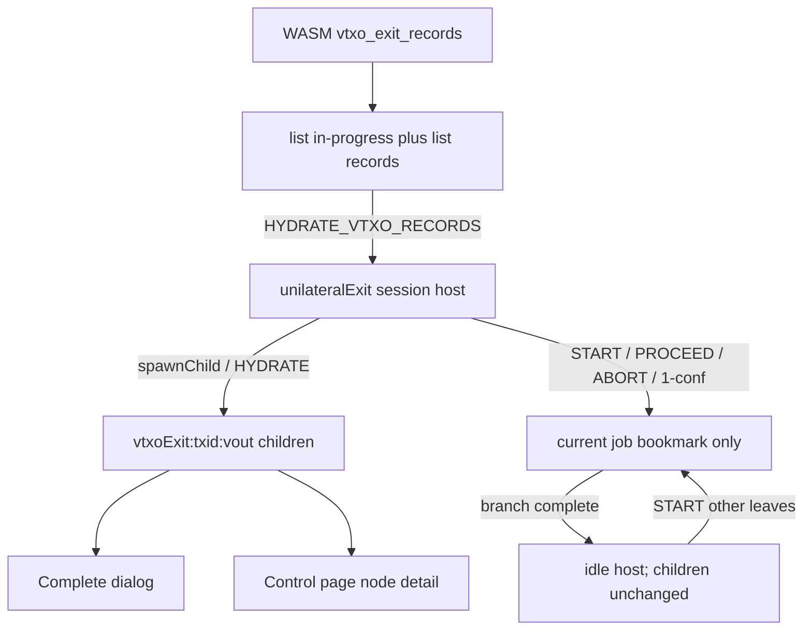
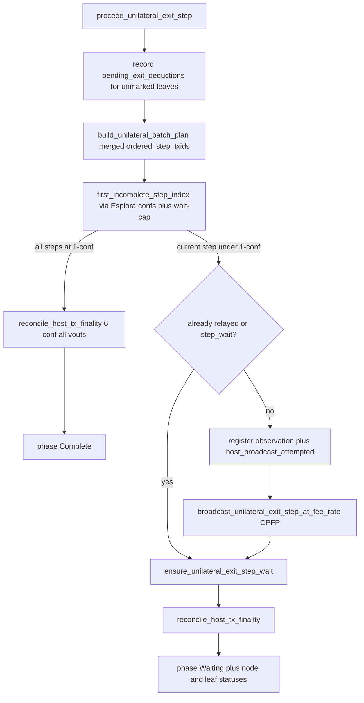

# Unilateral exit

Developer handbook for Arkade unilateral exit in Bitboard. Lead with invariants that are easy to break; then the XState family (job host plus VTXO children) and what one WASM proceed step actually does.

Related:

- Persistence (WASM envelope + Zustand job/prefs/failure): [persistence/unilateral-exit.md](persistence/unilateral-exit.md)
- Balance buckets and exit-line timing: [arkade-bitboard-wallet-model.md](arkade-bitboard-wallet-model.md)
- Historical design notes (shipped): [unilateral-exit-vtxo-lifecycle-refactor.md](archive/unilateral-exit-vtxo-lifecycle-refactor.md)
- Agent ownership rules: [`.cursor/rules/unilateral-exit-xstate.mdc`](../.cursor/rules/unilateral-exit-xstate.mdc)
- Historic Mutinynet false-confirmation investigation (resolved; methodology is not current): [archive/unilateral-exit-false-confirmation-rca.md](archive/unilateral-exit-false-confirmation-rca.md)
- Test contracts: `ARK-EXIT-*` in [doc/features/arkade.yaml](../doc/features/arkade.yaml)
- User-facing risk primer (in-app Library): `risks-of-arkade-unilateral-exits`

---

## VTXO lifecycle

The job actor is a session-scoped host plus unroll broadcaster; per-outpoint children hydrate from persisted VTXO exit records (`ARK-EXIT-32`). Host-tx observations, the Esplora 6-conf reconciler, watch fold into records, and `funding_lost` are current behavior (`ARK-EXIT-12`, `ARK-EXIT-27`–`33`, `ARK-SYNC-03`, `ARK-REC-08`).

**Two records** (WASM envelope is durable source of truth):

| Record | Key | Answers |
|--------|-----|---------|
| VTXO exit | `(txid, vout)` | Pipeline membership, spend-lock, complete-ready, funding lost |
| Host-tx observation | virtual `txid` | Broadcast attempted, relayed, confirmations, Esplora hot set |

Spend-lock (send / collab / renew / delegate) is pipeline ∪ `funding_lost`. Recover and signer-migrate are not spend-locked; they exclude in-progress pipeline membership only so they do not race an active unroll (`ARK-EXIT-27` / `ARK-REC-08`).

**Three parallel clocks** (do not merge): job DAG cursor (next unpublished step); host-tx confirmations (0 / relayed / 1-conf / 6-conf via the WASM Esplora reconciler); protocol timelock (`can_be_claimed_unilaterally_by_owner`). UI copy must distinguish waiting for host transaction broadcast, waiting for the first confirmation, waiting for 6 confirmations, and waiting for timelock.

**Esplora reconcile call sites** (no dedicated 6-conf poller): Arkade load including autonomous, operator sync, proceed, progress, `list_unilateral_exits_in_progress`, complete. Stamp every vout on a `tree`/`ark` host at 6 confs; skip `commitment`/`checkpoint`.

The **job machine** is the session-scoped host plus broadcaster (`waitingConfirm` remains 1-conf step advance). Job `complete` is DAG 1-conf (`isUnilateralExitBranchComplete`), not 6-conf `is_unrolled` — that stamp and the “waiting for 6 confirmations” copy live on VTXO children. `START_*` invokes `taggingPlan` (WASM tag, then persist job). Abort untags only `tagged` rows with no host observation. VTXO children hydrate from persisted records after those WASM queries return (`HYDRATE`). After abort or branch-complete, leftover coins stay on children; Complete uses `complete_ready`, not in-progress membership and not a leftover frontend job. A second unroll may start while earlier coins wait to be claimed.

## Protocol basics

Unilateral exit recovers VTXO funds to on-chain Bitcoin **without operator cooperation**. It has two phases:

| Phase | What happens | Who pays |
|-------|----------------|----------|
| **Unroll** | Publish the virtual-tree branch on Bitcoin, one virtual tx at a time | Bumper wallet (CPFP / child txs) |
| **Complete** | After the unilateral-exit timelock, spend the unrolled output to a `bc1` destination | Same on-chain wallet |

The bumper wallet is the same BIP32-derived BDK wallet used for boarding.

### Online vs offline ASP

Unroll can run while the Ark Service Provider (ASP) is reachable **or** while it is down.

- **Prefetch (sync time, not unroll time).** Operator sync stores per-host-tx materials in `unilateral_exit_materials_by_host_tx` (`ARK-EXIT-07`): VTXO chain topology plus virtual PSBTs. Unroll and complete build from that snapshot plus Esplora — never from live ASP indexer/batch APIs (`ARK-EXIT-06`).
- **Esplora is always required.** Broadcast, confirmation depth, and reorg detection go through Esplora. There is no “ASP-only” unroll path. Finalize also fetches **commitment** transaction bodies from Esplora so tree PSBTs can fill `witness_utxo`. That fetch list is the union of the VTXO record’s `commitment_txids` and `chain_json` links with `type=commitment`, **restricted to txids a virtual unroll tx spends** (`ARK-EXIT-36`). The VTXO list alone can omit a parent the tree still spends; fetching unspent historical commitments stalls proceed when Esplora has no `/raw`.
- **Autonomous mode** is a persisted per-ASP trust posture (`ARK-AUTO-01`): do not contact or ingest this operator until the user explicitly leaves. It reuses `cached_operator_info` and blocks non-exit Arkade RPCs (`ARK-EXIT-10`). Session open with the flag set uses `connect_with_cached_info` (no `getInfo`). Unilateral exit itself is still snapshot + Esplora in both modes. Implementation: [`bitboard-ark/src/session/autonomous.rs`](../bitboard-ark/src/session/autonomous.rs). Snapshot unroll/complete helpers live in [`snapshot_ops.rs`](../bitboard-ark/src/session/unilateral_exit/snapshot_ops.rs).
- **Background operator sync stays on during an exit job.** Unroll can take a long time and must not freeze boarding, collab, or other dashboard work. Users may also test exits while the ASP is still online. Dashboard poll skips ASP contact only while autonomous mode is active. Proceed/complete themselves still flush-only (no post-op operator sync).

### Do not coordinate with the ASP during unroll or complete

Communicating with the ASP during unilateral exit does not advance the chain and is a race surface (indexer lag, sweep, checkpoint). Unroll and complete are **Esplora + local materials only**, regardless of autonomous mode.

Vendored ark-client still has a live `build_unilateral_exit_branch` that talks to the Ark server; Bitboard must not call it on proceed/progress/complete. Prefetch remains on operator sync only. Do not add indexer/batch calls on the proceed/progress/complete path.

### If the ASP is still online, finish quickly

Partial unroll while the operator is reachable lets the ASP broadcast **checkpoint** transactions and reclaim VTXOs. That is protocol defense, not a Bitboard bug.

The XState machine treats ASP interference as **`terminated`**, never `complete`:

- `aspSweptTargets` — operator indexer reports job leaves swept that were not locally unrolled (ignored while autonomous; `ARK-AUTO-05`)
- `branchFundingLost` — Esplora reports a spend **outside** the wallet unroll chain: the first unroll step’s prevout(s) (commitment funding; covers an ASP batch sweep before any virtual tx is on chain), or an already-on-chain tree/ark VTXO outpoint. Still terminates in autonomous mode. The first-step prevout is re-probed on every viability/reconcile pass while pre-unroll records exist (reorgs).

Every `checkingProgress` entry runs `evaluateJobViabilityActor` **before** `fetchProgress`. User-facing explanation: Library article `risks-of-arkade-unilateral-exits`.

---

## Gotchas

These are the invariants that break wallets when ignored.

### One transaction, many exit-eligible VTXOs

A virtual tx can carry several VTXO outpoints (payment + change on the same leaf). Broadcast cannot target a single vout toward Bitcoin or the ASP — the chain only sees the published tx.

At host-tx finality (**6 confirmations**), WASM sets `is_unrolled` on **every** outpoint with that host txid (`ARK-EXIT-17`; `mark_virtual_tx_vtxos_unrolled_in_snapshot` via `reconcile_host_tx_finality` in [`bitboard-ark/src/session/unilateral_exit/host_tx_finality.rs`](../bitboard-ark/src/session/unilateral_exit/host_tx_finality.rs)). Sticky merge on sync promotes the same flags. The control page shows **one graph node per virtual tx** and selects sibling leaf outpoints atomically ([`unilateralExitControlStore.ts`](../frontend/src/stores/unilateralExitControlStore.ts)). Completion to on-chain remains **per outpoint**.

### Intermediary (en-passant) VTXOs

An exit branch can host exit-eligible VTXOs on upstream `tree` / `ark` virtual txs, not only on the selected leaves. After those txs reach **6 confirmations** on Esplora, those VTXOs must be marked unrolled so the user cannot start a **second** unilateral exit for funds already on the published branch.

Implemented in `reconcile_host_tx_finality` ([`bitboard-ark/src/session/unilateral_exit/host_tx_finality.rs`](../bitboard-ark/src/session/unilateral_exit/host_tx_finality.rs)), which runs on session open (including autonomous), operator sync, proceed, progress, list, and complete (`ARK-EXIT-29`). It uses the same 6-conf rule for every host (`UNILATERAL_EXIT_HOST_TX_CONFIRMATIONS`), not mere tx presence.

Frontend job reconcile must **not** treat a persisted job as stale when WASM reports no in-progress exits (pre-broadcast crash recovery). Non-overlapping in-progress outpoints are also not stale; intermediate VTXOs can differ from the original job leaves ([`unilateral-exit-job-reconcile.ts`](../frontend/src/lib/arkade/unilateral-exit-job-reconcile.ts)).

### Reorgs rewind progress

Unroll progress is **not** a monotonic counter. `first_incomplete_step_index` in [`progress.rs`](../bitboard-ark/src/session/unilateral_exit/progress.rs) walks `ordered_step_txids` and returns the first tx with fewer than **1** confirmation (`UNILATERAL_EXIT_STEP_CONFIRMATIONS`). A reorg that drops a later step back to 0 conf **rewinds** the current step; the next proceed/progress call broadcasts or waits again.

**1-conf requires `/raw`.** `GET /tx/{txid}/status` with `confirmed: true` is not enough. On arkade-regtest, `esplora_gateway` proxies `/status` to mempool when bitcoind has not confirmed the tx; those virtual-tree JSON stubs can claim `confirmed: true` while `/raw` is 404. Treating that as step-complete skips the first virtual tx (UI “step 2”), then lock/unlock rebuilds WASM without the confirmation cache and the cursor snaps back to that same skip. The next `submitpackage` then hits `package-not-child-with-unconfirmed-parents` because the skipped parent was never on bitcoind. `map_tx_confirmations` therefore requires `/raw` (mempool or chain) before trusting `/status.confirmed`. See [arkade-regtest-esplora-quirks.md](arkade-regtest-esplora-quirks.md).

The cursor also **does not skip** a later step this wallet has not yet broadcast (`wait_cap_holds_unbroadcast_successor`), even if Esplora already reports it confirmed (for example an ASP-published checkpoint). Skipping those used to produce `package-not-child-with-unconfirmed-parents` when submitting the next child. That skip is fixed; the same RPC can still fire for indexer/submit split, a reorg, or an unconfirmed CPFP bumper — see [`waitingForParentData`](#waitingforparentdata-submitpackage-parent-not-spendable). Historic skip write-up: [archive/unilateral-exit-false-confirmation-rca.md](archive/unilateral-exit-false-confirmation-rca.md).

Host-tx `is_unrolled` waits for **6** confs (`UNILATERAL_EXIT_HOST_TX_CONFIRMATIONS` in [`bitboard-ark/src/constants.rs`](../bitboard-ark/src/constants.rs)) so shallow reorgs do not stamp unroll. Do not persist “step N done” independently of Esplora confirmation depth.

### Register before Esplora; `never_seen` is the cleanup

Esplora is required for unroll and is **unreliable in the short term**: indexer vs write node, mempool `/raw` 404 (especially regtest), transient GET failures, and false broadcast RPC errors after a package actually relayed. Bitboard therefore does **not** wait for a first Esplora “seen” before treating a proceed step as attempted, and it does **not** treat a single Esplora “not seen” (or a local `step_wait` stamp) as proof the tx never existed.

**Early proceed (defensive, `ARK-EXIT-28`):** as soon as the parent is built and the step txid is known, WASM **registers** a host-tx observation and advances matching VTXOs to `host_broadcast_attempted`, **then** calls `broadcast_unilateral_exit_step_at_fee_rate`. That closes the hole where a false broadcast error would skip the observation and let abort unlock while the tx is already on the network. Abort cannot untag those rows **while the observation exists** (`ARK-EXIT-30`).

**`unilateral_exit_step_wait` is not chain proof.** It is the job cursor / relay-wait fallback after proceed considers the submit satisfied (RPC ok, redundant mempool reject, or `/raw` relayed). The same class of lie as a false error: RPC or `/raw` can look done while the indexer still has nothing. Do not use `step_wait` to veto `never_seen`.

**`never_seen` budget (cleanup of that early proceed):** Esplora reconcile call sites probe Esplora. A miss counts only when eligible — first after `registered_at + 10 minutes`, then further misses at `last_probed_at + 1 minute`, at most one increment per reconcile call, no collapsing a time skip into five misses. Fifteen-second UI polls must not reset the 1-minute spacing. After **five** eligible misses (~14 minutes from register: 10 minutes until miss 1, then four one-minute gaps), the wallet treats the tx as **truly never received**:

1. **Delete** the observation (txid leaves the hot set).
2. **Rewind** pre-unroll VTXOs on that host to **`tagged`** — keep the rows, keep the spend-lock. Do **not** idle them from this path.
3. User may **re-proceed** (same deterministic txid re-registers and resets the window) — preferred if they still want the unroll.
4. User may **abort**; abort now sees `tagged` + no observation and **unlocks**, same as abort before any register. That is intentional only **after** the budget. A broadcast error or the first Esplora miss must not untag.

Constants: `HOST_TX_NEVER_SEEN_FIRST_PROBE_AFTER_SECS`, `HOST_TX_NEVER_SEEN_PROBE_SPACING_SECS`, `HOST_TX_NEVER_SEEN_MAX_ELIGIBLE_MISSES` in [`constants.rs`](../bitboard-ark/src/constants.rs). Implementation: [`host_tx_finality.rs`](../bitboard-ark/src/session/unilateral_exit/host_tx_finality.rs), register in [`proceed.rs`](../bitboard-ark/src/session/unilateral_exit/proceed.rs). Persistence: [persistence/unilateral-exit.md](persistence/unilateral-exit.md#host-tx-observations-hosttxobservationrecord).

Residual risk: a tx that actually landed but that Esplora still omits for the whole budget can be abort-unlocked. The alternative is permanent spend-lock after a false-positive local submit, which is the failure this budget exists to recover from.

### Merged DAG, not one tree per leaf

The control page visualizes a **union** of selected leaves: shared branch txs are one node; `ordered_step_txids` is the deduped unroll order. Topology comes from `get_unilateral_exit_topology` (WASM) and is laid out with React Flow + d3-dag ([`unilateral-exit-topology.ts`](../frontend/src/lib/arkade/unilateral-exit-topology.ts), [`UnilateralExitTreeGraph.tsx`](../frontend/src/components/wallet/unilateral-exit/UnilateralExitTreeGraph.tsx)). Unspent VTXOs on a `tree`/`ark` host stay in `hostOutpoints` after the host tx has **6 confirmations** (`is_unrolled`); the graph overlay swaps Lucide `Coins` for `HandCoins` (`ARK-EXIT-13`). All vouts on that host share one unroll state.

While a job is active, graph outpoints come from the **actor** (`resolveUnilateralExitTopologyOutpoints`). Do not infer the job set from WASM “in progress” outpoints — those can include en-passant hosts.

---

## Bitboard app behavior

Route: `/wallet/arkade/unilateral-exit` ([`UnilateralExitControlPage.tsx`](../frontend/src/pages/wallet/UnilateralExitControlPage.tsx)).

The page is a **view** of the XState actor. UI sends events through [`unilateral-exit-runtime.ts`](../frontend/src/lib/wallet/lifecycle/unilateral-exit/unilateral-exit-runtime.ts). It must not invent phase, mutate job outpoints, or schedule `setTimeout` / `setInterval` advance loops. Selectors map `snapshot.value` to display; they never re-run completion guards from raw progress DTOs.

### Manual (default)

The user picks a fee rate **every** step (`START_MANUAL` then `PROCEED_MANUAL`). Custom sat/vB is allowed. The machine stays in `idle` / `waitingConfirm` until the user proceeds.

### Automatic (opt-in)

Optional fire-and-forget mode on the control page (“Proceed automatically”). When enabled, the XState actor in [`frontend/src/lib/wallet/lifecycle/unilateral-exit/`](../frontend/src/lib/wallet/lifecycle/unilateral-exit/) schedules ticks via machine `after` delays (`pollDelay` in `waitingConfirm`; network-dependent ms from `unilateralExitAutomationWaitPollMs`) while the app stays **unlocked** and the **same descriptor wallet** remains selected.

The sticky value is the **preset degree** (Low / Medium / High), not a frozen sat/vB (`ARK-EXIT-18`). Each tick re-resolves the live Esplora preset, capped by a user max sat/vB, then invokes `ark_proceed_unilateral_exit_step` through machine actors (`evaluateAutomationPolicy` → `proceedStep` / `ensureBroadcast`). Default max when enabling auto: `max(10 sat/vB, 2× High preset)` (`ARK-EXIT-19`; [`unilateral-exit-automation-fees.ts`](../frontend/src/lib/arkade/unilateral-exit-automation-fees.ts)).

Job progress and phase live in the **actor context**. The active job (outpoints, relay-wait timestamp), automation prefs, and last-failure banner persist in `unilateral_exit_frontend` inside encrypted `sdkPersistenceJson`. Details: [persistence/unilateral-exit.md](persistence/unilateral-exit.md).

Automation pauses on:

- `feeCapExceeded` — live preset for the selected degree exceeds max
- `bumperInsufficient` — bumper cannot cover remaining package fees
- `error` — proceed / broadcast / policy / progress failure after retries; explorer `Failed to fetch` is retried then shown as a short unreachable message (`ARK-EXIT-34`)

This is **not** delegator-based. Closing the tab stops automation.

### Abort is an emergency

Two-step confirmation (info modal, then red risk modal with required checkbox). `ABORT_ORCHESTRATION` → transient `aborted` → persist `user_aborted` failure banner with copyable VTXO ids (`ARK-EXIT-23`).

Abort **stops frontend orchestration only**. It does **not** delete `unilateral_exit_materials`, pending deductions, or on-chain broadcasts. It untags only `tagged` rows whose host has **no** observation. After a host is registered, abort leaves VTXO phase unchanged. If the `never_seen` budget has already deleted that observation and rewound the host to `tagged`, abort **can** unlock — that is the delayed cleanup of a proceed whose broadcast was never seen, not an immediate reaction to a broadcast RPC error. See [Register before Esplora](#register-before-esplora-never_seen-is-the-cleanup). If the ASP is online, an unfinished on-chain unroll can still be seized.

`ABORT_ORCHESTRATION` is sent immediately (VTXO id list RPCs must not block it). Copyable ids on the `user_aborted` banner are filled best-effort afterward.

Abort and ASP `terminated` clear the frontend job bookmark. The failure banner comes from error persistence (`user_aborted` / terminal viability). Hydrate must not treat leftover WASM in-progress rows as crash recovery: a job is restored only when persisted outpoints are still present.

After a successful unroll (`complete`), the frontend job is cleared. Remaining WASM in-progress / exiting VTXOs are waiting for **claim** (Complete unilateral exit), not a live unroll job. The control page must not show Abort, step progress, or a locked leaf selection for those leftover rows, and must not re-seed the control store from them. Lock/`ARKADE_SESSION_RESET` resets the in-memory control store.

---

## XState machine

The job lifecycle is one XState v5 actor: [`unilateral-exit.machine.ts`](../frontend/src/lib/wallet/lifecycle/unilateral-exit/unilateral-exit.machine.ts). Types: [`unilateral-exit-machine-types.ts`](../frontend/src/lib/wallet/lifecycle/unilateral-exit/unilateral-exit-machine-types.ts).

| Concern | File |
|---------|------|
| States, guards, transitions | `unilateral-exit.machine.ts` |
| WASM / TanStack side effects (`fromPromise` actors) | `unilateral-exit.actors.ts` |
| Module singleton, public send/subscribe API | `unilateral-exit-runtime.ts` |
| Snapshot → UI / lifecycle / automation views | `unilateral-exit-selectors.ts` |

Always enter `checkingProgress` before `proceeding` on hydrate, reload, automation tick, and manual start. `waitingConfirm` requires relay: enter `ensuringBroadcast` first; only wait when `isCurrentStepRelayed()` is true (WASM `currentStepTxRelayed`, or `currentStepWaitingSince` after proceed on regtest where `/raw` stays 404 in mempool). Helpers: [`unilateral-exit-broadcast.ts`](../frontend/src/lib/arkade/unilateral-exit-broadcast.ts).

### `waitingForParentData` (submitpackage parent not spendable)

`package-not-child-with-unconfirmed-parents` is Bitcoin Core `submitpackage` (Esplora `POST /txs/package`), not a missing `GET /tx/status` row. The package is always `[unroll_tx, cpfp_child]`. Core requires every unconfirmed parent of that package to be **inside** the hex. Bitboard does not include the previous unroll tx; it assumes that parent is already confirmed **on the submit node**.

Step-complete confirmation (`first_incomplete_step_index`) comes from `GET /tx/{txid}/status`. Those two endpoints are not one snapshot. Do **not** reuse `waitingConfirm` / the pickaxe overlay. Graph overlay is Lucide `UserRoundArrowLeft`. User copy: “Waiting for Esplora to acknowledge parent data” — the graph can already show the parent confirmed.

**Not this wait:** skipping an unbroadcast successor because Esplora already painted it confirmed (ASP-published checkpoint). That was a Bitboard cursor bug. `wait_cap_holds_unbroadcast_successor` is the fix. Historic failure mode: [archive/unilateral-exit-false-confirmation-rca.md](archive/unilateral-exit-false-confirmation-rca.md).

**Why the wait still exists** when Bitboard sequenced correctly (parent may already show confirmations):

1. **Indexer vs submit bitcoind.** Status is the Esplora indexer; `/txs/package` is `submitpackage` on a bitcoind. Same base URL does not mean the same backend. Public Mutinynet can report N confirmations on GET while the write node still treats the parent as unconfirmed or missing. Local arkade-regtest is less exposed (`esplora_gateway` serves `/status` from the same bitcoind).
2. **Shallow reorg between poll and submit.** Progress walks can take many HTTP calls (`prepare_confirmation_scan` snapshots the tip once). On Mutinynet or regtest a parent can have ≥1 conf at GET, then drop before POST. The machine waited; the chain moved.
3. **CPFP bumper coin, not the unroll parent.** The child also spends a wallet fee-coin that is **not** in the package, so that coin must be confirmed on the submit node. `ark-bdk-wallet` only selects confirmed bumpers. That “confirmed” is still Esplora/BDK, so (1) and (2) apply. If no confirmed bumper remains, `insufficient confirmed funds` maps to the same wait.

Machine: enter `waitingForParentData`, clear `lastErrorMessage` (not an error or pause), bookmark `unconfirmedParentRetry`. No broadcast on entry. After `parentDataWait` (15s; `UNILATERAL_EXIT_PARENT_DATA_WAIT_MS`) or `POLL_TICK`:

- **Manual:** `checkingProgress` with a progress refresh only. If still on the same step, return to `waitingForParentData`. `PROCEED_MANUAL` skips the wait and retries broadcast.
- **Automatic:** `checkingProgress` with proceed requested on the failed step, which typically retries `ensuringBroadcast`.

`terminated` and `aborted` persist failure, clear the job, invalidate topology/progress/balance queries, then **always** return to `idle`. `ARKADE_SESSION_RESET` is a root transition to `notConfigured` from every state (lock, Arkade session teardown, or Arkade wallet-scope change).

### Actors (WASM / policy, not UI)

Implemented in [`unilateral-exit.actors.ts`](../frontend/src/lib/wallet/lifecycle/unilateral-exit/unilateral-exit.actors.ts):

| Actor | Worker RPC / work |
|-------|-------------------|
| `evaluateJobViabilityActor` | `evaluateUnilateralExitJobViability` |
| `fetchProgressActor` | `getUnilateralExitProgress` |
| `evaluateAutomationPolicyActor` | live Esplora preset + `estimateUnilateralExitBatch` bumper check |
| `proceedStepActor` | `proceedUnilateralExitStep` then refetch progress |
| `ensureBroadcastActor` | refetch; if not relayed, proceed (resolve fee from policy when auto) |

React components and hooks must not call `getArkadeWorker()` for proceed/progress during an active job. During an active job, `actor.context.progress` wins; React Query is display cache only (no `refetchInterval`, no progress-query invalidate/refetch). Actors write progress into the query cache with `setQueryData` after WASM reads. Machine `after` delays own confirmation polling.

---

## WASM proceed step

Primary RPC: `ark_proceed_unilateral_exit_step` → `ArkSession::proceed_unilateral_exit_step` in [`proceed.rs`](../bitboard-ark/src/session/unilateral_exit/proceed.rs).

Proceed is **non-blocking**. It broadcasts (if needed) and returns `Waiting`; the machine polls Esplora via `waitingConfirm` → `checkingProgress`. Do not add a WASM 15s confirmation loop.

Sibling RPCs the machine also calls:

| RPC | Role |
|-----|------|
| `get_unilateral_exit_progress` | Confirmation-based phase, node/leaf statuses, relay flags |
| `evaluate_unilateral_exit_job_viability` | ASP sweep / foreign spend of first-step prevout or tree/ark VTXO → terminate |
| `estimate_unilateral_exit_batch` | Remaining steps + bumper sufficiency |
| `get_unilateral_exit_topology` | Merged DAG for the control graph |

Prefetch of exit materials happens on **operator sync**, not inside proceed.

Register **before** broadcast on purpose. `step_wait` after a satisfied submit is the job cursor, not Esplora finality. Absent probes use the `never_seen` budget — see [Register before Esplora](#register-before-esplora-never_seen-is-the-cleanup).

Confirmation and never-seen constants ([`bitboard-ark/src/constants.rs`](../bitboard-ark/src/constants.rs)):

| Constant | Value | Meaning |
|----------|-------|---------|
| `UNILATERAL_EXIT_STEP_CONFIRMATIONS` | 1 | Advance to the next virtual tx |
| `UNILATERAL_EXIT_HOST_TX_CONFIRMATIONS` | 6 | Stamp `is_unrolled` on every vout of that host tx |
| `HOST_TX_NEVER_SEEN_FIRST_PROBE_AFTER_SECS` | 600 | First eligible Esplora-absent miss (`registered_at` + 10 min) |
| `HOST_TX_NEVER_SEEN_PROBE_SPACING_SECS` | 60 | Minimum gap between later eligible misses |
| `HOST_TX_NEVER_SEEN_MAX_ELIGIBLE_MISSES` | 5 | Delete observation and rewind that host to `tagged` |

`reconcile_host_tx_finality` does **not** block on operator indexer polling. Sticky merge and unrolled+ record reconcile run during operator sync (`ARK-EXIT-11`). The same stamper also runs on session open (including autonomous), list, progress, and complete (`ARK-EXIT-29`).

Redundant mempool rejects (`-25` / `-26`) are ignored when the parent is already visible on the network.

---

## Source-file index

| Area | Paths |
|------|-------|
| Machine | `unilateral-exit.machine.ts` (states/transitions), `unilateral-exit-machine-setup.ts` (guards/actions/actors), `unilateral-exit.actors.ts` |
| Persistence (frontend) | `unilateral-exit-lifecycle-persistence.ts`, `unilateral-exit-automation-prefs-persistence.ts`, `unilateral-exit-failure-persistence.ts`, `unilateral-exit-frontend-sdk-persistence.ts` |
| Control page / DAG | `UnilateralExitControlPage.tsx`, `UnilateralExitTreeGraph.tsx`, `unilateral-exit-topology.ts` |
| WASM plan / proceed / progress / probe | `bitboard-ark/src/session/unilateral_exit/{plan,proceed,progress,host_tx_finality}.rs` |
| Topology merge | `bitboard-ark/src/session/unilateral_exit/topology.rs` |
| Viability | `bitboard-ark/src/session/unilateral_exit/viability.rs` |
| Materials | `bitboard-ark/src/unilateral_exit_materials.rs` |
| Intermediate unroll | `bitboard-ark/src/session/unilateral_exit/onchain.rs` |
| WASM bindings | `bitboard-ark/src/lib.rs` (`ark_proceed_unilateral_exit_step`, …) |
| Vendored client TODO | `third_party/ark-client/src/unilateral_exit.rs` |
| Esplora quirks | [arkade-regtest-esplora-quirks.md](arkade-regtest-esplora-quirks.md) |
