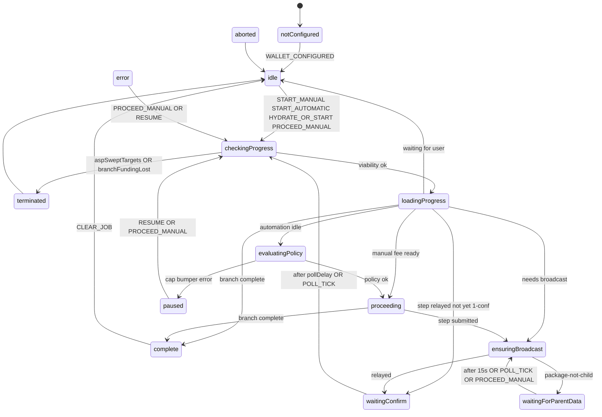
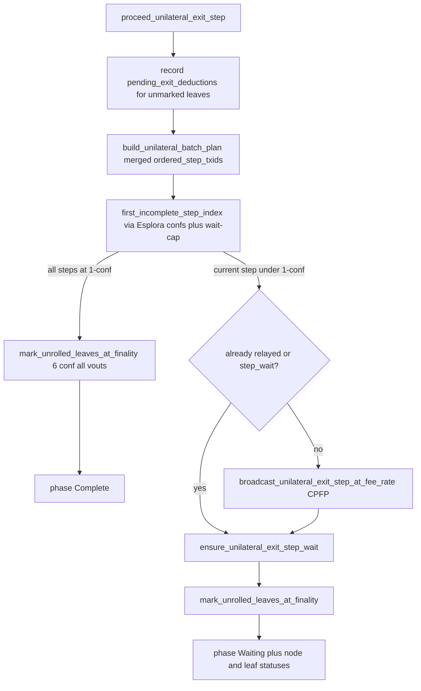

# Unilateral exit

Developer handbook for Arkade unilateral exit in Bitboard. Lead with invariants that are easy to break; then the XState machine (single source of truth) and what one WASM proceed step actually does.

Related:

- Persistence (WASM envelope + Zustand job/prefs/failure): [persistence/unilateral-exit.md](persistence/unilateral-exit.md)
- Balance buckets and exit-line timing: [arkade-bitboard-wallet-model.md](arkade-bitboard-wallet-model.md)
- VTXO exit lifecycle refactor (staged): [unilateral-exit-vtxo-lifecycle-refactor.md](unilateral-exit-vtxo-lifecycle-refactor.md)
- Agent ownership rules: [`.cursor/rules/unilateral-exit-xstate.mdc`](../.cursor/rules/unilateral-exit-xstate.mdc)
- Historic Mutinynet false-confirmation investigation (resolved; methodology is not current): [archive/unilateral-exit-false-confirmation-rca.md](archive/unilateral-exit-false-confirmation-rca.md)
- Test contracts: `ARK-EXIT-*` in [doc/features/arkade.yaml](../doc/features/arkade.yaml)
- User-facing risk primer (in-app Library): `risks-of-arkade-unilateral-exits`

---

## Protocol basics

Unilateral exit recovers VTXO funds to on-chain Bitcoin **without operator cooperation**. It has two phases:

| Phase | What happens | Who pays |
|-------|----------------|----------|
| **Unroll** | Publish the virtual-tree branch on Bitcoin, one virtual tx at a time | Bumper wallet (CPFP / child txs) |
| **Complete** | After the unilateral-exit timelock, spend the unrolled output to a `bc1` destination | Same on-chain wallet |

The bumper wallet is the same BIP32-derived BDK wallet used for boarding.

### Online vs offline ASP

Unroll can run while the Ark Service Provider (ASP) is reachable **or** while it is down.

- **Prefetch (sync time, not unroll time).** Operator sync stores per-leaf-tx materials in `unilateral_exit_materials_by_leaf_tx` (`ARK-EXIT-07`): VTXO chain topology plus virtual PSBTs. Unroll and complete build from that snapshot plus Esplora — never from live ASP indexer/batch APIs (`ARK-EXIT-06`).
- **Esplora is always required.** Broadcast, confirmation depth, and reorg detection go through Esplora. There is no “ASP-only” unroll path.
- **Autonomous mode** is a persisted per-ASP trust posture (`ARK-AUTO-01`): do not contact or ingest this operator until the user explicitly leaves. It reuses `cached_operator_info` and blocks non-exit Arkade RPCs (`ARK-EXIT-10`). Session open with the flag set uses `connect_with_cached_info` (no `getInfo`). Unilateral exit itself is still snapshot + Esplora in both modes. Implementation: [`bitboard-ark/src/session/autonomous.rs`](../bitboard-ark/src/session/autonomous.rs). Snapshot unroll/complete helpers live in [`snapshot_ops.rs`](../bitboard-ark/src/session/unilateral_exit/snapshot_ops.rs).
- **Background operator sync stays on during an exit job.** Unroll can take a long time and must not freeze boarding, collab, or other dashboard work. Users may also test exits while the ASP is still online. Dashboard poll skips ASP contact only while autonomous mode is active. Proceed/complete themselves still flush-only (no post-op operator sync).

### Do not coordinate with the ASP during unroll or complete

Communicating with the ASP during unilateral exit does not advance the chain and is a race surface (indexer lag, sweep, checkpoint). Unroll and complete are **Esplora + local materials only**, regardless of autonomous mode.

Vendored ark-client still has a live `build_unilateral_exit_branch` that talks to the Ark server; Bitboard must not call it on proceed/progress/complete. Prefetch remains on operator sync only. Do not add indexer/batch calls on the proceed/progress/complete path.

### If the ASP is still online, finish quickly

Partial unroll while the operator is reachable lets the ASP broadcast **checkpoint** transactions and reclaim VTXOs. That is protocol defense, not a Bitboard bug.

The XState machine treats ASP interference as **`terminated`**, never `complete`:

- `aspSweptTargets` — operator indexer reports job leaves swept that were not locally unrolled (ignored while autonomous; `ARK-AUTO-05`)
- `branchFundingLost` — an exit-relevant outpoint was spent by a tx **outside** the wallet unroll chain (Esplora; still terminates in autonomous mode)

Every `checkingProgress` entry runs `evaluateJobViabilityActor` **before** `fetchProgress`. User-facing explanation: Library article `risks-of-arkade-unilateral-exits`.

---

## Gotchas

These are the invariants that break wallets when ignored.

### One transaction, many exit-eligible VTXOs

A virtual tx can carry several VTXO outpoints (payment + change on the same leaf). Broadcast cannot target a single vout toward Bitcoin or the ASP — the chain only sees the published tx.

At leaf finality (**6 confirmations**), WASM sets `is_unrolled` on **every** outpoint with that leaf txid (`ARK-EXIT-17`; `mark_leaf_virtual_tx_vtxos_unrolled_in_snapshot` in [`bitboard-ark/src/session/unilateral_exit/complete.rs`](../bitboard-ark/src/session/unilateral_exit/complete.rs)). Sticky merge on sync promotes the same flags. The control page shows **one graph node per leaf tx** and selects sibling outpoints atomically ([`unilateralExitControlStore.ts`](../frontend/src/stores/unilateralExitControlStore.ts)). Completion to on-chain remains **per outpoint**.

### Intermediary (en-passant) VTXOs

An exit branch can host exit-eligible VTXOs on upstream `tree` / `ark` virtual txs, not only on the selected leaves. After those txs reach **6 confirmations** on Esplora, those VTXOs must be marked unrolled so the user cannot start a **second** unilateral exit for funds already on the published branch.

Implemented in `reconcile_intermediate_ark_virtual_txs_unrolled_on_esplora` ([`bitboard-ark/src/session/unilateral_exit/onchain.rs`](../bitboard-ark/src/session/unilateral_exit/onchain.rs)), which runs during operator sync. It uses the same 6-conf rule as leaves (`get_tx_confirmations` + `leaf_reached_finality`), not mere tx presence.

Frontend job reconcile must **not** treat a persisted job as stale when WASM reports no in-progress exits (pre-broadcast crash recovery). Non-overlapping in-progress outpoints are also not stale; intermediate VTXOs can differ from the original job leaves ([`unilateral-exit-job-reconcile.ts`](../frontend/src/lib/arkade/unilateral-exit-job-reconcile.ts)).

### Reorgs rewind progress

Unroll progress is **not** a monotonic counter. `first_incomplete_step_index` in [`progress.rs`](../bitboard-ark/src/session/unilateral_exit/progress.rs) walks `ordered_step_txids` and returns the first tx with fewer than **1** confirmation (`UNILATERAL_EXIT_STEP_CONFIRMATIONS`). A reorg that drops a later step back to 0 conf **rewinds** the current step; the next proceed/progress call broadcasts or waits again.

The cursor also **does not skip** a later step this wallet has not yet broadcast (`wait_cap_holds_unbroadcast_successor`), even if Esplora already reports it confirmed (for example an ASP-published checkpoint). Skipping those used to produce `package-not-child-with-unconfirmed-parents` when submitting the next child. Historic write-up: [archive/unilateral-exit-false-confirmation-rca.md](archive/unilateral-exit-false-confirmation-rca.md) — of interest for the failure mode, not as a description of current gating.

Leaf and intermediate-host `is_unrolled` wait for **6** confs (`UNILATERAL_EXIT_LEAF_CONFIRMATIONS` in [`bitboard-ark/src/constants.rs`](../bitboard-ark/src/constants.rs)) so shallow reorgs do not stamp unroll. Do not persist “step N done” independently of Esplora confirmation depth.

### Merged DAG, not one tree per leaf

The control page visualizes a **union** of selected leaves: shared branch txs are one node; `ordered_step_txids` is the deduped unroll order. Topology comes from `get_unilateral_exit_topology` (WASM) and is laid out with React Flow + d3-dag ([`unilateral-exit-topology.ts`](../frontend/src/lib/arkade/unilateral-exit-topology.ts), [`UnilateralExitTreeGraph.tsx`](../frontend/src/components/wallet/unilateral-exit/UnilateralExitTreeGraph.tsx)).

While a job is active, graph outpoints come from the **actor** (`resolveUnilateralExitTopologyOutpoints`). Do not infer the job set from WASM “in progress” outpoints — those can include en-passant hosts.

---

## Bitboard app behavior

Route: `/wallet/arkade/unilateral-exit` ([`UnilateralExitControlPage.tsx`](../frontend/src/pages/wallet/UnilateralExitControlPage.tsx)).

The page is a **view** of the XState actor. UI sends events through [`unilateral-exit-runtime.ts`](../frontend/src/lib/wallet/lifecycle/unilateral-exit/unilateral-exit-runtime.ts). It must not invent phase, mutate job outpoints, or schedule `setTimeout` / `setInterval` advance loops. Selectors map `snapshot.value` to display; they never re-run completion guards from raw progress DTOs.

### Manual (default)

The user picks a fee rate **every** step (`START_MANUAL` then `PROCEED_MANUAL`). Custom sat/vB is allowed. The machine stays in `idle` / `waitingConfirm` until the user proceeds.

### Automatic (opt-in)

Optional fire-and-forget mode on the control page (“Proceed automatically”). When enabled, the XState actor in [`frontend/src/lib/wallet/lifecycle/unilateral-exit/`](../frontend/src/lib/wallet/lifecycle/unilateral-exit/) schedules ticks via machine `after` delays (`pollDelay` in `waitingConfirm`; network-dependent ms from `unilateralExitAutomationWaitPollMs`) while the app stays **unlocked** and the **same descriptor wallet** remains selected.

The sticky value is the **preset degree** (Low / Medium / High), not a frozen sat/vB (`ARK-EXIT-18`). Each tick re-resolves the live Esplora preset, capped by a user max sat/vB, then invokes `ark_proceed_unilateral_exit_step` through machine actors (`evaluateAutomationPolicy` → `proceedStep` / `ensureBroadcast`). Default max when enabling auto: `max(10 sat/vB, 2× High preset)` (`ARK-EXIT-19`; [`unilateral-exit-automation-fees.ts`](../frontend/src/lib/arkade/unilateral-exit-automation-fees.ts)).

Job progress and phase live in the **actor context**. The active job (outpoints, relay-wait timestamp), automation prefs, and last-failure banner persist in `unilateral_exit_frontend` inside encrypted `sdkPersistenceJson`. Details: [persistence/unilateral-exit.md](persistence/unilateral-exit.md).

Automation pauses on:

- `feeCapExceeded` — live preset for the selected degree exceeds max
- `bumperInsufficient` — bumper cannot cover remaining package fees
- `error` — proceed / broadcast / policy failure

This is **not** delegator-based. Closing the tab stops automation.

### Abort is an emergency

Two-step confirmation (info modal, then red risk modal with required checkbox). `ABORT_ORCHESTRATION` → transient `aborted` → persist `user_aborted` failure banner with copyable VTXO ids (`ARK-EXIT-23`).

Abort **stops frontend orchestration only**. It does **not** delete `unilateral_exit_materials`, watches, pending deductions, or on-chain broadcasts. Backend in-progress state remains until completion or reconcile. If the ASP is online, an unfinished on-chain unroll can still be seized.

`ABORT_ORCHESTRATION` is sent immediately (VTXO id list RPCs must not block it). Copyable ids on the `user_aborted` banner are filled best-effort afterward.

Abort and ASP `terminated` clear the frontend job bookmark. The failure banner comes from error persistence (`user_aborted` / terminal viability). Hydrate must not treat leftover WASM in-progress rows as crash recovery: a job is restored only when persisted outpoints are still present.

---

## XState machine

The job lifecycle is one XState v5 actor: [`unilateral-exit.machine.ts`](../frontend/src/lib/wallet/lifecycle/unilateral-exit/unilateral-exit.machine.ts). Types: [`unilateral-exit-machine-types.ts`](../frontend/src/lib/wallet/lifecycle/unilateral-exit/unilateral-exit-machine-types.ts).

| Concern | File |
|---------|------|
| States, guards, transitions | `unilateral-exit.machine.ts` |
| WASM / TanStack side effects (`fromPromise` actors) | `unilateral-exit.actors.ts` |
| Module singleton, public send/subscribe API | `unilateral-exit-runtime.ts` |
| Snapshot → UI / lifecycle / automation views | `unilateral-exit-selectors.ts` |

Always enter `checkingProgress` before `proceeding` on hydrate, reload, automation tick, and manual start. `waitingConfirm` requires relay: enter `ensuringBroadcast` first; only wait when `isCurrentStepRelayed()` is true (WASM `currentStepTxRelayed`, or `currentStepWaitingSince` after proceed on regtest where `/raw` stays 404 in mempool). Helpers: [`unilateral-exit-broadcast.ts`](../frontend/src/lib/arkade/unilateral-exit-broadcast.ts).

`package-not-child-with-unconfirmed-parents` is a **different** wait: `waitingForParentData` (graph overlay: Lucide `UserRoundArrowLeft`). Esplora can already show the parent confirmed while the submit node does not. Do not use the pickaxe (`waitingConfirm`) for this. After `parentDataWait` (15s; `UNILATERAL_EXIT_PARENT_DATA_WAIT_MS`) the machine returns to `ensuringBroadcast`. `PROCEED_MANUAL` skips the wait.

`terminated` and `aborted` persist failure, clear the job, invalidate topology/progress/balance queries, then **always** return to `idle`. `WALLET_RESET` is a root transition to `notConfigured` from every state.

### Actors (WASM / policy, not UI)

Implemented in [`unilateral-exit.actors.ts`](../frontend/src/lib/wallet/lifecycle/unilateral-exit/unilateral-exit.actors.ts):

| Actor | Worker RPC / work |
|-------|-------------------|
| `evaluateJobViabilityActor` | `evaluateUnilateralExitJobViability` |
| `fetchProgressActor` | `getUnilateralExitProgress` |
| `evaluateAutomationPolicyActor` | live Esplora preset + `estimateUnilateralExitBatch` bumper check |
| `proceedStepActor` | `proceedUnilateralExitStep` then refetch progress |
| `ensureBroadcastActor` | refetch; if not relayed, proceed (resolve fee from policy when auto) |

React components and hooks must not call `getArkadeWorker()` for proceed/progress during an active job. During an active job, `actor.context.progress` wins; React Query is display cache only (no `refetchInterval`, no progress-query invalidate/refetch). Actors write progress into the query cache with `setQueryData` after WASM reads. Machine `after` delays own confirmation polling.

---

## WASM proceed step

Primary RPC: `ark_proceed_unilateral_exit_step` → `ArkSession::proceed_unilateral_exit_step` in [`proceed.rs`](../bitboard-ark/src/session/unilateral_exit/proceed.rs).

Proceed is **non-blocking**. It broadcasts (if needed) and returns `Waiting`; the machine polls Esplora via `waitingConfirm` → `checkingProgress`. Do not add a WASM 15s confirmation loop.

Sibling RPCs the machine also calls:

| RPC | Role |
|-----|------|
| `get_unilateral_exit_progress` | Confirmation-based phase, node/leaf statuses, relay flags |
| `evaluate_unilateral_exit_job_viability` | ASP sweep / foreign spend → terminate |
| `estimate_unilateral_exit_batch` | Remaining steps + bumper sufficiency |
| `get_unilateral_exit_topology` | Merged DAG for the control graph |

Prefetch of exit materials happens on **operator sync**, not inside proceed.

Confirmation constants ([`bitboard-ark/src/constants.rs`](../bitboard-ark/src/constants.rs)):

| Constant | Value | Meaning |
|----------|-------|---------|
| `UNILATERAL_EXIT_STEP_CONFIRMATIONS` | 1 | Advance to the next virtual tx |
| `UNILATERAL_EXIT_LEAF_CONFIRMATIONS` | 6 | Stamp `is_unrolled` on every vout of that virtual tx (leaf or intermediate host) |

`mark_unrolled_leaves_at_finality` does **not** block on operator indexer polling. Sticky merge and watch reconcile run during operator sync (`ARK-EXIT-11`).

Redundant mempool rejects (`-25` / `-26`) are ignored when the parent is already visible on the network.

---

## Source-file index

| Area | Paths |
|------|-------|
| Machine | `unilateral-exit.machine.ts` (states/transitions), `unilateral-exit-machine-setup.ts` (guards/actions/actors), `unilateral-exit.actors.ts` |
| Persistence (frontend) | `unilateral-exit-lifecycle-persistence.ts`, `unilateral-exit-automation-prefs-persistence.ts`, `unilateral-exit-failure-persistence.ts`, `unilateral-exit-frontend-sdk-persistence.ts` |
| Control page / DAG | `UnilateralExitControlPage.tsx`, `UnilateralExitTreeGraph.tsx`, `unilateral-exit-topology.ts` |
| WASM plan / proceed / progress | `bitboard-ark/src/session/unilateral_exit/{plan,proceed,progress}.rs` |
| Topology merge | `bitboard-ark/src/session/unilateral_exit/topology.rs` |
| Viability | `bitboard-ark/src/session/unilateral_exit/viability.rs` |
| Materials | `bitboard-ark/src/unilateral_exit_materials.rs` |
| Intermediate unroll | `bitboard-ark/src/session/unilateral_exit/onchain.rs` |
| WASM bindings | `bitboard-ark/src/lib.rs` (`ark_proceed_unilateral_exit_step`, …) |
| Vendored client TODO | `third_party/ark-client/src/unilateral_exit.rs` |
| Esplora quirks | [arkade-regtest-esplora-quirks.md](arkade-regtest-esplora-quirks.md) |
