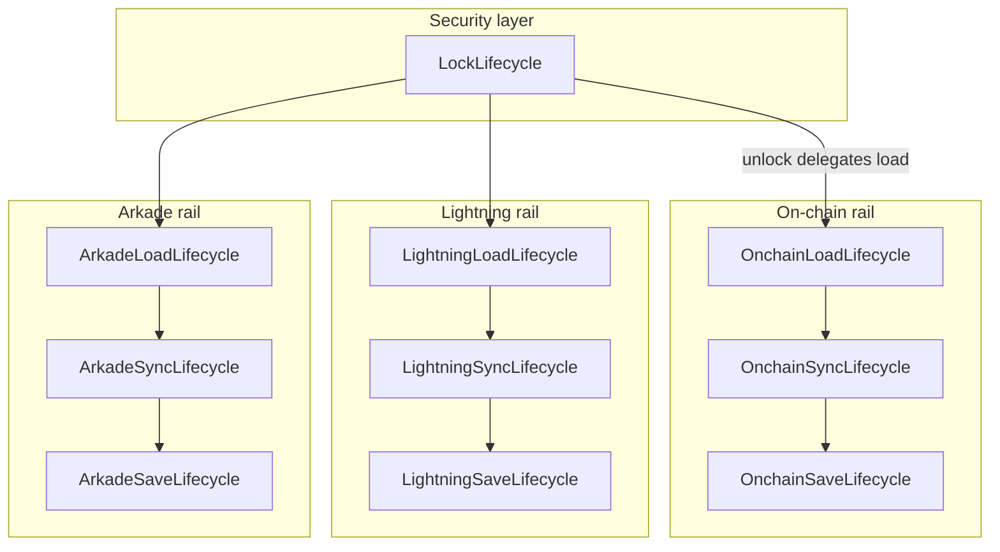
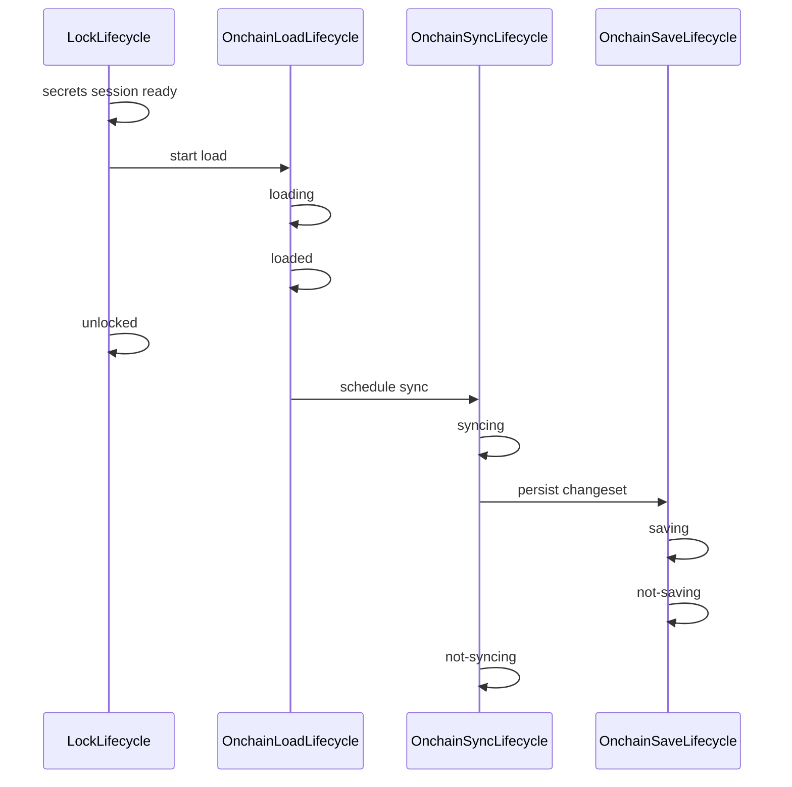

# Wallet rail lifecycle architecture

This document specifies the lifecycle architecture for Bitboard’s three wallet rails: **on-chain**, **Lightning (NWC)**, and **Arkade** — per-rail load/sync/save orchestrators, React subscription hooks, per-rail dashboard sync controls, and per-rail “last synced” captions.

Related docs:

- [Lock lifecycle](../frontend/src/lib/wallet/lifecycle/lock-lifecycle-orchestrator.ts)
- [Application architecture](../doc/ARCHITECTURE.md) — TanStack Query vs Zustand
- [Descriptor wallet switching](descriptor-wallet-switching.md)
- [On-chain wallet model](onchain-bitboard-wallet-model.md)
- [Lightning wallet model](lightning-bitboard-wallet-model.md)
- [Arkade wallet model](arkade-bitboard-wallet-model.md)
- [Wallet lifecycle contracts](../doc/features/wallet-lifecycle.yaml) — test-oriented contract IDs

## Motivation

Lock/unlock coordination is centralized in **LockLifecycle** (see `frontend/src/lib/wallet/lifecycle/`). Remaining complexity lives in **per-rail** pipelines that:

1. **Load** persisted state (SQLite / encrypted `wallet_secrets`) into workers and UI stores
2. **Sync** with remote services (Esplora, NWC, Ark operator)
3. **Save** merged state back to persistence

The rail lifecycle model makes readiness explicit for UI, tests, and lock teardown instead of scattering it across boolean flags, module-level promises, and ad hoc TanStack Query `enabled` heuristics.

## Orchestrator family



| Orchestrator | Owns | Does **not** own |
|--------------|------|------------------|
| **LockLifecycle** | Lock teardown; secrets session; mutex between manual vs bootstrap unlock; phases `no-lock` / `locked` / `unlocking` / `unlocked` | Per-rail load/sync/save |
| **LoadLifecycle** (per rail) | Read persistence → populate worker + in-memory store; expose `loaded` readiness | Remote sync, lock teardown |
| **SyncLifecycle** (per rail) | Remote fetch / operator sync; merge into runtime state | Initial persistence read, lock mutex |
| **SaveLifecycle** (per rail) | Persist runtime state after sync or user mutation | Remote network I/O (except flush triggered by sync completion) |

**File layout:**

```
frontend/src/lib/wallet/lifecycle/
  lock-lifecycle-*.ts
  rail-lifecycle-types.ts
  onchain-*-lifecycle-*.ts
  arkade-*-lifecycle-*.ts
  lightning-*-lifecycle-*.ts
  *-rail-snapshot.ts             # composite phase views (on-chain, arkade)

frontend/src/hooks/
  useLockLifecycleSnapshot.ts
  useOnchainLifecycleSnapshots.ts
  useArkadeLifecycleSnapshots.ts
  useLightningLifecycleSnapshots.ts
```

## Shared phase types

Each rail exposes **three independent** phase enums. Steady idle states use the `not-*` prefix; in-flight states are explicit; errors are rail-scoped.

```ts
type LoadLifecyclePhase =
  | 'not-configured'   // rail inactive: feature off, unsupported network, or no setup (e.g. no NWC)
  | 'loading'          // read persistence → worker/session → hydrate store
  | 'loaded'           // rail ready to serve local data
  | 'load-error'       // rare: true persistence/decrypt/read failure; rail unusable

type SyncLifecyclePhase =
  | 'not-configured'
  | 'not-syncing'      // steady: configured, no sync in flight
  | 'syncing'          // remote sync in flight
  | 'sync-error'       // last sync attempt failed; still serve loaded local data

type SaveLifecyclePhase =
  | 'not-configured'
  | 'not-saving'       // steady: no persist in flight
  | 'saving'           // write to SQLite / encrypted secrets in flight
  | 'save-error'       // last persist attempt failed
```

### Phase semantics

| Phase | Meaning |
|-------|---------|
| `not-configured` | Rail is inactive for the current wallet/network context — not the same as LockLifecycle `no-lock`. |
| `loading` / `syncing` / `saving` | Work in progress for that concern only. |
| `loaded` | Local/runtime data is available for UI and downstream operations. |
| `not-syncing` / `not-saving` | Configured rail idle after last operation completed (success or error). |
| `load-error` | Cannot trust local data; user action or support path required. |
| `sync-error` | Remote truth unavailable; **serve `loaded` data** with stale/error indication. |
| `save-error` | Memory may be ahead of disk; **lock and destructive actions must await or surface failure**. |

### Rail configured invariant

When a rail is **`not-configured`**, all three lifecycles for that rail **must** be `not-configured` together. Mixed states such as `loading` with `not-configured` on sync/save are **not allowed**.

When a rail becomes configured (gates satisfied — see per-rail sections), load, sync, and save transition out of `not-configured` together into their idle steady states (`not-syncing`, `not-saving`) before any in-flight work begins.

**Lab exception:** On **lab** network, the on-chain Esplora rail has **no sync** — `OnchainSyncLifecycle` stays `not-configured` permanently. **Load** and **save** still apply to the **lab database** (`labDb` / lab worker state via `runLabOp` + `persistLabState`), modeled as a separate concern from Esplora-backed on-chain sync or as lab-specific load/save orchestration (detail in lab implementation planning).

### Allowed combinations (examples)

| Load | Sync | Save | Typical situation |
|------|------|------|-------------------|
| `not-configured` | `not-configured` | `not-configured` | Rail inactive (feature off, no NWC, Arkade disabled, etc.) |
| `loading` | `not-syncing` | `not-saving` | Arkade session open, on-chain WASM load, Lightning hydration |
| `loaded` | `not-syncing` | `not-saving` | Idle dashboard |
| `loaded` | `syncing` | `not-saving` | Manual sync, hydration, or **opt-in** periodic poll (Settings → Features → Periodic sync) |
| `loaded` | `not-syncing` | `saving` | Post-sync changeset / SDK flush |
| `loaded` | `sync-error` | `not-saving` | Stale banner; data still shown |
| `load-error` | `not-syncing` | `not-saving` | Load failed on a configured rail; do not start sync/save |

**Rule (v1):** `loading` must not overlap with `syncing` for the same rail. Operator/network work during session open belongs under **load** until the rail is `loaded`; only **operator sync** (Esplora scan, NWC `listPayments`, Ark `syncWithOperator`) uses **sync**.

**Future (out of scope):** Parallel `loading` and `syncing` on the same rail may be allowed later to speed hydration (e.g. start Esplora while WASM still loads). That would be a separate project with new mutex rules and UI semantics; this spec does not permit it until explicitly designed.

## Design principles

1. **TanStack Query executes; lifecycle orchestrates.** Each rail’s orchestrator drives query `enabled` / `queryFn` and may **derive** phase from query state plus explicit transitions. Query runs async work (worker calls, network I/O); orchestrators own phase transitions and lock quiescence. **Do not** mirror lifecycle phase in TanStack Query cache or Zustand.
2. **Zustand holds domain snapshots** (balance, txs, connections) — not lifecycle phase. Phase lives in orchestrator module snapshots (`get*Snapshot` + `subscribe*`).
3. **React reads phase via subscription hooks** — thin `useSyncExternalStore` wrappers in `frontend/src/hooks/` (see [React lifecycle hooks](#react-lifecycle-hooks)). Components must not call `get*LifecycleSnapshot()` during render without subscribing; ad hoc `useState` + `useEffect` per component is discouraged.
4. **LockLifecycle gates all rails.** No load/sync/save when `no-lock` or during `locking`. Unlock delegates to per-rail load entry points.
5. **SaveLifecycle is internal-first for status text**, but sync is user-targetable: the **dashboard exposes a sync control per configured rail** (on-chain, Lightning when connected, Arkade when active) so users can trigger targeted sync without syncing everything. Save phases remain primarily for lock handoff and debugging; save UI is not required in v1.
6. **Per-rail sync state** is aggregated via `useAnyRailSyncing()` / `isAnyRailSyncing()` — not a global `walletStatus: 'syncing'`.
7. **One Lightning machine per rail** (v1). Sync and save aggregate across all NWC connections for the active Bitboard wallet.
8. **One Arkade operator** per `(walletId, networkMode)` — no multi-connection aggregation on the Arkade rail.

## Route independence and wallet hydration

Wallet **rail lifecycles** (load, sync, save on on-chain, Lightning, and Arkade) must be **independent of the current URL**. Navigation must not cancel, pause, restart, or gate in-flight lifecycle work. Sync and save started on the dashboard must be allowed to finish after the user opens Settings, Library, or any other section.

The **only** deliberate coupling between routing and wallet crypto is **when to start hydration** (bringing persisted secrets and WASM session state into memory after lock, reload, or near-zero session restore):

| Concept | Meaning |
|---------|---------|
| **Hydration** | Near-zero session restore (`tryLoadNearZeroSessionIntoMemory`) plus bootstrap unlock (`orchestrateBootstrapUnlock` → per-rail **load**). Distinct from background **sync** and **save**, which follow load and are not route-gated. |
| **Wallet route** | Any path under `/wallet` (dashboard, send, receive, management, wallets picker, etc.). Legacy `/` redirects to `/wallet`. |
| **Non-wallet route** | Settings, setup, lab, library, privacy, and any other path that is not a wallet route. |

### Rules

1. **Start hydration on wallet entry only.** When the user **visits a wallet route** and prerequisites are met (active wallet, secrets session or restorable near-zero session, wallet not already loaded), the app may start hydration. Visiting Settings, Lab, Library, or setup must **not** start hydration by itself.
2. **Lifecycle is route-agnostic.** In-flight load, sync, and save continue regardless of navigation. Do not cancel debounced sync timers, disable bootstrap queries mid-flight, or skip save because the user left `/wallet`.
3. **Lock and explicit user actions are exceptions.** Lock teardown, manual unlock, and network switch are intentional lifecycle drivers — not “navigation interference” in the sense above.
4. **Privacy redirect after lock** (wallet route → Library via `navigateToLibraryIfOnWalletRoute`) stays in place. It is privacy-enhancing: the user leaves wallet UI after locking. It does not tear down in-flight lifecycle work; it only defers **the next** hydration until the user opens a wallet route again.
5. **No route-based “special cases” for crypto needs.** Lab and Settings are **not** hydration entry points just because some screens eventually need wallet access. Do not add `/lab` or `/settings` to hydration gates to “pre-unlock” for those flows.

### Action-gated unlock (`requireUnlockedWallet`)

Some non-wallet screens **display** wallet-related information or **offer actions** that need an unlocked descriptor wallet (WASM loaded, secrets session active). These must **not** widen hydration to the whole route. Instead, guard the **action** (or the sensitive reveal) with a shared helper:

```ts
/**
 * If the wallet is already unlocked (or a rail sync is in flight), run `action` immediately.
 * Otherwise prompt for unlock (or near-zero auto-restore) and run `action` only after success.
 * Does not start hydration merely because the user opened Settings or Lab.
 */
async function requireUnlockedWallet(action: () => void | Promise<void>): Promise<void>
```

**Location:** [`require-unlocked-wallet.ts`](../frontend/src/lib/wallet/require-unlocked-wallet.ts) — UI wraps this in [`useRequireUnlockedWallet.tsx`](../frontend/src/hooks/useRequireUnlockedWallet.tsx) (`WalletUnlock` / `WalletUnlockOrNearZeroLoading`).

| Area | Route stays passive | Unlock at action time |
|------|---------------------|------------------------|
| **Settings — receiving descriptor** | Settings main page renders without hydrating WASM. Show copy such as “Unlock your wallet to view the receiving descriptor” when locked (`NetworkCardCommittedDescriptor` today). | Reveal, copy, or export descriptor → `requireUnlockedWallet` then load descriptor from encrypted secrets / WASM as needed. |
| **Settings — network / address type switch** | Network cards render; locked state is visible. | Applying a switch that loads a different descriptor → `requireUnlockedWallet` (today partially inlined via `WalletUnlock` on network selector). |
| **Lab** | Lab has **its own** chain DB, entities, and simulated wallets. Browsing blocks, lab entities, and lab-only mining do not require Bitboard wallet hydration. | Operations that credit **your** Bitboard wallet (e.g. mine block reward to “Wallet”, lab sends that use the live receive address) → `requireUnlockedWallet` before proceeding. Lab may still switch **network mode** to `lab` on entry (`runLabRouteBeforeLoad`); that is network UX, not a substitute for unlock on wallet-backed actions. |
| **Setup** | Create/import flows manage their own password/session steps. | After persist, **await** `orchestrateOnchainSetupAfterPersist` (load from secrets + `setupInitial` full scan) before navigating to dashboard — not background post-nav sync. |

**Anti-pattern:** Treating `/settings` or `/lab` like `/wallet` for route-wide hydration so bootstrap runs on navigation.

**Preferred pattern:** Route renders safely while locked; `walletIsUnlockedOrSyncing` gates **display** of secrets; `useRequireUnlockedWallet` / `ensureWalletUnlockedForAction` gates **mutations** and **secret reveal**.

### Implementation

- Hydration entry uses **`pathnameIsWalletRoute`** ([`pathname-is-wallet-route.ts`](../frontend/src/lib/shared/pathname-is-wallet-route.ts)) only — not broad “any route that might need crypto” gates.
- **`requireUnlockedWallet`** handles action-gated unlock on Settings, Lab, and similar — lifecycle orchestrators do not branch on pathname.
- Lifecycle orchestrators stay free of `useLocation` and pathname checks; a dedicated hydration coordinator reads “entered wallet route” once.
- TanStack Query `enabled` for bootstrap load may react to wallet-route entry, but must not flip off in a way that aborts an in-flight bootstrap when the user navigates away (LockLifecycle `bootstrap_unlock` extends the enabled window during unlock; the same “finish what you started” rule applies when leaving the route).
- Post-lock redirect to Library remains in place.

### Known violations (audit)

See [Known route–lifecycle violations](#known-route-lifecycle-violations) at the end of this document.

### Dashboard UI

The dashboard exposes **per-rail sync buttons** on each rail block:

| Rail | Control | Enabled when |
|------|---------|--------------|
| On-chain | Sync on-chain | OnchainLoadLifecycle `loaded`; triggers OnchainSyncLifecycle only |
| Lightning | Sync Lightning | LightningLoadLifecycle `loaded` and rail configured; triggers aggregated Lightning sync |
| Arkade | Sync Arkade | ArkadeLoadLifecycle `loaded` and rail configured; triggers operator sync only |

Each button reflects that rail’s `SyncLifecyclePhase` (`syncing`, `sync-error`, `not-syncing`). Syncing one rail must not implicitly sync the others. Global “sync all” is optional and out of scope for v1.

## React lifecycle hooks

Orchestrator modules remain the **source of truth** for phase. React components and TanStack Query `enabled` flags consume phase through **subscription hooks** — not through a lifecycle Zustand store and not by stuffing snapshots into Query cache.

### Layering

| Layer | Responsibility |
|-------|----------------|
| **Orchestrator** (`*-lifecycle-orchestrator.ts`) | Transitions, mutex, lock handoff, `get*Snapshot`, `subscribe*` |
| **Subscription hook** (`use*LifecycleSnapshot`) | `useSyncExternalStore` bridge to React |
| **Selector hook** (optional) | Derived booleans, e.g. `useIsArkadeSessionReady()` |
| **TanStack Query** | Execute async work; `enabled` gated by selector hooks |
| **Zustand** | Domain data only (balance, txs, connections) |

**Anti-patterns:**

- `getArkadeLoadLifecycleSnapshot()` in render without subscribing (queries stay disabled until an unrelated re-render).
- Component-local `useState` + `subscribe` in every consumer (use shared hooks instead).
- `useQuery` whose only job is polling lifecycle phase (use orchestrator subscribe).
- Duplicating phase in Zustand or `queryClient.setQueryData` on every transition.

### Hook tiers

**Per machine** — one hook per state machine, wrapping the orchestrator’s existing API:

```ts
// Pattern (all rails + lock follow this shape)
export function useArkadeLoadLifecycleSnapshot(): ArkadeLoadLifecycleSnapshot {
  return useSyncExternalStore(
    subscribeArkadeLoadLifecycle,
    getArkadeLoadLifecycleSnapshot,
    getArkadeLoadLifecycleSnapshot,
  )
}
```

| Hook | Orchestrator |
|------|----------------|
| `useLockLifecycleSnapshot()` | LockLifecycle |
| `useOnchainLoadLifecycleSnapshot()` | OnchainLoadLifecycle |
| `useOnchainSyncLifecycleSnapshot()` | OnchainSyncLifecycle |
| `useOnchainSaveLifecycleSnapshot()` | OnchainSaveLifecycle |
| `useArkadeLoadLifecycleSnapshot()` | ArkadeLoadLifecycle |
| `useArkadeSyncLifecycleSnapshot()` | ArkadeSyncLifecycle |
| `useArkadeSaveLifecycleSnapshot()` | ArkadeSaveLifecycle |
| `useLightning*LifecycleSnapshot()` | Lightning |

**Per rail (dashboard)** — composite view for status chips, sync buttons, E2E attributes:

| Hook | Returns |
|------|---------|
| `useOnchainRailSnapshot()` | `{ loadPhase, syncPhase, savePhase }` from `getOnchainRailSnapshot()` |
| `useArkadeRailSnapshot()` | `{ loadPhase, syncPhase, savePhase }` from `getArkadeRailSnapshot()` |
| `useLightningRailSnapshot()` | same shape |

**Selectors** — thin helpers over machine or rail hooks (not separate state machines):

| Hook | Typical use |
|------|-------------|
| `useIsArkadeSessionReady()` | `loadPhase === 'loaded'` — gate `useArkadeQueries` |
| `useIsOnchainRailLoaded()` | on-chain dashboard / Esplora queries |
| `useIsArkadeSaveBlockingLock()` | lock UI (wraps orchestrator helper) |
| `useAnyRailSyncing()` | `isAnyRailSyncing()` aggregate across rails |

### TanStack Query integration

- **Readiness gates:** `enabled: useIsArkadeSessionReady()` (or equivalent), never a one-shot `getSnapshot()` in a hook body.
- **Manual sync:** `useRailManualSyncMutations` → per-rail orchestrators only; `RailSyncControl` disabled/spinner from `use*SyncLifecycleSnapshot().syncPhase`.
- **Per-rail last synced:** `RailSyncControl` caption reads persisted metadata queries (`useOnchainEsploraSyncMetadataQuery`, `useLightningSyncMetadataQuery`, `useArkadeSyncMetadataQuery`) — not a global dashboard header timestamp.
- **Domain queries unchanged:** balance/history still use Query for fetch/cache; orchestrator invalidates after save (existing pattern).

Load completion and operator sync are **different readiness levels**. UI that needs post-sync data (e.g. mock ASP fixture balance) must wait for sync completion or domain query success — not only `loadPhase === 'loaded'`. E2E helpers document this split (see [E2E readiness](#e2e-readiness)).

### UI attributes

Dashboard rail blocks expose lifecycle phase on the DOM for tests:

- `data-rail-onchain-load` / `data-rail-onchain-sync` — on-chain balance block
- `data-rail-lightning-load` / `data-rail-lightning-sync` — Lightning balance block
- `data-rail-arkade-load` / `data-rail-arkade-sync` — Arkade balance card
- `data-testid="rail-sync-{onchain|lightning|arkade}"` — per-rail sync button
- Optional `data-rail-last-synced-at` ISO string on sync caption

Values come from rail or machine hooks, not imperative snapshot reads at render time.

## LockLifecycle handoff

`orchestrateManualUnlock` / `orchestrateBootstrapUnlock` delegate per-rail work after the secrets session is ready:



Lock teardown **awaits** in-flight sync (best-effort cancel/debounce) and save quiescence per rail before purging workers — via `await*SyncQuiescence`, `await*SaveQuiescence`, and `awaitInFlightWalletSecretsWrites`.

`loadDescriptorWalletAndSync` remains a convenience facade for bootstrap paths: it calls `orchestrateOnchainLoad`, optionally starts `orchestrateArkadeLoad`, then `orchestrateOnchainPostUnlockSync`.

---

## On-chain rail

### When `not-configured`

- **Lab network:** Esplora-backed **on-chain sync** is inactive — `OnchainSyncLifecycle` remains `not-configured`. Crypto worker load for lab wallet operations and **lab DB load/save** (`labDb`) are modeled under the on-chain rail (no separate `Lab*` lifecycle modules).
- `LockLifecycle` not `unlocked` (including `locked`, `locking`, `no-lock`) — all three on-chain lifecycles are `not-configured`.
- Otherwise, when `LockLifecycle` is `unlocked` and a descriptor wallet exists for the committed triple, the on-chain rail is **configured** (load, sync, and save lifecycles leave `not-configured` together; sync stays `not-configured` on lab per lab exception).

### LoadLifecycle

**Work included in `loading` → `loaded`:**

1. `waitForCryptoWorkerHealthy`
2. Resolve descriptor wallet from encrypted `wallet_secrets`
3. `loadWallet` into crypto WASM (changeset from persistence)
4. `commitLoadedDescriptorWallet` + `setWalletStatus('unlocked')`
5. `refreshWalletStoreFromLoadedBdk` (balance, txs from WASM → `walletStore`)

**Query mapping:** `useActiveWalletLoadQuery` orchestration — keyed by `(activeWalletId, networkMode, addressType, accountId)`.

**`load-error`:** decrypt failure, missing descriptor row, WASM load failure, worker unhealthy after retries.

### SyncLifecycle

**Work in `syncing`:**

- Esplora incremental or full scan via crypto worker
- Incremental sync includes WASM **anchor+chain reconcile** after `bdk_esplora` (see [`esplora-bdk-anchor-reconcile.md`](esplora-bdk-anchor-reconcile.md))
- Network switch full scan (`switchDescriptorWallet` path)

**Does not persist** — on success triggers SaveLifecycle.

**`sync-error`:** Esplora unreachable, scan failure, `BadLocalChainStateError` — keep BDK-local `loaded` data; surface toast/banner. **Persistence policy while `sync-error`:** dashboard Sync / Full rescan and network/address switch are allowed; switch **skips outgoing changeset save**. `exportChangesetForPersistence()` is blocked (send broadcast, new receive address, switch outgoing save) until repair succeeds. Post-successful-sync save uses `exportChangesetForPersistenceBypass()` inside the save orchestrator only.

### SaveLifecycle

**Work in `saving`:**

- `exportChangeset` + `updateDescriptorWalletChangeset` to encrypted payload
- `lastSuccessfulEsploraSyncAt` metadata update when applicable

**`save-error`:** SQLite / secrets write failure — dashboard `OnchainSaveErrorBanner` with Retry (`orchestrateOnchainRetrySave`) and Lock anyway (`acknowledgeOnchainSaveErrorForForcedLock`). Lock/auto-lock blocked with toast until retry or forced ack.

### Entry points

| API | Owner |
|---------|----------------|
| `orchestrateOnchainLoad` | OnchainLoadLifecycle |
| `orchestrateOnchainPostUnlockSync`, dashboard manual sync | OnchainSyncLifecycle → OnchainSaveLifecycle |
| `useIsOnchainRailLoaded()` | Gates `useOnchainDashboardQueries` |
| `useAnyRailSyncing()` / `isAnyRailSyncing()` | Aggregate per-rail sync state |

---

## Lightning rail

### When `not-configured`

- No NWC connections stored for `activeWalletId`, **or**
- `LockLifecycle` not `unlocked` / wallet locked (all three lifecycles `not-configured` for this rail)

Lightning is optional — absence of connections is normal `not-configured`, not an error.

### LoadLifecycle

**Work in `loading` → `loaded`:**

1. `loadLightningConnectionsForWallet` from encrypted secrets
2. `replaceConnectionsForWallet` in `lightningStore`
3. Restore active connection ids per network from persisted metadata

**Query mapping:** `orchestrateLightningLoad` on unlock.

**`load-error`:** secrets decrypt/read failure for Lightning slice.

### SyncLifecycle (aggregated)

**Work in `syncing`:** any connection in `fetchLightningPaymentsForActiveWallet` / balance probes / NWC `listTransactions` in flight.

**Aggregation rules (v1):**

- `syncing` if **any** connection has sync in flight
- `sync-error` if **any** dashboard-matching connection’s last NWC attempt failed and none are syncing (**any failure** — even when other connections succeeded)
- `not-syncing` when all connections idle with no failures

**`sync-error`:** serve merged history from store + last persisted snapshots; show stale indicator per existing dashboard patterns.

### SaveLifecycle (aggregated)

**Work in `saving`:**

- `saveLightningConnectionsForWallet` after add/remove connection
- Snapshot persistence after successful NWC fetch (`lightning-wallet-snapshot-persistence`)

**Aggregation:** `saving` if **any** persist in flight.

### Entry points

| API | Owner |
|---------|----------------|
| `orchestrateLightningLoad` | LightningLoadLifecycle (on unlock) |
| `fetchLightningPaymentsForActiveWallet` | LightningSyncLifecycle |
| `saveLightningConnectionsForWallet` | LightningSaveLifecycle |

---

## Arkade rail

### When `not-configured`

- `isArkadeEnabled` false, **or**
- Network not in `{ mainnet, testnet, signet }`, **or**
- No operator connection row for `(walletId, networkMode)` after first-time setup path

### LoadLifecycle (largest pipeline)

**Work in `loading` → `loaded`:**

1. `ensureSecretsChannel` / `ensureArkadeEncryptedSecretsHost`
2. Read encrypted mnemonic + payload; resolve operator connection
3. `ark_open_session` in arkade worker (hydrate from `sdkPersistenceJson`)
4. `ensureArkadeOperatorConnection` (DB metadata)
5. `refreshArkadeStoreFromLoadedWasm` — balance, payments, **receive address stable**
6. Set `activeArkadeConnectionId` when **load completes** (not when sync completes)

**Readiness contract:**

- UI queries and Receive page gate on `ArkadeLoadLifecycle === 'loaded'`
- `activeArkadeConnectionId` is set at load completion, not as a separate sync gate

**`load-error`:** WASM open failure, persistence corrupt, secrets read failure.

### SyncLifecycle

**Work in `syncing`:** **operator sync only** — `syncWithOperator`, debounced background operator sync, dashboard poll sync.

Does **not** include session open or initial WASM hydration (those are load).

**`sync-error`:** operator unreachable — serve `loaded` WASM/local data; `isStaleArkade` / operator-stale banner.

### SaveLifecycle

**Work in `saving`:**

- `flushSdkPersistence` / SDK blob merge into encrypted `wallet_secrets`
- `saveLastSuccessfulOperatorSyncAtEncrypted`
- Offchain receive index persist (`offchain_next_derivation_index` in wallet DB) on address reveal

**Lock** awaits `not-saving` via `awaitArkadeSyncQuiescence` + `awaitArkadeSaveQuiescence` + flush on close.

### Entry points

| API | Owner |
|---------|----------------|
| `orchestrateArkadeLoad` | ArkadeLoadLifecycle (+ post-load sync scheduling) |
| `orchestrateArkadeSyncThenSave` | ArkadeSyncLifecycle + ArkadeSaveLifecycle |
| `awaitArkadeLoadQuiescence` | Load phase `loaded` |
| `useIsArkadeSessionReady()` | Gates `useArkadeQueries` |

---

## Cross-rail coordination

### Unlock order

After LockLifecycle establishes secrets session:

1. Start **on-chain load** (required for almost all wallet routes)
2. Start **Lightning load** and **Arkade load** in parallel when configured
3. Do not block unlock UI on sync; sync/save run in background per rail

### Lock order

1. Await each rail: sync debounce cleared → sync idle → save idle (best-effort flush)
2. LockLifecycle `orchestrateLock` → purge workers and stores

### Network switch

- Close Arkade session → `not-configured` / reset all Arkade machines
- On-chain: save outgoing changeset (save) → load new descriptor (load) → sync (sync)
- Lightning: connections persist per wallet; sync restarts for new `networkMode`

### E2E readiness

Expose lifecycle phase on the DOM and in Playwright helpers:

| Attribute / helper | Meaning |
|--------------------|---------|
| `data-rail-arkade-load="loaded"` | WASM session open; receive address stable (LIFE-ARK-LOAD-03) |
| `data-rail-arkade-sync="not-syncing"` | Post-load operator sync finished (optional; for balance fixtures) |
| `waitForArkadeLoadReady` | Waits on `data-rail-arkade-load="loaded"` |
| `waitForArkadeMockDashboardBalance` | Load **plus** operator-synced balance (mock ASP) |

**Load ≠ synced:** `loaded` does not imply operator balance matches remote truth. Tests asserting fixture balances must wait for sync or use `waitForDashboardArkadeBalanceSats`, not only load phase.

Future: `data-rail-onchain-load="loaded"` for on-chain dashboard assertions (LIFE-E2E-02).

---

## Error and retry policy

| Error | User-visible data | Retry | Dashboard UI |
|-------|-------------------|-------|----------------|
| `load-error` | Do not show rail data | `orchestrate*RetryLoad` via `RailLoadErrorBanner` | `wallet-load-error-banner-{rail}` |
| `sync-error` | Show last `loaded` data + error UI | Manual sync / `RailSyncErrorBanner` “Sync again” | `wallet-sync-error-banner-{rail}`; see [Stale vs sync-error banners](#stale-vs-sync-error-banners) |
| `save-error` | Show data but warn persistence may be stale | Dashboard banner Retry; lock toast points to banner; forced lock via Lock anyway | `wallet-save-error-banner-{rail}` |

### Stale vs sync-error banners

These answer different questions:

| Banner kind | Question it answers | Driven by |
|-------------|---------------------|-----------|
| **Stale** (session-not-verified) | “Is this rail’s remote source unverified *this unlock session*, even though we have older persisted sync metadata?” | Timestamp heuristics (`lastSyncTime` / `lastOperatorSyncTime` vs encrypted `lastSuccessful*SyncAt`), or Lightning per-connection cached snapshots |
| **Sync-error** (`RailSyncErrorBanner`) | “Did a sync attempt *fail* while the rail was loaded?” | `syncPhase === 'sync-error'` + `errorMessage` on the sync lifecycle snapshot |

**When stale banners show (on-chain / Arkade)**

All of the following must hold:

1. Rail `loadPhase === 'loaded'` (data is shown).
2. `syncPhase !== 'sync-error'` (no failed sync this session — sync-error banner wins).
3. `syncPhase !== 'syncing'` and (Arkade) save not in progress — avoids flashing stale during active work.
4. **Session** last-sync timestamp is still `null` (`lastSyncTime` / `lastOperatorSyncTime` in the wallet store).
5. **Persisted** metadata records a prior successful sync (`lastSuccessfulEsploraSyncAt` / `lastSuccessfulOperatorSyncAt` from encrypted storage).

Typical case: user unlocks, WASM/local state hydrates from persistence, post-unlock sync has not finished yet and has not failed — “showing saved chain/operator state, not verified with Esplora/operator this session.” After a successful sync, the session timestamp is set and the stale banner disappears. If sync fails instead, `sync-error` replaces the stale copy.

**When stale banners show (Lightning)**

- **Balance** (`lightning-balance-stale-banner`): a connection’s balance row is `isStaleBalance` (NWC unreachable, cached snapshot used) and `syncPhase !== 'sync-error'`.
- **History** (`lightning-history-stale-banner`): merged history includes payments from a prior successful sync while NWC was unreachable (`stalePaymentsAsOf`); not gated on `sync-error` today.

Stale banners are **informational** (amber, no Retry). Sync-error banners are **actionable** (message from the failed attempt + “Sync again”).

---

## Resolved and open questions

### Resolved

1. **Lab load/save orchestration:** under **Onchain\*** namespacing; no separate `LabLoadLifecycle` / `LabSaveLifecycle` modules.
2. **Save-error on lock:** **hard block** on `save-error` for on-chain, Arkade, and Lightning.
3. **Cross-tab:** OPFS SQLite writers use Web Locks (`bitboard-wallet-writer`, `bitboard-lab-writer` in `opfs-writer-lock.ts`) so only one tab mutates a given OPFS database at a time. After commits, peers refresh via `wallet-cross-tab-sync` / `lab-cross-tab-sync` (TanStack Query invalidation only). Each tab owns its own WASM/worker hydration; lifecycle phase snapshots are **not** mirrored across tabs.
4. **`walletStatus: 'syncing'`:** removed; per-rail `syncPhase` and `useAnyRailSyncing()` / `walletIsUnlockedOrSyncing()` replace it.
5. **React lifecycle hooks:** orchestrator-owned phase; `useSyncExternalStore` hooks in `frontend/src/hooks/`; stable snapshot getters for referential equality; TanStack Query for async work only.
6. **Lightning `sync-error` aggregation:** **any failure** among dashboard-matching connections.
7. **Route vs unlock:** Hydration starts on wallet routes only; Lab/Settings needs use `requireUnlockedWallet` at action time, not route-wide hydration (see [Action-gated unlock](#action-gated-unlock-requireunlockedwallet)).
8. **Post-lock Library redirect:** retained for privacy (`navigateToLibraryIfOnWalletRoute`).

### Still open

_(none — route/hydration alignment implemented; see `pathname-is-wallet-route.ts`, `require-unlocked-wallet.ts`, `useRequireUnlockedWallet.tsx`.)_

---

## Known route–lifecycle violations

**Status:** Resolved in route/hydration alignment (v0.3.2). Retained as historical audit; do not reintroduce these patterns.

Audit of the codebase against [Route independence and wallet hydration](#route-independence-and-wallet-hydration). Guardrails — do not reintroduce:

1. Narrow **hydration entry** to wallet routes (`pathnameIsWalletRoute`).
2. Add **`requireUnlockedWallet`** for Settings/Lab (and similar) **actions** that need WASM/secrets.
3. Avoid re-introducing route checks into sync/save orchestrators or cancelling lifecycle on navigation.

### Hydration started on non-wallet routes (fixed)

| Location | Resolution |
|----------|------------|
| `pathname-requires-wallet-crypto-session.ts` | **Removed.** Replaced by [`pathname-is-wallet-route.ts`](../frontend/src/lib/shared/pathname-is-wallet-route.ts). |
| [`useActiveWalletLoadQuery.ts`](../frontend/src/hooks/useActiveWalletLoadQuery.ts) | Bootstrap gated on `pathnameIsWalletRoute` + `lockUnlockInProgress`. |
| [`AppInitializer.tsx`](../frontend/src/components/AppInitializer.tsx) | Near-zero restore on wallet-route **entry** edge only. |
| [`DatabaseReadyGate.tsx`](../frontend/src/components/DatabaseReadyGate.tsx) | Cold-start restore only on wallet-route URLs. |

### Navigation interferes with in-flight hydration (fixed)

| Location | Resolution |
|----------|------------|
| [`useActiveWalletLoadQuery.ts`](../frontend/src/hooks/useActiveWalletLoadQuery.ts) | `needsBootstrap` stays true while `lockUnlockInProgress`. |
| [`useActiveWalletDescriptorWalletBootstrap.ts`](../frontend/src/hooks/useActiveWalletDescriptorWalletBootstrap.ts) | Clears bootstrap cache on lock without session, not on route leave. |

### Action-gated unlock (fixed)

| Location | Resolution |
|----------|------------|
| Settings / Lab call sites | [`require-unlocked-wallet.ts`](../frontend/src/lib/wallet/require-unlocked-wallet.ts) + [`useRequireUnlockedWallet.tsx`](../frontend/src/hooks/useRequireUnlockedWallet.tsx) |

### Route-coupled behavior (review separately from hydration)

| Location | What happens | Notes |
|----------|----------------|-------|
| [`lab-route-before-load.ts`](../frontend/src/lib/lab/lab-route-before-load.ts) via [`routes/lab.tsx`](../frontend/src/routes/lab.tsx) | `beforeLoad` runs `switchToLabNetwork` (persist, `loadDescriptorWalletWithoutSync`, network mode → lab). | **Network/lab UX**, not a substitute for `requireUnlockedWallet`. Wallet-backed lab actions still need action-time unlock. Refactor may narrow what runs on entry vs on first wallet-backed action. |
| [`AppInitializer.tsx`](../frontend/src/components/AppInitializer.tsx) | Wallet-list effects redirect to `/setup`, `/wallet/wallets`, etc. based on pathname. | Navigation policy, not rail lifecycle — OK. |

### Intentional / aligned behavior (not violations)

| Location | Behavior |
|----------|----------|
| [`app-router.ts`](../frontend/src/lib/shared/app-router.ts) `navigateToLibraryIfOnWalletRoute` | After lock, redirect off `/wallet` to Library for privacy. **Keep.** Does not cancel in-flight sync/save. |
| Lock → Library + hydration on next wallet visit | Matches rules 1 and 4. |
| Settings/Lab browsable while locked | Sensitive ops use `requireUnlockedWallet`; route-wide hydration is not required. |
| Dashboard Arkade queries → `scheduleBackgroundArkadeOperatorSync` | Operator sync debounced from query fetches when balance/history/VTxO queries run (hydration, manual invalidation, or opt-in periodic `refetchInterval`). Timer may complete after navigation. **Correct** under route-independent lifecycle — do not cancel on route change. |
| Lightning dashboard NWC fetch | Periodic background polling is **React Query `refetchInterval` only** (gated by `isPeriodicSyncEnabled` and per-rail settings). No orchestrator scheduler. |
| On-chain Esplora incremental sync | Default: hydration (`postUnlock`) and manual dashboard sync only. Opt-in periodic sync uses `useOnchainPeriodicSyncQuery` when the feature and per-rail switch are on. |
| Per-rail sync/save orchestrators under `frontend/src/lib/wallet/lifecycle/` | No pathname imports — aligned with route-independent lifecycle. |

### Related symptom (dashboard → Settings)

Observed “wallet syncs again” when opening Settings after a synced dashboard may be a **deferred Arkade operator sync** (400ms debounce from balance/history queries) completing after navigation, or an in-flight periodic poll tick when periodic sync is enabled — not Settings starting new hydration. Under this policy that completion is acceptable. **Unacceptable:** route-wide bootstrap/hydration triggered by opening Settings — fixed by wallet-route-only hydration, not by cancelling sync on navigation.

**Periodic sync default:** Off. Users enable **Periodic sync** under Settings → Features, then configure per-rail intervals on Settings → Main (default 300s, visible tab only).
