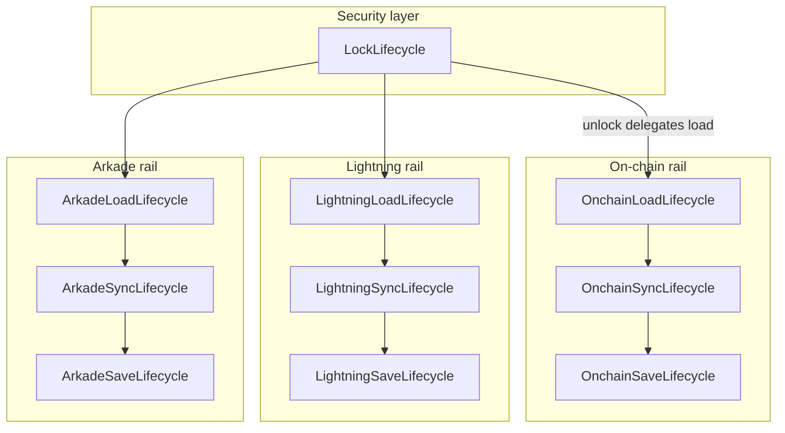
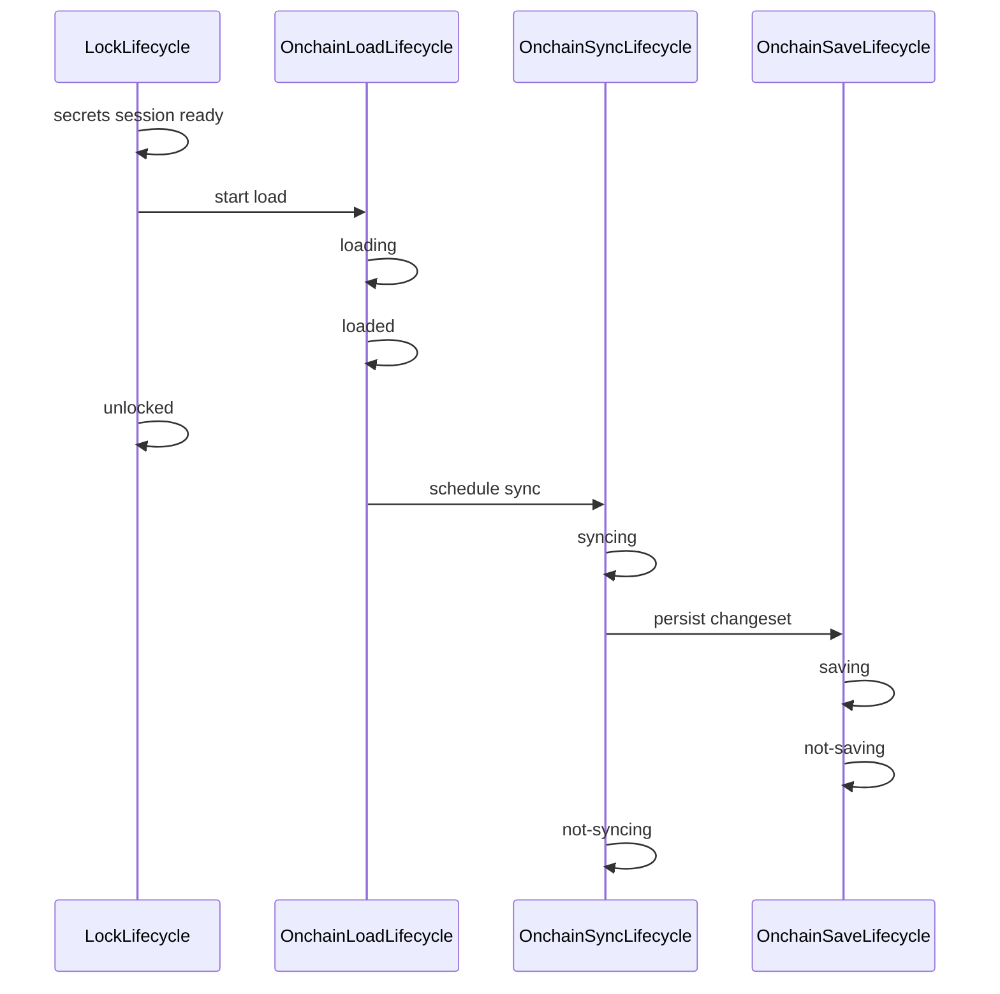

# Wallet rail lifecycle architecture

This document specifies the lifecycle architecture for Bitboard’s three wallet rails: **on-chain**, **Lightning (NWC)**, and **Arkade**. **L1 (OnchainLoadLifecycle)** is implemented; remaining phases are specified here for future work.

Related docs:

- [Lock lifecycle (implemented)](../frontend/src/lib/wallet/lifecycle/lock-lifecycle-orchestrator.ts) — iteration 1 complete
- [Application architecture](../doc/ARCHITECTURE.md) — TanStack Query vs Zustand
- [Descriptor wallet switching](descriptor-wallet-switching.md)
- [On-chain wallet model](onchain-bitboard-wallet-model.md)
- [Lightning wallet model](lightning-bitboard-wallet-model.md)
- [Arkade wallet model](arkade-bitboard-wallet-model.md)
- [Wallet lifecycle contracts](../doc/features/wallet-lifecycle.yaml) — test-oriented contract IDs

## Motivation

Lock/unlock coordination is centralized in **LockLifecycle** (see `frontend/src/lib/wallet/lifecycle/`). Remaining complexity lives in **per-rail** pipelines that:

1. **Load** persisted state (SQLite / encrypted `wallet_secrets`) into workers and UI stores
2. **Sync** with remote services (Esplora, NWC, Ark operator)
3. **Save** merged state back to persistence

Today these concerns are implicit: boolean flags, module-level promises, TanStack Query `enabled` heuristics, and global `walletStatus: 'syncing'`. The rail lifecycle model makes readiness explicit for UI, tests, and lock teardown.

## Orchestrator family



| Orchestrator | Owns | Does **not** own |
|--------------|------|------------------|
| **LockLifecycle** (done) | Lock teardown; secrets session; mutex between manual vs bootstrap unlock; phases `no-lock` / `locked` / `unlocking` / `unlocked` | Per-rail load/sync/save |
| **LoadLifecycle** (per rail) | Read persistence → populate worker + in-memory store; expose `loaded` readiness | Remote sync, lock teardown |
| **SyncLifecycle** (per rail) | Remote fetch / operator sync; merge into runtime state | Initial persistence read, lock mutex |
| **SaveLifecycle** (per rail) | Persist runtime state after sync or user mutation | Remote network I/O (except flush triggered by sync completion) |

**File layout (target):**

```
frontend/src/lib/wallet/lifecycle/
  lock-lifecycle-*.ts          # implemented
  rail-lifecycle-types.ts      # shared phase enums (implemented)
  onchain-load-lifecycle-*.ts  # L1 implemented
  onchain-sync-lifecycle-*.ts  # L2
  onchain-save-lifecycle-*.ts  # L2
  lightning-*-lifecycle-*.ts
  arkade-*-lifecycle-*.ts
```

## Shared phase types

Each rail exposes **three independent** phase enums. Steady idle states use the `not-*` prefix; in-flight states are explicit; errors are rail-scoped.

```ts
type LoadLifecyclePhase =
  | 'not-configured'   // rail inactive: feature off, unsupported network, or no setup (e.g. no NWC)
  | 'loading'          // read persistence → worker/session → hydrate store
  | 'loaded'           // rail ready to serve local data
  | 'load-error'       // rare: true persistence/decrypt/read failure; rail unusable

type SyncLifecyclePhase =
  | 'not-configured'
  | 'not-syncing'      // steady: configured, no sync in flight
  | 'syncing'          // remote sync in flight
  | 'sync-error'       // last sync attempt failed; still serve loaded local data

type SaveLifecyclePhase =
  | 'not-configured'
  | 'not-saving'       // steady: no persist in flight
  | 'saving'           // write to SQLite / encrypted secrets in flight
  | 'save-error'       // last persist attempt failed
```

### Phase semantics

| Phase | Meaning |
|-------|---------|
| `not-configured` | Rail is inactive for the current wallet/network context — not the same as LockLifecycle `no-lock`. |
| `loading` / `syncing` / `saving` | Work in progress for that concern only. |
| `loaded` | Local/runtime data is available for UI and downstream operations. |
| `not-syncing` / `not-saving` | Configured rail idle after last operation completed (success or error). |
| `load-error` | Cannot trust local data; user action or support path required. |
| `sync-error` | Remote truth unavailable; **serve `loaded` data** with stale/error indication. |
| `save-error` | Memory may be ahead of disk; **lock and destructive actions must await or surface failure**. |

### Rail configured invariant

When a rail is **`not-configured`**, all three lifecycles for that rail **must** be `not-configured` together. Mixed states such as `loading` with `not-configured` on sync/save are **not allowed**.

When a rail becomes configured (gates satisfied — see per-rail sections), load, sync, and save transition out of `not-configured` together into their idle steady states (`not-syncing`, `not-saving`) before any in-flight work begins.

**Lab exception:** On **lab** network, the on-chain Esplora rail has **no sync** — `OnchainSyncLifecycle` stays `not-configured` permanently. **Load** and **save** still apply to the **lab database** (`labDb` / lab worker state via `runLabOp` + `persistLabState`), modeled as a separate concern from Esplora-backed on-chain sync or as lab-specific load/save orchestration (detail in lab implementation planning).

### Allowed combinations (examples)

| Load | Sync | Save | Typical situation |
|------|------|------|-------------------|
| `not-configured` | `not-configured` | `not-configured` | Rail inactive (feature off, no NWC, Arkade disabled, etc.) |
| `loading` | `not-syncing` | `not-saving` | Arkade session open, on-chain WASM load, Lightning hydration |
| `loaded` | `not-syncing` | `not-saving` | Idle dashboard |
| `loaded` | `syncing` | `not-saving` | Background Esplora / operator poll |
| `loaded` | `not-syncing` | `saving` | Post-sync changeset / SDK flush |
| `loaded` | `sync-error` | `not-saving` | Stale banner; data still shown |
| `load-error` | `not-syncing` | `not-saving` | Load failed on a configured rail; do not start sync/save |

**Rule (v1):** `loading` must not overlap with `syncing` for the same rail. Operator/network work during session open belongs under **load** until the rail is `loaded`; only **operator sync** (Esplora scan, NWC `listPayments`, Ark `syncWithOperator`) uses **sync**.

**Future (out of scope):** Parallel `loading` and `syncing` on the same rail may be allowed later to speed hydration (e.g. start Esplora while WASM still loads). That would be a separate project with new mutex rules and UI semantics; this spec does not permit it until explicitly designed.

## Design principles

1. **TanStack Query executes; lifecycle orchestrates.** Each rail’s orchestrator drives query `enabled` / `queryFn` and **derives** phase from query state plus explicit transitions. Do not duplicate query cache in Zustand.
2. **Zustand holds domain snapshots** (balance, txs, connections) — not lifecycle phase. Phase lives in orchestrator snapshots (subscribable for UI/E2E).
3. **LockLifecycle gates all rails.** No load/sync/save when `no-lock` or during `locking`. Unlock delegates to per-rail load entry points (replacing direct `loadDescriptorWalletAndSync` in LockLifecycle over time).
4. **SaveLifecycle is internal-first for status text**, but sync is user-targetable: after this refactoring, the **dashboard exposes a sync control per configured rail** (on-chain, Lightning when connected, Arkade when active) so users can trigger targeted sync without syncing everything. Save phases remain primarily for lock handoff and debugging; save UI is not required in v1.
5. **Replace global `walletStatus: 'syncing'`** with an aggregate of per-rail `syncPhase === 'syncing'` (migration deferred). Until then, document which rail owns each legacy `setWalletStatus('syncing')` call site.
6. **One Lightning machine per rail** (v1). Sync and save aggregate across all NWC connections for the active Bitboard wallet.
7. **One Arkade operator** per `(walletId, networkMode)` — no multi-connection aggregation on the Arkade rail.

### Dashboard UI (post-refactor)

Replace the single global sync affordance with **per-rail sync buttons** on the dashboard (or per-rail blocks already on the dashboard):

| Rail | Control | Enabled when |
|------|---------|--------------|
| On-chain | Sync on-chain | OnchainLoadLifecycle `loaded`; triggers OnchainSyncLifecycle only |
| Lightning | Sync Lightning | LightningLoadLifecycle `loaded` and rail configured; triggers aggregated Lightning sync |
| Arkade | Sync Arkade | ArkadeLoadLifecycle `loaded` and rail configured; triggers operator sync only |

Each button reflects that rail’s `SyncLifecyclePhase` (`syncing`, `sync-error`, `not-syncing`). Syncing one rail must not implicitly sync the others. Global “sync all” is optional and out of scope for v1.

## LockLifecycle handoff (current + target)

**Today:** `orchestrateManualUnlock` / `orchestrateBootstrapUnlock` call `loadDescriptorWalletAndSync`, which bundles on-chain load, store hydration, and background Esplora sync.

**Target:**



Lock teardown **must await** in-flight sync (best-effort cancel/debounce) and save quiescence per rail before purging workers — formalizing today’s `awaitBackgroundArkadeOperatorSync` and `awaitInFlightWalletSecretsWrites`.

---

## On-chain rail

### When `not-configured`

- **Lab network:** Esplora-backed **on-chain sync** is inactive — `OnchainSyncLifecycle` remains `not-configured`. Crypto worker load for lab wallet operations and **lab DB load/save** (`labDb`) are modeled under the on-chain rail (no separate `Lab*` lifecycle modules).
- `LockLifecycle` not `unlocked` (including `locked`, `locking`, `no-lock`) — all three on-chain lifecycles are `not-configured`.
- Otherwise, when `LockLifecycle` is `unlocked` and a descriptor wallet exists for the committed triple, the on-chain rail is **configured** (load, sync, and save lifecycles leave `not-configured` together; sync stays `not-configured` on lab per lab exception).

### LoadLifecycle

**Work included in `loading` → `loaded`:**

1. `waitForCryptoWorkerHealthy`
2. Resolve descriptor wallet from encrypted `wallet_secrets`
3. `loadWallet` into crypto WASM (changeset from persistence)
4. `commitLoadedDescriptorWallet` + `setWalletStatus('unlocked')` (until global status is retired)
5. `refreshWalletStoreFromLoadedBdk` (balance, txs from WASM → `walletStore`)

**Query mapping (target):** extends / replaces `useActiveWalletLoadQuery` orchestration — keyed by `(activeWalletId, networkMode, addressType, accountId)`.

**`load-error`:** decrypt failure, missing descriptor row, WASM load failure, worker unhealthy after retries.

### SyncLifecycle

**Work in `syncing`:**

- Esplora incremental or full scan via crypto worker
- Network switch full scan (`switchDescriptorWallet` path)

**Does not persist** — on success triggers SaveLifecycle.

**`sync-error`:** Esplora unreachable, scan failure — keep BDK-local `loaded` data; surface toast/banner.

### SaveLifecycle

**Work in `saving`:**

- `exportChangeset` + `updateDescriptorWalletChangeset` to encrypted payload
- `lastSuccessfulEsploraSyncAt` metadata update when applicable

**`save-error`:** SQLite / secrets write failure — dashboard `OnchainSaveErrorBanner` with Retry (`orchestrateOnchainRetrySave`) and Lock anyway (`acknowledgeOnchainSaveErrorForForcedLock`). Lock/auto-lock blocked with toast until retry or forced ack.

### Legacy mapping

| Current | Target owner |
|---------|----------------|
| `loadDescriptorWalletAndSync` (WASM part) | OnchainLoadLifecycle |
| `runEsploraSyncAndPersistChangeset` | ~~OnchainSyncLifecycle + OnchainSaveLifecycle~~ (L2 done) |
| `walletStatus: 'syncing'` | OnchainSyncLifecycle aggregate (global mirror temporary until L5) |
| `useOnchainDashboardQueries` | Derive enabled from `loaded` + sync metadata |

---

## Lightning rail

### When `not-configured`

- No NWC connections stored for `activeWalletId`, **or**
- `LockLifecycle` not `unlocked` / wallet locked (all three lifecycles `not-configured` for this rail)

Lightning is optional — absence of connections is normal `not-configured`, not an error.

### LoadLifecycle

**Work in `loading` → `loaded`:**

1. `loadLightningConnectionsForWallet` from encrypted secrets
2. `replaceConnectionsForWallet` in `lightningStore`
3. Restore active connection ids per network from persisted metadata

**Query mapping:** `useHydrateLightningConnections` → orchestrator drives `enabled` when unlocked + `activeWalletId != null`.

**`load-error`:** secrets decrypt/read failure for Lightning slice.

### SyncLifecycle (aggregated)

**Work in `syncing`:** any connection in `fetchLightningPaymentsForActiveWallet` / balance probes / NWC `listTransactions` in flight.

**Aggregation rules (v1):**

- `syncing` if **any** connection has sync in flight
- `sync-error` if **any** connection’s last attempt failed and none are syncing (optional: only aggregate active connection per network — document in implementation if tightened)
- `not-syncing` when all connections idle

**`sync-error`:** serve merged history from store + last persisted snapshots; show stale indicator per existing dashboard patterns.

### SaveLifecycle (aggregated)

**Work in `saving`:**

- `saveLightningConnectionsForWallet` after add/remove connection
- Snapshot persistence after successful NWC fetch (`lightning-wallet-snapshot-persistence`)

**Aggregation:** `saving` if **any** persist in flight.

### Legacy mapping

| Current | Target owner |
|---------|----------------|
| `useHydrateLightningConnections` | LightningLoadLifecycle |
| `fetchLightningPaymentsForActiveWallet` | LightningSyncLifecycle |
| `addConnection` → `saveLightningConnectionsForWallet` | LightningSaveLifecycle |

---

## Arkade rail

### When `not-configured`

- `isArkadeEnabled` false, **or**
- Network not in `{ mainnet, testnet, signet }`, **or**
- No operator connection row for `(walletId, networkMode)` after first-time setup path

### LoadLifecycle (largest pipeline)

**Work in `loading` → `loaded`:**

1. `ensureSecretsChannel` / `ensureArkadeEncryptedSecretsHost`
2. Read encrypted mnemonic + payload; resolve operator connection
3. `ark_open_session` in arkade worker (hydrate from `sdkPersistenceJson`)
4. `ensureArkadeOperatorConnection` (DB metadata)
5. `refreshArkadeStoreFromLoadedWasm` — balance, payments, **receive address stable**
6. Set `activeArkadeConnectionId` when **load completes** (not when sync completes)

**Readiness contract (replaces UNLOCK-ARK connection-id delay):**

- UI queries and Receive page gate on `ArkadeLoadLifecycle === 'loaded'`
- `activeArkadeConnectionId` is set at load completion, not as a separate sync gate

**`load-error`:** WASM open failure, persistence corrupt, secrets read failure.

### SyncLifecycle

**Work in `syncing`:** **operator sync only** — `syncWithOperator`, debounced background operator sync, dashboard poll sync.

Does **not** include session open or initial WASM hydration (those are load).

**`sync-error`:** operator unreachable — serve `loaded` WASM/local data; `isStaleArkade` / operator-stale banner.

### SaveLifecycle

**Work in `saving`:**

- `flushSdkPersistence` / SDK blob merge into encrypted `wallet_secrets`
- `saveLastSuccessfulOperatorSyncAtEncrypted`
- Offchain receive index persist (`offchain_next_derivation_index` in wallet DB) on address reveal

**Lock** awaits `not-saving` (today: `awaitBackgroundArkadeOperatorSync` + flush).

### Legacy mapping

| Current | Target owner |
|---------|----------------|
| `openArkadeSessionForWallet` / `runArkadeSessionOpenWork` | ArkadeLoadLifecycle (+ schedule sync after) |
| `runArkadeOperatorSyncAndPersist` | ArkadeSyncLifecycle + ArkadeSaveLifecycle |
| `awaitArkadeSessionReady` | `ArkadeLoadLifecycle === 'loaded'` |
| `setActiveArkadeConnectionId` after hydration | End of ArkadeLoadLifecycle `loaded` |
| `useArkadeQueries` `withReadyArkadeWorker` | Gate on load phase |

---

## Cross-rail coordination

### Unlock order

After LockLifecycle establishes secrets session:

1. Start **on-chain load** (required for almost all wallet routes)
2. Start **Lightning load** and **Arkade load** in parallel when configured
3. Do not block unlock UI on sync; sync/save run in background per rail

### Lock order

1. Await each rail: sync debounce cleared → sync idle → save idle (best-effort flush)
2. LockLifecycle `orchestrateLock` → purge workers and stores

### Network switch

- Close Arkade session → `not-configured` / reset all Arkade machines
- On-chain: save outgoing changeset (save) → load new descriptor (load) → sync (sync)
- Lightning: connections persist per wallet; sync restarts for new `networkMode`

### E2E readiness (future)

Expose subscribe hooks or `data-testid` per rail, e.g.:

- `data-rail-onchain-load="loaded"`
- `data-rail-arkade-load="loaded"` for receive address tests
- Avoid DOM polling and long `toPass` timeouts where phase is sufficient

---

## Error and retry policy

| Error | User-visible data | Retry |
|-------|-------------------|-------|
| `load-error` | Do not show rail data | User: lock/unlock, reload; fix secrets |
| `sync-error` | Show last `loaded` data + stale/error UI | Automatic on focus/refetch; manual sync button |
| `save-error` | Show data but warn persistence may be stale | Dashboard banner Retry; lock toast points to banner; forced lock via Lock anyway |

---

## Implementation phases

| Phase | Scope | Status |
|-------|--------|--------|
| **L1** | Types + on-chain LoadLifecycle; peel WASM load from `loadDescriptorWalletAndSync`; LockLifecycle delegates load | **Done** |
| **L2** | On-chain Sync + Save lifecycles; retire bundled post-unlock Esplora in wallet-utils | **Done** |
| **L3** | Arkade Load/Sync/Save; simplify `arkade-session-service`; E2E hooks for load readiness | Planned |
| **L4** | Lightning Load/Sync/Save (aggregated) | Planned |
| **L5** | Replace `walletStatus: 'syncing'` with rail aggregate; per-rail dashboard sync buttons; optional `useRailLifecycleSnapshot` hooks | Planned |

Each phase should follow TDD per `.cursor/rules/testing-strategy.mdc` and add rows to `doc/features/wallet-lifecycle.yaml`.

---

## Resolved and open questions

### Resolved

1. **Lab load/save orchestration:** under **Onchain\*** namespacing; no separate `LabLoadLifecycle` / `LabSaveLifecycle` modules.
2. **Save-error on lock:** **hard block** on `save-error` (L2); Lightning/Arkade deferral in L3/L4.
3. **Cross-tab:** full rail snapshot via `useOnchainRailLifecycleCrossTabSync`; apply only when local tab has same `walletId` + descriptor triple loaded (`descriptorScope` gate).
4. **`walletStatus: 'syncing'`:** temporary mirror of on-chain sync phase only (revert to `unlocked` when sync completes even if save still running); removed in L5.

### Still open

1. **Lightning `sync-error` aggregation:** any failure vs active-connection-only failure (resolve in L4).
