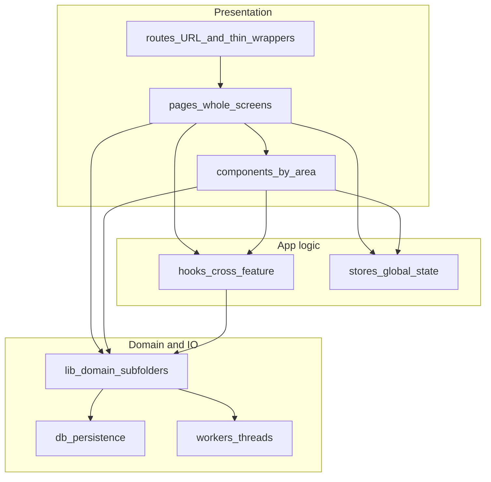

# Frontend folder structure

This document is the placement contract for new and refactored frontend code. It applies to contributors, reviewers, and agent-assisted changes.

For stack and development setup, see [frontend/README.md](../README.md). For system-wide architecture, see [doc/ARCHITECTURE.md](../../doc/ARCHITECTURE.md).

## Hybrid model



## Layer rules

| Layer | Role |
|--------|------|
| `src/routes/` | TanStack route modules only: URL, `createFileRoute`, layout wiring, lazy-load shells, redirects. **No whole-page UI**—import from `pages/` (see migrated examples below). |
| `src/pages/<area>/` | Whole page components (`*Page.tsx`). Large screens may use a subfolder (e.g. `pages/wallet/SendPage/`). Pages compose `components/`, hooks, and stores. |
| `src/components/<area>/` | Reusable feature UI (`lab`, `wallet`, `settings`, …)—cards, modals, forms, banners. Co-locate tiny private hooks next to a component when truly local. |
| `src/lib/<domain>/` | Portable domain logic shared across routes—not a flat dump. Use subfolders such as `lib/lab/`, `lib/wallet/`, `lib/lightning/` for new and moved code. |
| `src/hooks/`, `src/stores/` | Cross-feature hooks and global client state. |
| `src/db/`, `src/workers/` | Persistence and worker boundaries; keep separate from feature UI unless a deliberate vertical slice is adopted later. |
| `src/db/opfs/` | OPFS root file I/O, SQLite basename constants, capability probes, and replace-and-reload helpers—colocated with persistence, not `lib/shared/`. |

### `pages/` migration status

Wallet, settings, setup, privacy, library route shells, and part of lab live under `src/pages/`. **Lab is partially migrated**—four route files still hold inline page UI. Article **content** modules remain under `routes/library/articles/` (see backlog).

| Area | Status | Target |
|--------|--------|--------|
| `wallet/` | **Migrated** | `pages/wallet/` (including `WalletsPage`, `SendPage/`, etc.) |
| `settings/` | Migrated | `pages/settings/` |
| `setup/` | Migrated | `pages/setup/` |
| `privacy/` | Migrated | `pages/privacy/` |
| `library/` | **Shells migrated** | `pages/library/` — index, history, favorites, article, tags; article content stays in `routes/library/articles/` until registry glob is updated |
| `lab/` | **Partial** | `pages/lab/` — `BlocksPage`, `ControlPage`, `Layer2Page` done; `transactions`, block detail, and tx detail routes still inline in `routes/lab/` |

**Migrated route pattern** (wallet send):

```tsx
// routes/wallet/send.tsx — thin shell only
const SendPageLazy = lazy(() =>
  import('@/pages/wallet/SendPage').then((m) => ({ default: m.SendPage })),
)
export const Route = createFileRoute('/wallet/send')({ component: SendRouteShell })
```

## Guardrails

- **Do not add whole-page UI to `routes/`**; add `pages/<area>/` and import from the route module.
- Prefer **no new single-purpose files at `lib/` root**; add under `lib/<domain>/` (or `lib/shared/` for truly generic helpers used across domains).
- **Reusable UI** belongs in `components/`; **screen-level composition** belongs in `pages/`; `lib/` stays mostly non-UI pure logic, types, and formatters.
- When extracting from hotspot files (e.g. send flow, backup hooks), place page orchestration in `pages/<area>/`, feature hooks in `components/<area>/`, and pure logic in `lib/<domain>/`.
- Optional later strictness: `lib` must not import from `components`; `routes` must not accumulate business logic.

## Relationship to a full `features/` layout

Not required. This hybrid matches TanStack file-based routes, `pages/` for screens, and `components/<area>/` for reusable UI. Avoid duplicating `routes/` + `pages/` + `features/` for the same screen without a dedicated migration project.

## Migration backlog

### `pages/` (route thinning)

- **Lab (remaining):** extract inline page components from `routes/lab/transactions.tsx`, `block.$height.tsx`, `block.current.tsx`, and `tx.$txid.tsx` into `pages/lab/`.
- **Library (content):** article TSX modules under `routes/library/articles/` (~67 files) are content, not route shells. Moving them requires updating the glob in `lib/library/articles-registry.ts`—separate from shell migration.

### `lib/` (domain subfolders)

**Done (PR-2):** Flat `lib/` root modules moved into domain subfolders (`lab/`, `wallet/`, `lightning/`, `library/`, `fiat/`, `esplora/`, `faucet/`, `settings/`, `shared/`). OPFS-specific modules live under `db/opfs/` (not `lib/shared/`). Tests co-located under each domain’s `__tests__/`. No new files at `lib/` root.

When adding code, use the domain folder directly—do not reintroduce flat root files.

## PR placement checklist

Before opening a refactor PR, confirm:

1. Route file stays thin (`createFileRoute`, lazy shell, or redirect only).
2. Whole-page UI lives under `pages/<area>/`, not in `routes/`.
3. Reusable UI or modal logic is under `components/<area>/`.
4. New shared pure functions are under `lib/<domain>/`, not `lib/` root.
5. Cross-route hooks go in `src/hooks/`; global state in `src/stores/`.
6. DB and worker boundaries stay in `src/db/` and `src/workers/`.
